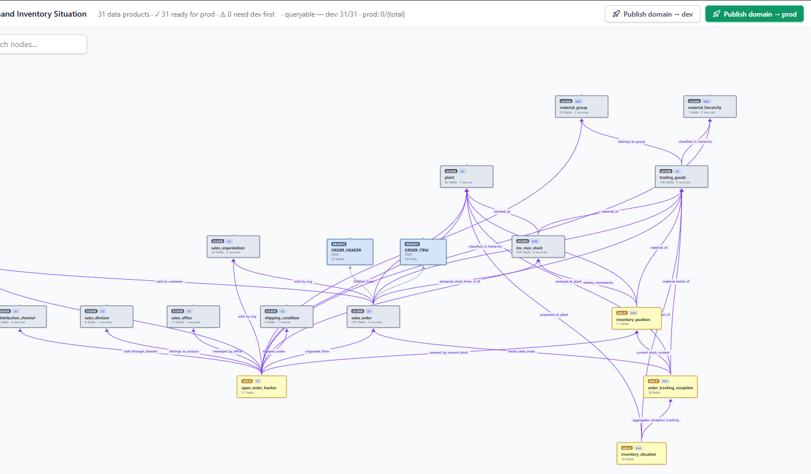

# Onibex ASK — Agentic Semantic Knowledge

> Ask your enterprise data a question in plain language. Get governed, deterministic
> SQL back — compiled from a business-vocabulary semantic layer, never guessed from
> raw schema.

**"Based on open sales orders for material ID TG12, do we have enough stock to cover that
demand?"**

A business user types that into **[ASK Chat](platform/docs/ask-chat/README.md)**. That question
names no table, and answering it takes two things the business tracks separately: what has been
ordered, and what is on the shelf. ASK resolves *open sales orders*, *material* and *stock*
against a curated semantic layer, works out that both are needed, computes the join between them
deterministically, compiles SQL in your database's own dialect, runs it, and answers — starting
with **"No, we do not have enough stock"**, then the figures, then the query it ran.

The LLM maps language to a contract you control. It never invents a table or a column
name, because it is never shown one it may invent from.


> The two Data Products are **Open Order Tracker** and **Inventory Position**. The join between
> them was computed, not written — and the SQL is on screen, so you can check.

---

## Works with your data where it already lives

ASK does not move or copy your data. It connects to the engine you already run and
compiles to **that engine's dialect** — each of these has its own SQL generator and
its own execution adapter, not a generic fallback:

| | | |
|---|---|---|
| **SAP HANA** | **Snowflake** | **Google BigQuery** |
| **PostgreSQL** | **Databricks** | **ClickHouse** |
| **Microsoft SQL Server** | **Microsoft Fabric** | **IBM Db2** |
| **Presto** | | |

Connections are configured in **[ASK Setup](platform/docs/ask-setup/README.md)** and stored
encrypted — never in a file in this repository. Adding one is
[Connect a database](platform/docs/ask-setup/02-database-connections.md). Which drivers ship in your image is one build variable
(`EXECUTOR_EXTRAS`), so a HANA-only deployment stays small.

ASK was forged on SAP ECC and S/4HANA workloads, and that is where its reference
semantic layer comes from — but nothing in the contract is SAP-specific.

---

## Two surfaces, and what has to exist before either works

| | For | What you do there |
|---|---|---|
| 🟣 **[ASK Studio](platform/docs/ask-studio/README.md)** | Data & business analysts | Author the semantic layer: workspaces, business domains, Data Products. Import from DDL or SAP metadata, enrich with AI, publish dev → prod. |
| 🔵 **[ASK Chat](platform/docs/ask-chat/README.md)** | Business users | Ask questions in any language. Get answers with the SQL, the sources, and a per-request token breakdown. |

**Before either does anything, [ASK Setup](platform/docs/ask-setup/README.md) has to hold a
database connection and a model provider.** It is the platform's precondition, not a third
product: Studio has nothing to publish against and Chat has nothing to answer from until it is
configured. Whoever owns the infrastructure does it once, and the people who author and ask
never open it again.

All of it runs from one `docker compose up`, on the same backend, behind the same identity
provider — [Sign in to ASK](platform/docs/guides/sign-in.md). There is also an
[MCP server](platform/services/ask-mcp-server/README.md) for SAP write operations and a
`/external/ask` API for agent runtimes such as watsonx Orchestrate, n8n and Zapier.

---

## Why not just point an LLM at the schema?

Because a schema does not say what anything *means*. It does not know that `MATNR` is a
material number, that "open order" means four status fields agreeing, or which of six
join paths between two tables is the correct one for a revenue question.

An LLM given raw schema fills those gaps by guessing. It is confident, it is fluent, and
it is wrong in ways nobody catches until the number reaches a board deck.

ASK removes the guessing from the part that must be exact:

- **The LLM chooses among resolved entities.** It never names a table.
- **Join paths are computed, not written** — Dijkstra over a declared relationship graph.
- **Retrieval is hybrid and ranked** — kNN + BM25 + RRF over a curated vocabulary.
- **Everything is scoped** — a workspace allowlist decides what any question can reach.

Each of those is a decision the product makes rather than a claim it asserts, and
[The three chat engines](platform/docs/explain/engines.md) is where they are set out — what
each engine computes, what it concedes to the model, and why that trade is the one worth
making. The scope itself is a workspace:
[Create workspaces and business domains](platform/docs/ask-studio/01-workspaces-domains.md).



That is one business domain — thirty-one Data Products, and every line between them a
relationship somebody declared. Each carries a join predicate, a cardinality, a traversal cost
and an aggregation-safety hint, which is what lets a path be **computed** rather than chosen.
Point an LLM at the raw schema and this graph does not exist; it has to guess its way across.

---

## The semantic layer

Two layers face the agent, and they answer different kinds of question:

| Layer | What it is | When the agent uses it |
|---|---|---|
| 🥇 **[Gold](definition/docs/GOLD_LAYER.md)** | A **business definition** — pre-joined and semantically resolved. "Open Order Tracker", "Inventory Position". | **Preferred.** If a Gold answers the question, it wins. |
| 🥈 **[Silver](definition/docs/SILVER_LAYER.md)** | A **reusable enterprise entity** — Customer, Product, Sales Order — with declared grain, measures and relationships. | **Fallback**, when no Gold fits. Also the building blocks Gold is composed from. |

> **Bronze is lineage, and in the usual path you never write it.** When SAP metadata is
> ingested — the way Onibex OneConnect feeds ASK — one Bronze node per source table is
> **generated for you**, along with the Silver that composes them. Bronze is what makes
> a business field traceable back to the physical column it came from, and it is
> machine output. You author it by hand only when you choose to; a flat Silver imported
> from a single `CREATE TABLE` has no Bronze at all, and Gold never has any — its table
> is `db_table_name` and its lineage is `relationships`.
>
> The other half never varies: **Bronze is never agent context.** It is never embedded, never
> given field-registry rows and never chunked into the retrieval collections — so a business
> question has nothing to resolve a raw table *against*, in any of the three engines. Most of
> that isolation is structural rather than a rule someone has to remember: a Bronze is simply
> not given the representations retrieval runs on. The remaining step is an explicit
> layer filter, and the one path meant to reach a Bronze is a schema question — *"what columns
> does VBAK have"* — which is not a question about your data.
>
> So the [Bronze specification](definition/docs/BRONZE_LAYER.md) is there to make the
> generated output well-defined and auditable — read it when you are modelling ingestion
> or tracing a number to its source. If you are evaluating ASK, skip it.

The [`definition/`](definition/README.md) folder holds the normative rules; the
[manual](platform/docs/README.md) shows how to author them in ASK Studio.

---

## What ships, and what you write

[`definition/examples/`](definition/examples/README.md) contains **4 Gold, 12 Silver and 15
Bronze** data products drawn from SAP SD and MM. They are **reference examples — a shape to
copy, not a catalog to deploy.** Reading one teaches the contract faster than the spec does,
and [the index says which to open first](definition/examples/README.md#where-to-start).

So where does the line fall in practice?

**Silver is where reuse lives.** A Sales Order, a Customer, a Material behave much the
same across SAP shops, and the shipped Silvers are a genuine head start — adjust the
fields your org actually populates and you have a foundation.

**Gold is yours by definition.** A Gold Data Product encodes *your* business question:
what your company counts as an open order, which exclusions your controllers apply,
which measures your board reviews. Two companies on identical S/4HANA schemas need
different Golds, because they run their business differently. The four shipped Golds
show the shape; the ones that answer your questions are the ones you author — and
authoring them in [ASK Studio](platform/docs/ask-studio/README.md) is the everyday work the
product is built around.

---

## The two halves of this repository

| If you want to… | Go to | What it is |
|---|---|---|
| **Learn the specification** — how AI-ready data products are described in vendor-neutral YAML | **[`definition/`](definition/README.md)** | The **ASK specification** (`ask-spec 1.0`): layer rules, resolution priority, reference examples. Runtime-neutral — any vendor can adopt it. |
| **Run the product** — install it, author a semantic layer, publish it, query it | **[`platform/`](platform/README.md)** | The **Onibex ASK Platform**: source, the Docker Compose stack, and the [complete manual](platform/docs/README.md). |

```
agentic-semantic-knowledge-ask/
├── definition/               ← the ASK specification
│   ├── docs/                 ← Gold / Silver / Bronze layer specifications
│   └── examples/             ← reference YAML data products
└── platform/                 ← Onibex ASK Platform
    ├── docker-compose.yml    ← the whole stack, one command
    ├── ask-studio-spa/       ← ASK Studio    (React)
    ├── ask-chat-spa/         ← ASK Chat      (React)
    ├── ask-setup-spa/        ← ASK Setup     (React)
    ├── packages/             ← typed Python packages (orchestrator, admin-api, …)
    ├── services/             ← MCP server for SAP write operations
    └── docs/                 ← product manual + engine docs
```

---

## Where to start

| You are… | Start here |
|---|---|
| **Evaluating ASK** | This page, then [Concepts and architecture](platform/docs/02-concepts.md) |
| **Here to see the product** | [Using the Chat](platform/docs/ask-chat/02-chat.md) — ask a question, read the answer, see the SQL behind it |
| **Asking how governed the answers are** | [The three chat engines](platform/docs/explain/engines.md) — what is computed rather than guessed |
| **Trying it for the first time** | [Getting Started](platform/docs/GETTING_STARTED.md) — one guided path, empty machine to a real answer, ~45 min |
| **Installing it** | [Install and run the platform](platform/docs/01-installation.md) — every variable, the startup order, the gotchas |
| **Configuring it** | [Configure the platform first · ASK Setup](platform/docs/ask-setup/README.md) — the database, the model provider, identity |
| **Authoring a semantic layer** | [Author the semantic layer · ASK Studio](platform/docs/ask-studio/README.md) — the eleven flows, and the order to read them in |
| **Reading the whole manual** | [The manual](platform/docs/README.md) — every page, grouped by what you are trying to do |
| **Adopting the specification** | [`definition/README.md`](definition/README.md) |
| **An AI agent** | [`llms.txt`](llms.txt) |

---

## License

The two tracks of this repository are licensed individually — see the
[`LICENSE`](LICENSE) map for the authoritative table:

- **`definition/`** — the ASK specification, under **PolyForm Strict 1.0.0 OR
  PolyForm Free Trial 1.0.0** ([`definition/LICENSE`](definition/LICENSE)).
- **`platform/`** — the Onibex ASK Platform, under **PolyForm Strict 1.0.0 OR
  PolyForm Free Trial 1.0.0** ([`platform/LICENSE.md`](platform/LICENSE.md)).

Both are **source-available** and dual-licensed: noncommercial use, research,
evaluation, and personal study are permitted indefinitely under PolyForm
Strict, or you can evaluate the software for your business for up to **32
days** under PolyForm Free Trial (e.g. via `docker compose up`). Production
or any other commercial use requires a commercial license from
[Onibex](https://onibex.com) — see [`COMMERCIAL-LICENSE.md`](COMMERCIAL-LICENSE.md).

"Onibex", "ASK", and the Onibex logos are trademarks of Onibex, LLC and are excluded
from both licenses. This repository also references, without redistributing under
this license, third-party software including SAP HANA, SAP BTP, and SAP AI Core
(trademarks of SAP SE), OpenSearch (a registered trademark of Amazon Web Services),
and Keycloak (a trademark of Red Hat, Inc.) — see [`THIRD-PARTY-NOTICES.md`](THIRD-PARTY-NOTICES.md).

Apache Kafka and the Kafka logo are trademarks of the Apache Software Foundation; Onibex is
not affiliated with, and is not endorsed by, the Apache Software Foundation. CONFLUENT is a
registered trademark of Confluent, Inc. All marks are used for identification only.

---

## Contributing & support

ASK is **source-available, not open source** — see [`LICENSE`](LICENSE). Contributions are
welcome on that footing:

- [`CONTRIBUTING.md`](CONTRIBUTING.md) — the two tracks, how a specification change is
  handled differently from a platform one, and the checks CI runs.
- [`SUPPORT.md`](SUPPORT.md) — where to go for a bug, a documentation problem, a
  specification proposal, or a licensing question.
- [`SECURITY.md`](SECURITY.md) — vulnerability disclosure. Not a public issue.
- [`CODE_OF_CONDUCT.md`](CODE_OF_CONDUCT.md).

Found something inaccurate or confusing in the documentation? That is a bug, and reporting
it is a contribution.

---

## Maintainers

ASK is initiated and maintained by **[Onibex, LLC](https://onibex.com)** — an SAP
silver partner and a Confluent gold partner building real-time SAP data hyperconnectivity
for the enterprise.

> *"Tables don't think. Schemas don't reason. ASK is what an agent reads when it needs
> to know what your data means."*
