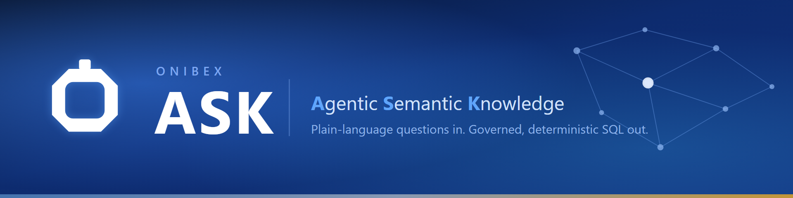

# Onibex Agentic Semantic Knowledge (ASK)

> Ask your enterprise data a question in plain language. Get governed, deterministic
> SQL back, compiled from a business-vocabulary semantic layer and never guessed from
> raw schema.

**[Quick start](#quick-start)** · **[Manual](platform/docs/README.md)** ·
**[Specification](definition/README.md)** · **[Where to start](#where-to-start)** ·
**[FAQ](#faq)** · **[Support](SUPPORT.md)**

[](definition/README.md)
[](CHANGELOG.md)
[](LICENSE)
[](platform/README.md#technology)

**"Based on open sales orders for material ID TG12, do we have enough stock to cover that
demand?"**

A business user types that into **[ASK Chat](platform/docs/ask-chat/README.md)**. The question
names no table, and answering it takes two things the business tracks separately: what has been
ordered, and what is on the shelf. ASK resolves *open sales orders*, *material* and *stock*
against a curated semantic layer, computes the join between them deterministically, compiles
SQL in your database's own dialect, runs it, and answers.


> The two Data Products are **Open Order Tracker** and **Inventory Position**. The join between
> them was computed, not written, and the SQL is on screen so you can check.

---

## Built around two halves

| | What it is |
|---|---|
| **[`definition/`](definition/README.md)** | The **ASK specification** (`ask-spec 1.0`): a vendor-neutral YAML standard for describing AI-ready data products across Bronze, Silver and Gold. Runtime-neutral, so any vendor can adopt it. |
| **[`platform/`](platform/README.md)** | The **Onibex Agentic Semantic Knowledge Platform**: the product that implements the standard end to end, from authoring a semantic layer to querying it in plain language. |

The platform runs from one `docker compose up`: **ASK Setup** to configure it, **ASK Studio** to
author the semantic layer, **ASK Chat** to ask. There is also an
[MCP server](platform/services/ask-mcp-server/README.md) for SAP write operations, and an
`/external/ask` API for agent runtimes such as watsonx Orchestrate, n8n and Zapier.

| | Most text-to-SQL tools | **ASK** |
|---|---|---|
| **The table and column names** | Shown to the model, which may invent one | Never shown. The model picks from resolved Data Products |
| **The join between two tables** | Written by the model, by plausibility | **Computed**: the shortest declared path, by cost |
| **What "open order" means** | Whatever the model infers today | A definition you wrote, versioned in your git |
| **What one question can reach** | The whole schema | Only what a workspace allows |

Why a semantic layer rather than the schema itself is
[Why not just point an LLM at the schema?](platform/docs/explain/why-not-raw-schema.md). How
much each engine computes rather than concedes to the model is
[The three chat engines](platform/docs/explain/engines.md).

---

## Quick start

Docker with Compose v2, and a few minutes for the first build.

```bash
git clone https://github.com/Onibex/agentic-semantic-knowledge-ask.git
cd agentic-semantic-knowledge-ask/platform
cp .env.example .env
docker compose up -d
```

Two values in `.env` have to be set before the stack will come up.
**`ONIBEX_ENCRYPTION_KEY`** encrypts every credential you are about to enter: generate it with
the one-liner in the file, and keep it, because lose it and everything stored becomes
unreadable. **`SEMANTIC_LAYER_HOST_PATH`** is an absolute path to a git repository where your
semantic layer will live, and it must already contain a `.git` or publishing silently does
nothing.

**Open ASK Setup first.** Nothing answers until it holds a database and a model provider, and
until ASK Studio has published something.

**→ [Getting Started](platform/docs/GETTING_STARTED.md)** walks that path end to end, from an
empty machine to a real answer, in about 45 minutes.
**→ [Install and run the platform](platform/docs/01-installation.md)** has the ports, every
variable, the health checks and what to do when a service will not start.

---

## How to use this repository

1. **Go to the folder for what you want**: `definition/` for the open standard, `platform/`
   for the product.
2. **Start with the `README.md` inside it.** Every folder has one, and it is the index for
   that folder.
3. **Open the page you need** from there.

Everything is Markdown and renders on GitHub. Nothing has to be downloaded to be read.

---

## Contents

**[`definition/`](definition/README.md)**, the open specification

- [The layer specifications](definition/docs/README.md). The normative Bronze, Silver and Gold
  rules, and which layer the agent reaches for first
- [Reference examples](definition/examples/README.md). Thirty-one Data Products drawn from SAP
  SD and MM: a shape to copy, not a catalog to deploy

**[`platform/`](platform/README.md)**, the product

- [Getting Started](platform/docs/GETTING_STARTED.md) and
  [Install and run the platform](platform/docs/01-installation.md)
- [Concepts and architecture](platform/docs/02-concepts.md)
- [Configure the platform first · ASK Setup](platform/docs/ask-setup/README.md)
- [Author the semantic layer · ASK Studio](platform/docs/ask-studio/README.md)
- [Ask questions · ASK Chat](platform/docs/ask-chat/README.md)
- [The three chat engines](platform/docs/explain/engines.md) and
  [Operating the platform](platform/docs/runbooks/README.md)
- [Glossary](platform/docs/reference/glossary.md) and
  [Troubleshooting & FAQ](platform/docs/reference/troubleshooting.md)

**[The manual](platform/docs/README.md)** is the full index: every page, grouped by what you
are trying to do.

---

## Where to start

| You are… | Start here |
|---|---|
| **Evaluating ASK** | This page, then [Concepts and architecture](platform/docs/02-concepts.md) |
| **Here to see the product** | [Using the Chat](platform/docs/ask-chat/02-chat.md). Ask a question, read the answer, see the SQL behind it |
| **Asking how governed the answers are** | [The three chat engines](platform/docs/explain/engines.md). What is computed rather than guessed |
| **Trying it for the first time** | [Getting Started](platform/docs/GETTING_STARTED.md). One guided path, empty machine to a real answer, about 45 minutes |
| **Installing it** | [Install and run the platform](platform/docs/01-installation.md). Every variable, the startup order, the gotchas |
| **Configuring it** | [Configure the platform first · ASK Setup](platform/docs/ask-setup/README.md). The database, the model provider, identity |
| **Authoring a semantic layer** | [Author the semantic layer · ASK Studio](platform/docs/ask-studio/README.md). The nine flows, and the order to read them in |
| **Reading the whole manual** | [The manual](platform/docs/README.md). Every page, grouped by what you are trying to do |
| **Adopting the specification** | [`definition/README.md`](definition/README.md) |
| **An AI agent** | [`llms.txt`](llms.txt) |

---

## FAQ

**Is my data sent to the model?**
To write SQL, the agent is shown your **semantic layer**, the Data Products you authored, never
the raw schema. Query **results** are sent: once the SQL has run, the rows go to the model to be
written up as the answer you read. The model is whichever one you configured in ASK Setup, and
it can be a self-hosted one.

**Do I need SAP?**
No. ASK does not move or copy your data: it connects to the engine you already run and compiles
to that engine's dialect, and there are ten of them, each with its own SQL generator and its own
execution adapter rather than a generic fallback. **SAP HANA**, **PostgreSQL**, **Snowflake**,
**Databricks**, **Google BigQuery**, **ClickHouse**, **Microsoft SQL Server**, **Microsoft
Fabric**, **IBM Db2** and **Presto**. Nothing in the specification is SAP-specific either. The
reference examples are SAP SD and MM because that is where ASK was built, and it is where a
semantic layer earns the most. A `CREATE TABLE` on PostgreSQL is a valid starting point, and
adding a connection is [Connect a database](platform/docs/ask-setup/02-database-connections.md).

**Which models can I use?**
SAP AI Core for managed models, or any LiteLLM provider: Anthropic, OpenAI, AWS Bedrock,
Databricks and others. Chosen in ASK Setup; changing one reloads the affected services rather
than needing a redeploy.

**Do I have to write the YAML by hand?**
No, and mostly you should not. Import a `CREATE TABLE` and let AI draft the layer, ingest SAP
metadata through OneConnect, or author in the UI, then review the diff. See
[Add Data Products](platform/docs/ask-studio/02-add-data-products.md).

**Do I have to author a semantic layer at all?**
Yes, and this is the one honest condition. ASK's determinism comes from the contract, so if
nobody is going to author one there is nothing for it to compile against. Importing a
`CREATE TABLE` and letting AI draft the layer is a fifteen-minute start, but somebody has to
review what it drafted.

**Is this open source?**
**No. Source-available.** Read it, evaluate it, study it, build against it. Production use
needs a commercial licence. The distinction is real and we would rather you learn it here than
after a procurement review.

**How long does an answer take?**
Between roughly fifteen and sixty seconds, depending on the engine. That is a real trade, and
[The three chat engines](platform/docs/explain/engines.md) is where it is laid out rather than
hidden.

---

## License, contributing and support

**Source-available, not open source.** Both tracks are licensed under **PolyForm Strict 1.0.0
OR PolyForm Free Trial 1.0.0**, at your option: noncommercial use, research, evaluation and
personal study are permitted indefinitely under Strict, or you can evaluate the software for
your business for up to **32 days** under Free Trial, for example via `docker compose up`.
Production or any other commercial use requires a commercial license from
[Onibex](https://onibex.com).

- [`LICENSE`](LICENSE) is the authoritative map, with [`definition/LICENSE`](definition/LICENSE)
  and [`platform/LICENSE.md`](platform/LICENSE.md) per track, and
  [`COMMERCIAL-LICENSE.md`](COMMERCIAL-LICENSE.md) for production use.
- [`CONTRIBUTING.md`](CONTRIBUTING.md). The two tracks, how a specification change is handled
  differently from a platform one, and the checks CI runs.
- [`SUPPORT.md`](SUPPORT.md). Where a bug, a documentation problem, a specification proposal or
  a licensing question each goes.
- [`SECURITY.md`](SECURITY.md). Vulnerability disclosure, never a public issue.
- [`CODE_OF_CONDUCT.md`](CODE_OF_CONDUCT.md) and [`CHANGELOG.md`](CHANGELOG.md).

Found something inaccurate or confusing in the documentation? That is a bug, and reporting it
is a contribution.

"Onibex", "ASK", and the Onibex logos are trademarks of Onibex, LLC and are excluded from both
licenses. Third-party software referenced but not redistributed here, including SAP HANA, SAP
BTP and SAP AI Core (trademarks of SAP SE), OpenSearch (a registered trademark of Amazon Web
Services), Keycloak (a trademark of Red Hat, Inc.), Apache Kafka (a trademark of the Apache
Software Foundation) and CONFLUENT (a registered trademark of Confluent, Inc.), is listed in
[`THIRD-PARTY-NOTICES.md`](THIRD-PARTY-NOTICES.md). All marks are used for identification only.

---

Maintained by **[Onibex, LLC](https://onibex.com)**, an SAP silver partner and a Confluent gold
partner building real-time SAP data hyperconnectivity for the enterprise.

> *"Tables don't think. Schemas don't reason. ASK is what an agent reads when it needs
> to know what your data means."*
