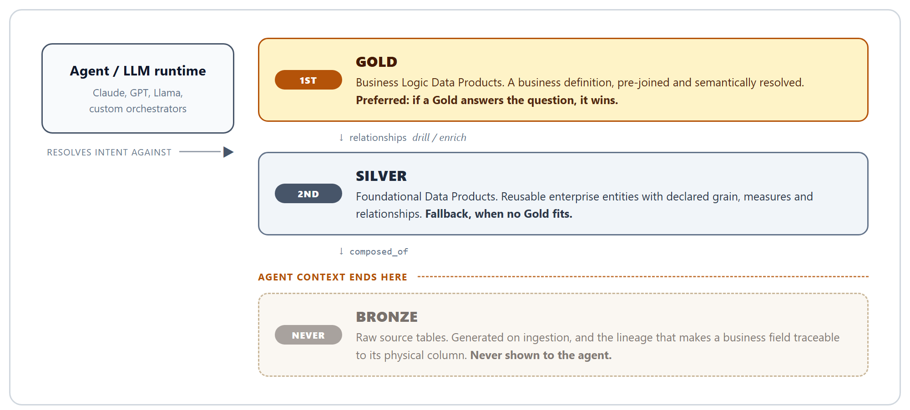

# Onibex Agentic Semantic Knowledge Definition

> A YAML specification for AI-ready data products. The semantic foundation for Agentic AI on
> enterprise data.

**[Who it is for](#who-ask-is-for)** · **[The normative documents](#the-normative-documents)** ·
**[The three layers](#the-three-layers)** · **[How a question resolves](#how-a-question-resolves)** ·
**[How it compares](#how-ask-compares)** · **[Versioning](#versioning-and-governance)**

[](#versioning-and-governance)
[](LICENSE)

> **New here?** The [repository overview](../README.md) has the big picture, and the
> [Onibex Agentic Semantic Knowledge Platform manual](../platform/docs/README.md) shows this
> contract authored and queried in a running product. This folder is the specification itself.

> **This folder is the single normative source for the Bronze / Silver / Gold contract.** The
> Onibex Agentic Semantic Knowledge Platform derives its AI-enrichment prompts from these rules
> and ships them as code assets, but the prompt is a rendering of the specification, never a
> second authority. Where the platform's behaviour and this text disagree, that is a defect in
> one of them, to be reconciled here rather than forked.

---

## What ASK is

**Agentic Semantic Knowledge (ASK)** is a YAML specification that describes enterprise data in
the terms an agent has to reason in: what a Data Product is, at what grain, which measures it
carries, and which joins are legitimate.

LLMs are good at generating SQL, calling tools and chaining steps. They are bad at knowing
*which* table answers *which* business question, what `MATNR` means, why `VBAK.GBSTK = 'C'`
means an order is closed, or which join path is the cheapest to traverse. Most enterprises sit
on decades of OLTP systems where the names are codes, the meaning lives in tribal knowledge, and
two teams compute *"open order"* differently. Retrieval over schema descriptions does not close
that gap, because the model still has to resolve a question to the right Data Product, the
right grain and the right join path.

ASK closes it by declaring the **business semantics**: Data Products, grains, measures, statuses,
relationships and intent, in a layered contract any agent runtime can read.



ASK is **declarative**, **runtime-neutral** and **business-vocabulary-first**. It does not
generate data products. It describes them, so agents know what they are.

## Who ASK is for

ASK was forged on SAP ECC and S/4HANA workloads, but the contract is source-system agnostic.
Examples for Salesforce, Workday, NetSuite and others are welcome by PR.

- **Data platform teams** building agent-native data products on warehouses or lakehouses.
- **Enterprise architects** designing semantic layers across SAP, Oracle, Salesforce and other
  transactional systems.
- **AI engineers** integrating text-to-SQL, GenBI or autonomous agents on enterprise data.
- **Data practitioners** wanting a portable, vendor-neutral way to describe Foundational and
  Business Logic Data Products.

## The normative documents

| Document | What it fixes |
|---|---|
| **[Gold Layer Specification](docs/GOLD_LAYER.md)** | Business Logic Data Products. Pre-joined, semantically resolved, agent-first |
| **[Silver Layer Specification](docs/SILVER_LAYER.md)** | Foundational Data Products. Grain, measures, `join_graph`, relationships, variants |
| **[Bronze Layer Specification](docs/BRONZE_LAYER.md)** | Raw nodes. The lineage substrate |
| **[Resolution](docs/RESOLUTION.md)** | Layer priority, the two planes, resolver conformance |
| **[Reference examples](examples/README.md)** | Thirty-one Data Products from SAP SD and MM. A shape to copy, not a catalog to deploy |

Reading one example teaches the contract faster than the specification does, and
[the index says which to open first](examples/README.md#where-to-start).

## The three layers

**Entities, Business Objects and Data Products are equivalent terms.** ASK uses *Data Product*
throughout. The YAML keys keep the `entity_` prefix (`entity_role`, `entity_grain`,
`target_entity`), and that split is deliberate and stable: *Data Product* is the term for
humans, `entity_` is the machine vocabulary, and renaming the keys would break every catalog
that points at them.

| Layer | Concept | Purpose | Agent visibility |
|---|---|---|---|
| 🥇 **[Gold](docs/GOLD_LAYER.md)** | Business Logic Data Product | Encodes a business definition such as *Available-to-Sell Inventory* or *Open Order Tracker*. Semantically pre-resolved, denormalized, ready to answer directly. | **Primary.** Agents prefer Gold |
| 🥈 **[Silver](docs/SILVER_LAYER.md)** | Foundational Data Product | Encodes a real-world enterprise artifact: Customer, Product, Sales Order. Composed of one or more Bronze nodes joined into a coherent Data Product, and reusable across many Golds. | **Fallback.** Used when no Gold matches |
| 🥉 **[Bronze](docs/BRONZE_LAYER.md)** | Raw node or table | A faithful, mostly uninterpreted representation of a source table. | **Never.** Lineage, not agent context |

## How a question resolves

A question is answered from the highest layer that can answer it: a Gold that answers it
outranks a Silver that could compose one, and Bronze is never a candidate. That priority
produces **two resolution planes**, and which plane a question lands in is what makes the
authoring rules make sense. It is also what binds the author: a Silver fact has to reach its
dimensions through its *own* relationships, or the fallback has no graph to walk.

**→ [Resolution](docs/RESOLUTION.md)** is the normative rule: the priority, why Bronze is
skipped, both planes, and what a conforming resolver has to do.

## A Gold, end to end

The shape of a Business Logic Data Product, abridged. The whole file is
[`examples/gold/gold_s4h_open_order_tracker.yaml`](examples/gold/gold_s4h_open_order_tracker.yaml).

```yaml
id: "gold_s4h_open_order_tracker"
layer: "gold"
business_process: "ORDER TO CASH"
entity_role: "fact"
grain:
  entity_grain: ["client", "sales_order", "item"]
  business_grain: "sales_order_item_level"

fields:
  - name: "order_status"
    field_role: "status_flag"
    description: "Derived OPEN/CLOSE classification. Rule: GBSTK='C' -> CLOSE, else OPEN."

relationships:
  - target_entity: "silver_s4h_sd_customer_master"
    relationship_type: "many_to_one"
    join_condition: "GOLD_SD_OPEN_ORDER_TRACKER.customer_id = SILVER_SD_CUSTOMER_MASTER.kunnr_kna1"
    traversal_cost: 1
    aggregation_safety: "safe"
```

An agent reading that knows the data product answers questions about **open sales orders**, that
its grain is one row per order item so `order_qty` is safe to sum, that `order_status` is already
derived so the `GBSTK` rule need not be re-implemented, and that customer details are one cheap,
aggregation-safe join away. That is enough for a Gold-quality SQL plan, with no raw schema.

## What ASK does not describe

ASK is the **structural and semantic contract** of a data product, not its **build logic**.

- ❌ ETL / ELT code, Spark jobs, dbt models, SQLMesh transforms
- ❌ Aggregations, deduplication rules, slowly-changing-dimension logic
- ❌ Validations, data-quality checks, business-rule engines
- ✅ The **resulting structure** those pipelines produce
- ✅ The **business meaning** of that structure
- ✅ The **relationships** between Data Products

If your Gold *"Available-to-Sell"* data product is built by a 400-line dbt model, ASK does not
care about the 400 lines. It cares about the columns, grains, measures, statuses and joins that
come *out* of them, because that is what the agent needs to reason about.

## How ASK compares

ASK is influenced by, and complementary to, other open semantic-modelling efforts:

| Project | Focus | Relationship to ASK |
|---|---|---|
| [AtScale SML](https://github.com/semanticdatalayer/SML) | Universal semantic-model spec for BI and analytics tools | Shares the layered, YAML-first approach. ASK adds explicit Bronze / Silver / Gold layering and an agent-resolution priority |
| [Snowflake Semantic Model Generator](https://github.com/Snowflake-Labs/semantic-model-generator) | YAML semantic model for Snowflake Cortex Analyst | Shares the goal of grounding LLM SQL in business semantics. ASK is platform-agnostic and adds layered composition, relationship costing and aggregation safety |
| [Cube](https://github.com/cube-js/cube) | Headless semantic layer with REST, GraphQL and SQL APIs | Cube is a runtime, ASK is a contract. ASK can describe entities a Cube schema serves, and the reverse |

**Runtime neutrality is deliberate.** An ASK catalog can be served from Cube, dbt, Snowflake,
Databricks Unity Catalog, SAP HANA or a resolver you write. The YAML does not care.

## Versioning and governance

**`ask-spec 1.0`.** The specification carries its own version, separate from the platform's
release number, because they answer different questions: the release says which build you are
running, the specification version says which contract your YAML is written against. The
platform iterates far more often than the contract, and a change there should not tell everyone
who adopted the specification that their files need revisiting.

Two digits, no patch level. A contract does not get bugfixes, it gets changes.

| | When it moves |
|---|---|
| **MAJOR**, `2.0` | A document valid under the previous version stops being valid: a required field is removed or renamed, or resolution semantics change |
| **MINOR**, `1.1` | Additions that leave existing documents valid: a new optional field, a new document, clarified wording |

Not to be confused with the `version:` field inside each data product, which tracks the
evolution of one Data Product rather than of the contract that describes it.

**Open.** Refresh the reference examples on S/4HANA adding PP, examples for non-SAP source
systems, and a conformance test suite.

**Proposing a change.** Open an issue with `[RFC]` in the title; new examples and non-SAP
coverage come as PRs. [`CONTRIBUTING.md`](../CONTRIBUTING.md) has the rest, including why a
specification change is handled differently from a platform one. Tooling you build *around* the
contract is yours: the licence covers this repository's material, not what you write against it.

**Licence.** Source-available and dual-licensed under **PolyForm Strict 1.0.0 OR PolyForm Free
Trial 1.0.0**, at your option. See [`LICENSE`](LICENSE) and
[`../COMMERCIAL-LICENSE.md`](../COMMERCIAL-LICENSE.md). To cite ASK, the repository ships a
[`CITATION.cff`](../CITATION.cff) that GitHub renders into APA and BibTeX.

**Stewardship.** ASK is published and maintained by **[Onibex, LLC](https://onibex.com)**. It
grew out of production work on Onibex ASK, and is published source-available so it can be
studied, evaluated and discussed in the open.

## Where this is implemented

The [Onibex Agentic Semantic Knowledge Platform](../platform/README.md) is Onibex's
implementation of this specification. Its manual covers
[Author the semantic layer · ASK Studio](../platform/docs/ask-studio/README.md), where a layer is
written against these rules, and
[The three chat engines](../platform/docs/explain/engines.md), where the resolution model above
becomes a query.

The specification is runtime-neutral. The platform is one reader of it, not the only possible
one.
