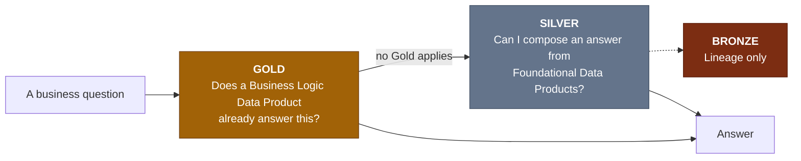
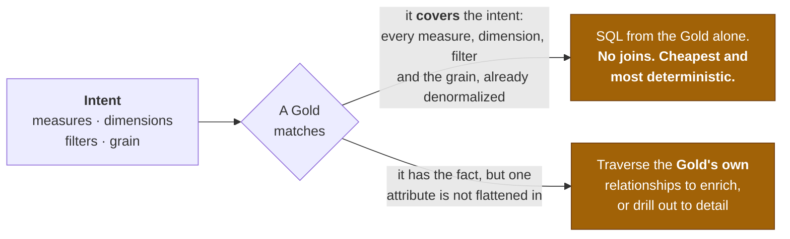
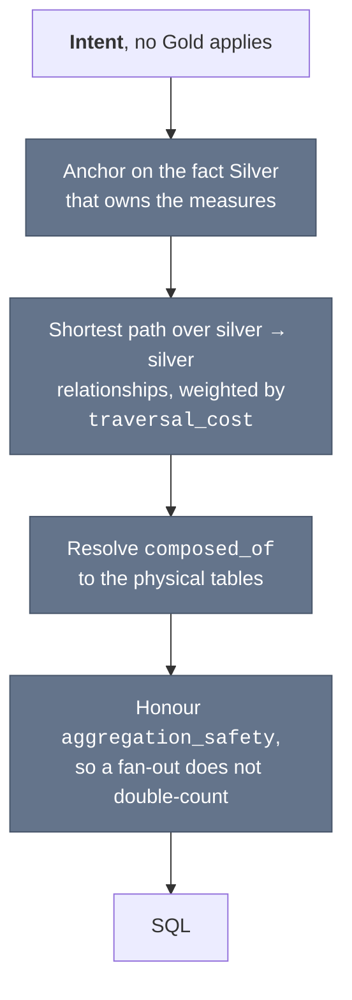

# Resolution Specification

> **Scope:** every layer • **Status:** v1 • **Part of:** [Onibex Agentic Semantic Knowledge Definition](../README.md)

How an agent picks which Data Products answer a question, and how it joins them. This is the
part of the contract that constrains the **resolver**, and through it the **author**: the rules
below are why relationships live where they live.

The three layers themselves are specified in [Gold](GOLD_LAYER.md), [Silver](SILVER_LAYER.md)
and [Bronze](BRONZE_LAYER.md).

## 1. Layer priority

A question is answered from the highest layer that can answer it.

The dotted edge is the one a resolver never takes: **Bronze is not an answer surface.**

**This is a priority, not a sequence of passes.** A resolver is free to search the whole catalog
at once and then rank what it found. What the contract fixes is the *outcome*: a Gold that
answers the question outranks a Silver that could compose one, and Bronze is not a candidate at
all. Expressing the priority as re-ranking rather than a layer-by-layer walk is what makes a
single retrieval pass sufficient.

### Why Bronze is skipped

A raw table like `VBAK` has no notion that `GBSTK='C'` means *closed*, that `VDATU` is the
*requested* delivery date rather than the actual one, or how it joins to `VBAP`. Giving an agent
Bronze leaks raw schema noise and almost always produces wrong SQL.

Bronze exists to be **lineage** for Silver and Gold, so a business field can be traced back to
the physical column it came from. It is not the agent surface.

## 2. The two planes

That priority produces two resolution planes. Knowing which one a question lands in is what
makes the authoring rules make sense.

### 2.1 The Gold plane

Reached when a Gold Data Product matches the intent. Two outcomes, and the first is the one the
layer exists for.

### 2.2 The Silver plane

Reached only when no Gold applies. The resolver composes the answer from Foundational Data
Products.

## 3. What this binds the author to

Two consequences follow, and they are the reason the layer specifications read as they do.

**The Silver plane must be self-sufficient.** A Silver fact has to reach its dimensions through
*its own* `relationships`. Strip those and the fallback has no graph to walk. That is why
relationships are declared on Silver and not only on Gold, and why
[SILVER_LAYER.md §5.6](SILVER_LAYER.md#56-declare-relationships-generously) tells you to
declare them generously.

**The two planes are parallel, not layered.** On fallback the resolver uses the *Silver's*
relationships, never a Gold's. The Gold was not selected, and its join keys differ. Gold
relationships exist only to enrich a non-flattened attribute or to drill down to detail.

Which plane is used is decided by retrieval priority, not by which Data Products happen to carry
edges. **Declaring relationships on Silver does not weaken the preference for Gold.**

## 4. What a conforming resolver has to do

- Rank Gold above Silver for the same question, however it retrieves.
- Never place Bronze in the context it generates SQL from.
- Compute the join path from declared relationships rather than inferring one, weighting by
  `traversal_cost` where more than one path exists.
- Respect `aggregation_safety` and `requires_dedup` on every edge it traverses, so a
  many-to-many fan-out does not double-count a measure.
- Scope the catalog it searches. The contract does not say how; it says an answer must not
  reach a Data Product the question was not entitled to.

The specification does not name an algorithm. Shortest-path over the declared graph is the
obvious reading, and it is what the
[Onibex Agentic Semantic Knowledge Platform](../../platform/README.md) does, but a resolver that
reaches the same outcome by other means conforms.

---

[← Back to the ASK specification](../README.md) · [The layer specifications](README.md)
