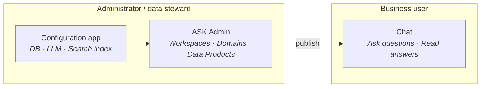
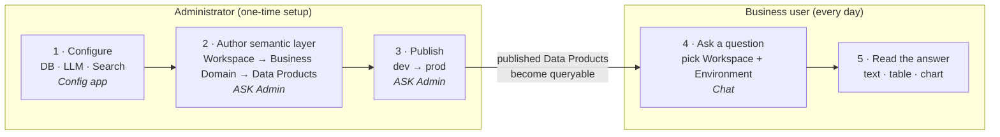
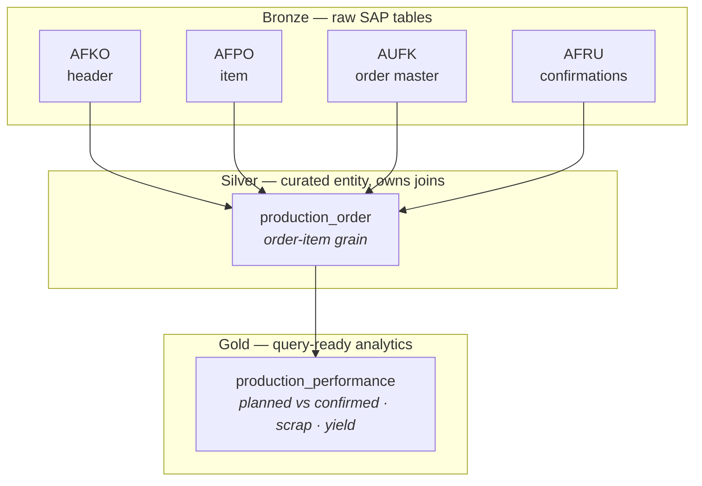
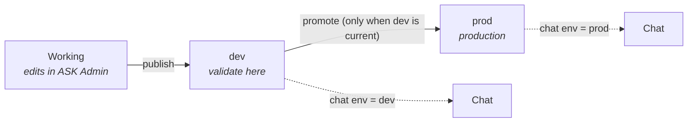
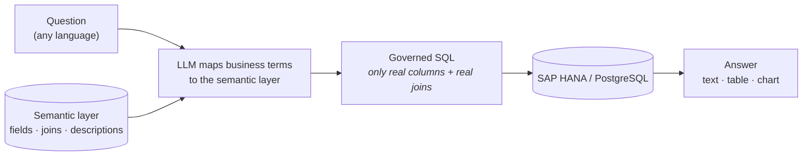
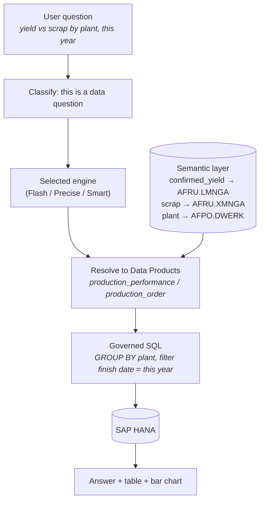

# Concepts & Architecture

> **The mental model for the whole platform.** Read this once and the rest of the manual
> falls into place: the three surfaces you work in, the two roles that use them, how the
> **semantic layer** is organized, why the SQL is **governed**, and how the three chat
> engines differ.

| | |
|---|---|
| **Who** | Everyone — administrators, data stewards, and business users. |
| **Time** | ~8 minutes to read. |
| **Prerequisites** | None. This is the orientation page; no login required. |
| **You'll end with** | A clear picture of how a natural-language question becomes a governed SQL answer, and where each task in this manual fits. |

**Where this fits:** **Concepts (you are here)** → Configure → Author → Publish → Ask

> The screenshots and sample values below use an illustrative **SAP Production Planning** example (Production Orders). Substitute your own Data Products — the exact demo names and questions won't exist in your system.

---

## Concepts (30-second version)

- The platform turns a **natural-language question** into **governed SQL** over your SAP
  data, runs it, and returns a written answer plus a table and an automatic chart.
- **Governed** is the key word: the agent never invents column names or guesses at joins.
  It can only use the **Data Products** an administrator has defined and published.
- Preparing that governed layer is a one-time (and occasional) **administrator** job.
  Asking questions is the everyday **business-user** job.
- Nothing is answerable until a business domain is **published** to the environment the
  chat is querying (`dev` or `prod`). This is the single most common source of empty
  answers.

---

## 1. Three surfaces, two roles

The platform is three applications, used by two kinds of people.

| Surface | Who uses it | What it's for |
|---|---|---|
| **ASK Admin** | Administrator / data steward | Author and publish the **semantic layer**: workspaces, business domains, Data Products. |
| **Configuration app** | Administrator | Technical setup: database connection, LLM/embeddings provider, search index. |
| **Chat** | Business user | Ask questions in natural language and read the answers. |

The two roles map cleanly onto the surfaces:

- The **administrator** (or data steward) works in the **Configuration app** and **ASK
  Admin**. They connect the database, pick the model provider, model the SAP tables into
  business entities, and publish them.
- The **business user** works only in the **Chat**. They pick a workspace, ask a question
  in plain language, and read the answer — no SQL, no schema knowledge required.



> **Tip —** If you are here to *ask questions*, you only need the Chat. The rest of this
> page explains what an administrator set up on your behalf so you understand why an answer
> looks the way it does.

---

## 2. The journey at a glance

A question can only be answered once an administrator has (1) **configured** the system,
(2) **authored** a semantic layer, and (3) **published** it to the environment the user
queries. The diagram below is the full path from an empty platform to a first answer.



> **Warning — the dependency that trips people up.** The chat only sees Data Products that
> have been **published to the environment it is querying** (`dev` or `prod`). If nothing is
> published, the user gets empty answers even though the platform is otherwise working.
> Always publish before asking.

---

## 3. The semantic layer

The **semantic layer** is the curated description of your data in business terms. It is what
makes answers governed and reproducible. It has two dimensions: a **hierarchy** (how things
are organized) and **layers** (the medallion Bronze / Silver / Gold model).

### 3.1 Hierarchy: Workspace → Business Domain → Data Product

```
Workspace  ─►  Business Domain  ─►  Data Products (Bronze / Silver / Gold)
```

| Level | What it is | Demo example |
|---|---|---|
| **Workspace** | The top-level container the chat scopes to. It backs a deployment (`dev` / `prod`). | *Manufacturing Operations* |
| **Business Domain** | A group of Data Products that answer a related business question. The same Data Product can be reused across several domains. | *Production Orders* |
| **Data Product** | One entity definition (a YAML): its fields, roles, relationships, and descriptions. | `production_order`, `production_performance` |

You create workspaces and domains in
[ASK Admin · Workspaces & Business Domains](ask-admin/01-workspaces-domains.md), and Data
Products in [ASK Admin · Add Data Products](ask-admin/02-add-data-products.md).

### 3.2 The three layers (Bronze / Silver / Gold)

Every Data Product sits in a **layer**. The layers form a medallion model — raw at the
bottom, analytics-ready at the top.

| Layer | What it is | Demo example |
|---|---|---|
| **Bronze** | A raw source table — columns and keys, **no join logic**. | `afko_order_header` (AFKO), `afpo_order_item` (AFPO), `aufk_order_master` (AUFK), `afru_order_confirmation` (AFRU) |
| **Silver** | A curated business entity that **owns the join topology** — how tables connect. This is the single source of truth for joins. | `production_order` (AFKO + AFPO + AUFK + AFRU, at order-item grain) |
| **Gold** | A denormalized analytics table you can query directly, with dimensions flattened in as columns. | `production_performance` (planned vs confirmed, scrap/yield by plant / order type / material / month) |



Two rules from the [ASK specification](../definition/README.md) are worth
knowing even at the concept level, because they explain how the agent chooses what to query:

- **Silver owns the joins.** A Silver fact must be able to reach its dimensions through *its
  own* relationships. This "Silver plane" is the fallback the agent uses when no Gold covers
  a question.
- **The agent resolves gold-first.** If a Gold table already covers the metrics, dimensions
  and grain a question needs, the agent answers from that Gold alone — the cheapest, most
  deterministic path. Otherwise it falls back to the Silver plane and computes the joins.

### 3.3 Environments and publish (dev → prod)

Authoring changes are **not visible to the chat** until you **publish** them. Publishing is
**gated**: you publish to **dev** first, and can only promote to **prod** once dev is
current. This ensures nothing reaches production without first being validated in dev.



The chat's **environment** selector (`dev` / `prod`) decides which published snapshot the
user queries. A Data Product published only to `dev` is invisible when the chat is set to
`prod`. Publishing is covered in the ASK Admin publish flow; **History** lets you audit
changes per branch (working / dev / prod) and restore an earlier version.

---

## 4. Governed SQL: the LLM is a compiler, not an inventor

The whole point of the semantic layer is to make the language model **write** SQL, never
**invent** it. The [ASK specification](../definition/README.md) puts it plainly:
the layer exists "for one purpose: to let the agent build **deterministic SQL**."

Three consequences follow, and they are why answers are trustworthy:

1. **Every field maps to a real, selectable column.** The `source` of a field is a physical
   `TABLE.COLUMN` (for example `production_order.confirmed_yield` → `AFRU.LMNGA`).
2. **Every relationship is a real JOIN.** Relationships are not documentation — they are the
   exact join predicates the agent is allowed to emit.
3. **The agent maps your words to the layer; it does not go beyond it.** If a term isn't in
   the layer (or the semantic dictionary), the agent asks for clarification rather than
   guessing a column.



Field **descriptions** and **synonyms** are what let the agent map a user's words to the
right column — for example mapping "good output" or "yield" to `AFRU.LMNGA`. Good
descriptions therefore directly improve answer quality; see the
[ASK specification](../definition/README.md) for the authoring rules.

---

## 5. The three chat engines (Flash / Precise / Smart)

For data questions, the chat offers three engines that trade **speed**, **cost**, and
**rigor** differently. They all return the same shape of answer (SQL + rows + written
answer + chart); they differ in *how* they decide which tables and joins to use.

- **Flash** — one LLM call. Searches your schema as free-text chunks and writes SQL in a
  single shot. No plan, no deterministic join planning, no scope validation. Fastest and
  cheapest; least rigorous.
- **Precise** — the most reproducible engine. It extracts a plan, ranks Data Products
  **deterministically** (hybrid search + medallion re-ranking), picks optimal joins with
  Dijkstra over the relationship graph, and validates that the SQL only touches allowed
  tables (with one retry if not). Highest rigor; highest cost and latency.
- **Smart** — the balanced default. It shows the LLM a compact **catalog** of your Data
  Products, lets the LLM pick the relevant ones, then resolves the joins **deterministically**
  through the same relationship graph (Dijkstra). Efficient and production-grade.

### 5.1 Comparison

| | **Flash** | **Precise** | **Smart** |
|---|---|---|---|
| **In plain English** | Fastest — one-shot SQL from schema text. | Most rigorous and reproducible. | Balanced, production-grade default. |
| **LLM calls per query** | 1 | 3 | 2 |
| **Schema source** | Free-text RAG chunks | Structured Data Products | Structured Data Products |
| **How Data Products are chosen** | Chunk similarity (approximate) | Hybrid search + medallion re-ranking (deterministic) | LLM picks from a compact catalog |
| **How joins are planned** | LLM guesses from schema text | Dijkstra over the relationship graph | Dijkstra over the relationship graph |
| **Scope validation** | None | Post-SQL audit + one retry | None (but catalog-scoped) |
| **Speed (approx.)** | ~15–20 s | ~60 s | ~40 s |
| **Rigor / reproducibility** | Low | High | Medium |
| **Best for** | Quick, exploratory questions; well-indexed data. | Audit, compliance, "explain exactly which table and join." | Everyday use and high volume. |

*Speed and cost figures are observational estimates for the Flash, Precise and Smart engines;
they vary with your model provider and question complexity.*

> **Tip —** If you are unsure which engine to pick, start with **Smart**. Switch to
> **Precise** when an answer looks off and you want a rigorously validated, reproducible
> result; use **Flash** for quick exploration where latency matters more than guarantees.

### 5.2 What they share

All three engines share the same downstream contract, which is what makes them
interchangeable from the chat's point of view:

- They target the **same database** (SAP HANA or PostgreSQL) and the same published
  environment (`dev` / `prod`).
- They emit **governed SQL** constrained by the semantic layer — none of them invents
  columns.
- They return the same response shape: generated **SQL**, a **results table**, a written
  **answer**, and an **automatic chart** when the result has more than one row.

The deeper difference is *where determinism lives*. Precise makes the **selection** of Data
Products deterministic (a pure ranking function); Smart makes the **join planning**
deterministic while letting the LLM do the selection; Flash leaves both to the LLM in a
single call. Precise and Smart both plan joins deterministically over the relationship graph;
Flash does not.

---

## 6. Putting it together: a demo question

With the *Production Orders* domain published to **dev**, a business user asks:

> *"What is the total confirmed yield versus scrap quantity by plant for production orders
> finished this year?"*

Here is what happens, end to end:



- The question is classified as a **data question**.
- The chosen engine resolves it to the relevant Data Products (the Gold
  `production_performance` if it covers the question, otherwise the Silver
  `production_order` with its joins).
- Business terms map to real columns — "confirmed yield" → `AFRU.LMNGA`, "scrap" →
  `AFRU.XMNGA`, "plant" → `AFPO.DWERK`.
- The agent emits governed SQL (a grouped aggregate by plant, filtered to this year),
  executes it against the database, and returns a written answer, a results table, and —
  because the result has multiple rows — an automatic bar chart.

---

## What's next

→ **[ASK Admin · Workspaces & Business Domains](ask-admin/01-workspaces-domains.md)** —
create the containers your data lives in.
→ **[ASK Admin · Add Data Products](ask-admin/02-add-data-products.md)** — create the
entities the agent maps questions to.
→ **[ASK specification](../definition/README.md)** — the Bronze / Silver / Gold layer definitions and the
authoring rules behind governed SQL.
→ **Engine behavior** — summarized in section 5 above; deeper internals are maintained by the
platform team.
