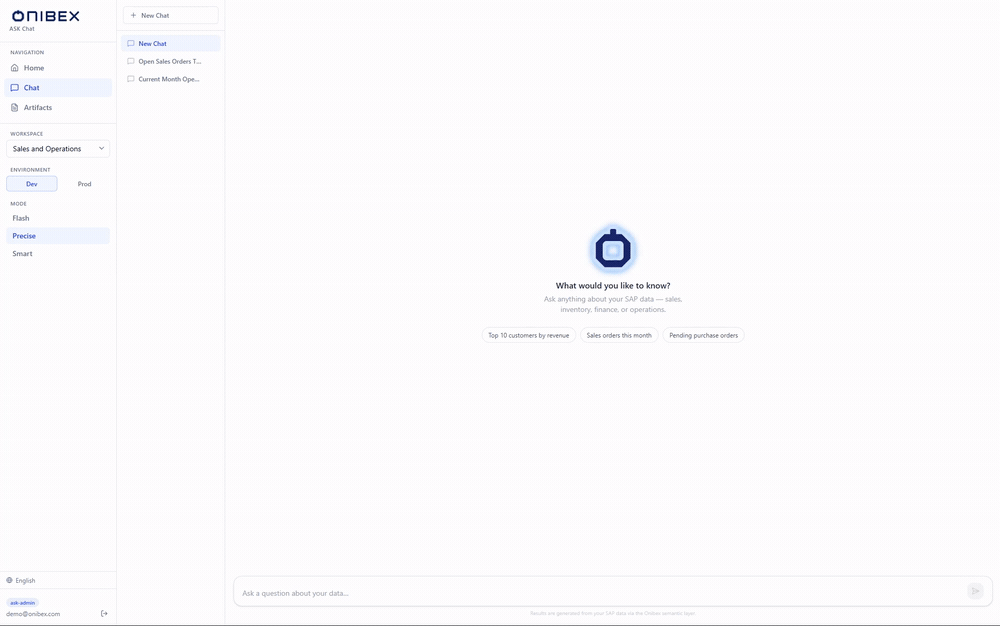

# Onibex Agentic Semantic Knowledge Platform

> Turn a question in plain language into **governed SQL** over the data you already have,
> compiled from a semantic layer your own people author.

**"Based on open sales orders for material ID TG12, do we have enough stock to cover that
demand?"**

The platform resolves your business terms against a curated
**[semantic layer](../definition/README.md)**, computes the join path deterministically,
compiles SQL in your database's own dialect, runs it, and returns a written answer with a table,
an automatic chart and the query behind it.

The agent never invents a column or guesses a join. It can only use Data Products an author has
defined and **published**. That is what makes an answer reproducible, and what makes it
auditable when someone asks where a number came from.



> **New here?** [Getting Started](docs/GETTING_STARTED.md) takes you from an empty machine to a
> real answer in about 45 minutes, and makes every choice for you along the way.

← [Repository overview](../README.md) · 📖 **[The complete manual](docs/README.md)**

---

## The surfaces

| | For | What you do there |
|---|---|---|
| 🟣 **[ASK Studio](docs/ask-studio/README.md)** | Data stewards and analysts | Author the semantic layer: workspaces, business domains, and the [Data Products](../definition/README.md) the contract defines. Import from DDL or SAP metadata, enrich with AI, publish dev to prod |
| 🔵 **[ASK Chat](docs/ask-chat/README.md)** | Business users | Ask in any language. Get the answer, the sources, the SQL and a per-request token breakdown |

**Before either does anything, [ASK Setup](docs/ask-setup/README.md) has to hold a database
connection and a model provider.** It is the platform's precondition rather than a third
product: whoever owns the infrastructure fills it in once, and the people who author and ask
never open it. Signing in to any of the three is [Sign in to ASK](docs/guides/sign-in.md).

## Quick start

`docker-compose.yml` lives in this directory, so everything runs from here:

```bash
cp .env.example .env
docker compose up -d
```

First boot builds the images and bootstraps OpenSearch, so give it a few minutes. Two variables
in `.env` have to be set before that command gets you anywhere. Then open **ASK Setup** on
`http://localhost:5175`, because nothing answers until it is filled in.

[Install and run the platform](docs/01-installation.md) has those two variables, the startup
order, every port, the health checks and what to do when a service will not start.

## What is in this directory

| | |
|---|---|
| `docker-compose.yml` | The whole stack, one command. Local and server deploys differ only in `.env` |
| [`ask-setup-spa/`](ask-setup-spa/README.md) · [`ask-studio-spa/`](ask-studio-spa/README.md) · [`ask-chat-spa/`](ask-chat-spa/README.md) | The three React SPAs, each served by its own Nginx |
| [`packages/`](packages/README.md) | The backend: typed Python packages with boundaries the build enforces |
| [`services/`](services/README.md) | Runtime services that are not Python packages, currently the MCP server for SAP write operations |
| [`docs/`](docs/README.md) | The manual |
| `design/` | The one authored copy of the design tokens, synced into all three SPAs |
| `tests/` | Boundary, end-to-end and benchmark suites |

## Documentation

**[The manual](docs/README.md)** is the index: every page, grouped by what you are trying to
do. Three pages carry most of the load, and the rest are reached from there.

| | |
|---|---|
| [Getting Started](docs/GETTING_STARTED.md) | One guided path, an empty machine to a real answer |
| [Install and run the platform](docs/01-installation.md) | Every variable, the startup order, the gotchas |
| [Concepts and architecture](docs/02-concepts.md) | The mental model, with diagrams |

The normative Bronze / Silver / Gold rules are not here. They are the
[ASK specification](../definition/README.md), a separate track of this repository with its own
licence and its own version policy: the [layer specifications](../definition/docs/README.md) fix
what a Data Product may declare, and [Resolution](../definition/docs/RESOLUTION.md) fixes how an
agent picks between them. Where this manual and that contract disagree, the contract wins.

## Technology

- **Orchestration:** LangGraph. Intent resolution → SQL generation → execution, with three
  engines that differ in what they compute rather than guess. Which is which:
  [The three chat engines](docs/explain/engines.md).
- **LLM and embeddings:** pluggable. SAP AI Core for managed models, or any LiteLLM provider
  (Anthropic, OpenAI, AWS Bedrock, Databricks and others), chosen in ASK Setup.
- **Semantic search:** OpenSearch, hybrid kNN + BM25 with reciprocal rank fusion.
- **Target databases:** SAP HANA, PostgreSQL, Snowflake, Databricks, Google BigQuery,
  ClickHouse, Microsoft SQL Server, Microsoft Fabric, IBM Db2 and Presto. Each has its own SQL
  generator and its own execution adapter, not a generic fallback. Which drivers ship in your
  image is one build variable, `EXECUTOR_EXTRAS`.
- **Backend:** typed Python packages with enforced boundaries. See
  [`packages/`](packages/README.md).
- **Frontends:** three React SPAs served by Nginx.
- **Ways in other than the browser:** an `/external/ask` API for agent runtimes such as watsonx
  Orchestrate, n8n and Zapier, with its own OpenAPI document and its own credentials; a
  Microsoft Teams bridge onto it; and an [MCP server](services/ask-mcp-server/README.md) for
  SAP write operations. The last two sit behind the `extras` Compose profile: a bare
  `docker compose up -d` skips them, and `docker compose --profile extras up -d` starts them.

## License

The Onibex Agentic Semantic Knowledge Platform is source-available and dual-licensed. See
[`LICENSE.md`](LICENSE.md): **PolyForm Strict License 1.0.0** (noncommercial use, research,
evaluation, and personal study, indefinitely) or **PolyForm Free Trial License 1.0.0**
(evaluate for your business for up to 32 consecutive calendar days, for example via
`docker compose up`), at your option. Production or any other commercial use requires a
commercial license from [Onibex](https://onibex.com). See
[`../COMMERCIAL-LICENSE.md`](../COMMERCIAL-LICENSE.md).

"Onibex", "ASK", and the Onibex logos are trademarks of Onibex, LLC and are excluded from the
license. This platform also references, without redistributing under this license, third-party
software including SAP HANA, SAP BTP, and SAP AI Core (trademarks of SAP SE), OpenSearch (a
registered trademark of Amazon Web Services), and Keycloak (a trademark of Red Hat, Inc.). See
[`../THIRD-PARTY-NOTICES.md`](../THIRD-PARTY-NOTICES.md).

## Support

Found something inaccurate or confusing in the documentation? That is a bug, and reporting it is
a contribution. [`SUPPORT.md`](../SUPPORT.md) says where each kind of question goes, and
[`CONTRIBUTING.md`](../CONTRIBUTING.md) how a change is reviewed. Vulnerabilities go through
[`SECURITY.md`](../SECURITY.md), never a public issue.
