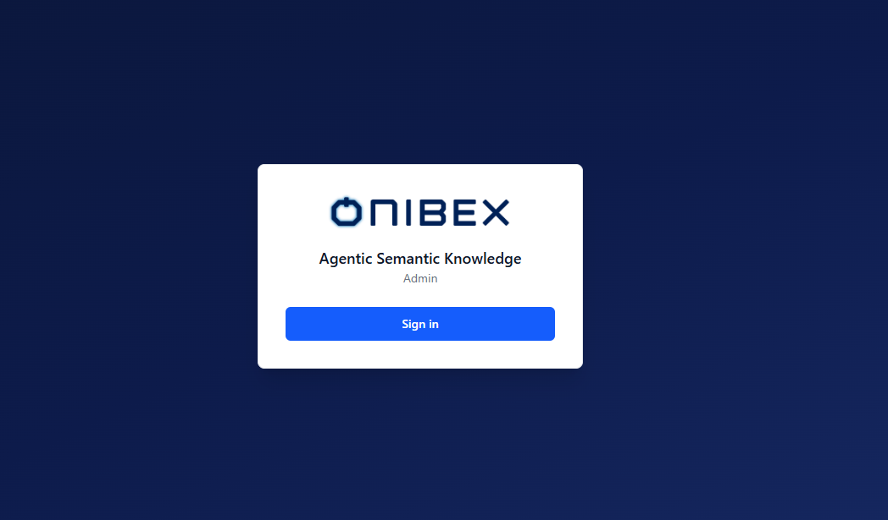
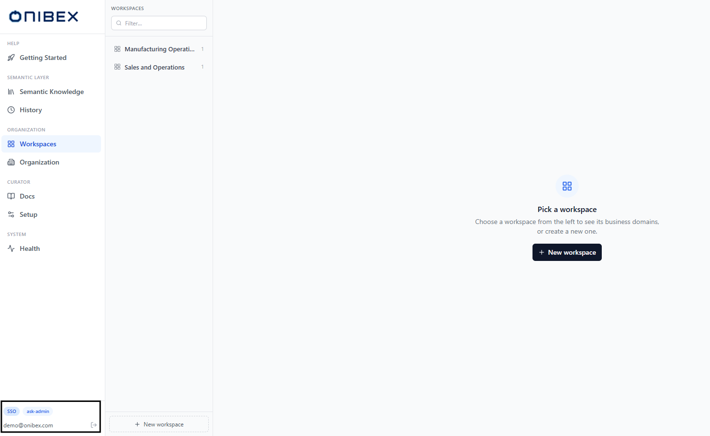
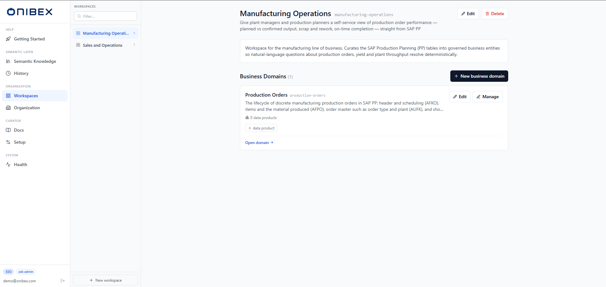

# ASK Admin · Overview & Navigation

> **Flow 0 of the ASK Admin manual — the map.** Get oriented in **ASK Admin**: how you
> sign in, what each sidebar section does, and which flow doc to open next. Every other
> flow (01–09) is reachable from here.

| | |
|---|---|
| **Who** | Administrator / data steward |
| **Time** | ~2 minutes to read |
| **Prerequisites** | The SPA is installed and reachable (see [Installation](../01-installation.md)). |
| **You'll end with** | A clear picture of the navigation and where every task lives. |

**Where this fits:** Configure → **Author — get oriented (you are here)** → Publish → Ask

> The screenshots and sample values below use an illustrative **SAP Production Planning** example (Production Orders). Substitute your own Data Products — the exact demo names and questions won't exist in your system.

---

## Concepts (30-second version)

- **ASK Admin** is the semantic-layer curator app. Its sign-in screen shows the title
  **Agentic Semantic Knowledge** with **Admin** on a subtitle line (short: **ASK Admin**).
  This is where you author and publish the business meaning the chat agent maps questions to.
- It is one of two admin surfaces. ASK Admin owns the **semantic layer** (workspaces,
  domains, Data Products). Technical/system configuration — database, providers, MCP —
  lives in the separate **ASK Setup** app (see [ASK Setup](../ask-setup/00-overview.md)).
- The whole platform follows one journey: **Configure → Author → Publish → Ask**. ASK Admin
  covers the **Author** and **Publish** steps.

---

## 1. Sign in

Open the app URL. If you're not already authenticated you land on the **sign-in** screen —
the Onibex logo above the title **Agentic Semantic Knowledge**, with **Admin** on the line beneath.

What you see depends on how the deployment is configured:

| Auth mode | Button label | What happens |
|---|---|---|
| **Keycloak (SSO)** | **Sign in** | Redirects to your identity provider, then back to the app. The usual on-prem / self-hosted production mode. |
| **SAP BTP (XSUAA)** | **Sign in** | Redirects to SAP BTP identity (IAS / XSUAA), then back. Used on SAP BTP deployments. |
| **Dev bypass** | **Continue without authentication** | Enters the app directly with no login — for local development only. |

After you're in, the auth mode is shown as a small chip in the sidebar footer (**SSO** for
Keycloak, **XSUAA** for SAP BTP, **Dev** for the bypass), next to your email and role.

> **Warning —** *Continue without authentication* only appears when the deployment is
> explicitly set to the dev-bypass mode. Never run production with the bypass enabled.

## 2. The navigation sidebar

Once signed in, the left sidebar is your permanent map. It's grouped into five labelled
sections; the current page is highlighted in Onibex blue.

| Section | Item | What the page does | Flow |
|---|---|---|---|
| **Help** | **Getting Started** | In-product launchpad: the Configure → Author → Publish → Ask journey with deep links into each page. | this overview |
| **Semantic Layer** | **Semantic Knowledge** | The global catalog of all Data Products, with status filters and the **New data product** button. | [Flow 2 · Add Data Products](02-add-data-products.md) |
| **Semantic Layer** | **History** | Version history of the semantic layer, viewable per branch (working / dev / prod). | [Flow 6 · History](06-history.md) |
| **Organization** | **Workspaces** | Create and manage workspaces and the business domains inside them; the app's landing page. | [Flow 1 · Workspaces & Business Domains](01-workspaces-domains.md) |
| **Organization** | **Organization** | Your organization profile (company name, source system) that pre-fills authoring defaults. | [Flow 8 · Organization](08-organization.md) |
| **Curator** | **Docs** | Manage the documentation corpus the agent uses to answer DOCS-type questions. | [Flow 9 · Providers & Docs](09-providers-docs.md) |
| **Curator** | **Setup** | Curator-side setup for the semantic-layer workflow. | [Flow 9 · Providers & Docs](09-providers-docs.md) |
| **System** | **Health** | Service health check for the platform's backing services. | [Flow 9 · Providers & Docs](09-providers-docs.md) |

> **Tip —** The sidebar footer always shows the **auth chip**, your **email**, your **role**,
> and a **sign-out** button. Use the sign-out button (the door icon) to end your session.

## 3. The page chrome (PageHeader)

Most tool pages share the same header bar at the top of the content area — a tinted, rounded
icon, a **title**, an optional one-line **subtitle**, and an optional actions area pinned to
the right (for buttons like **New data product**). Reading that header tells you at a glance
which page you're on and what actions it offers.

## 4. The landing page (Workspaces)

Signing in takes you to **Workspaces** — the app's home. It's a split screen: a **rail** of
all workspaces on the left and the selected workspace's business domains on the right. This is
where the authoring journey begins.

From here, follow the flows in order:

1. [Flow 1 · Workspaces & Business Domains](01-workspaces-domains.md) — create the containers.
2. [Flow 2 · Add Data Products](02-add-data-products.md) — create the entities.
3. [Flow 3 · Edit & Enrich](03-edit-enrich.md) — refine fields and descriptions.
4. [Flow 5 · Publish & Deploy](05-publish-deploy.md) — make it queryable in the chat.

---

## What's next

→ **[Flow 1 · Workspaces & Business Domains](01-workspaces-domains.md)** — start authoring:
create a workspace and its first business domain.
