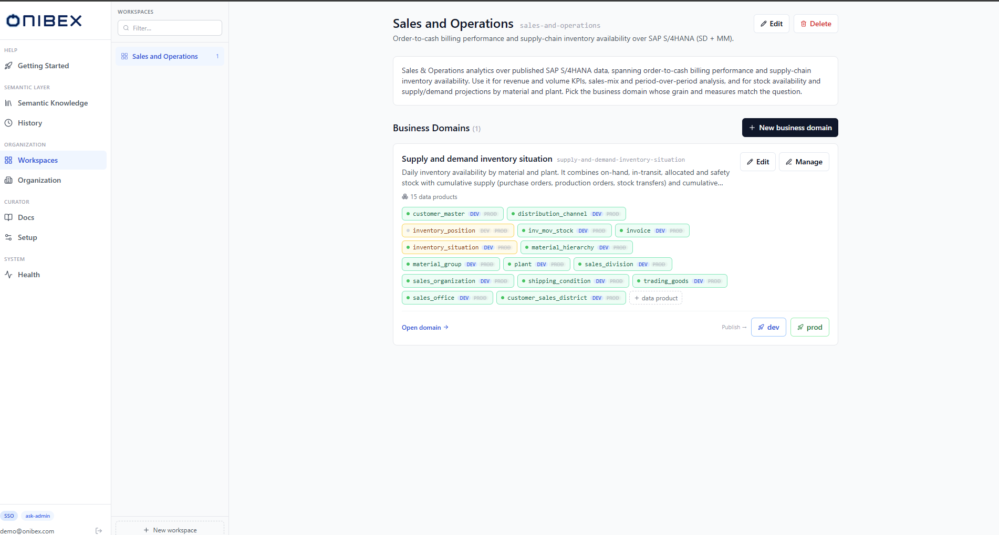
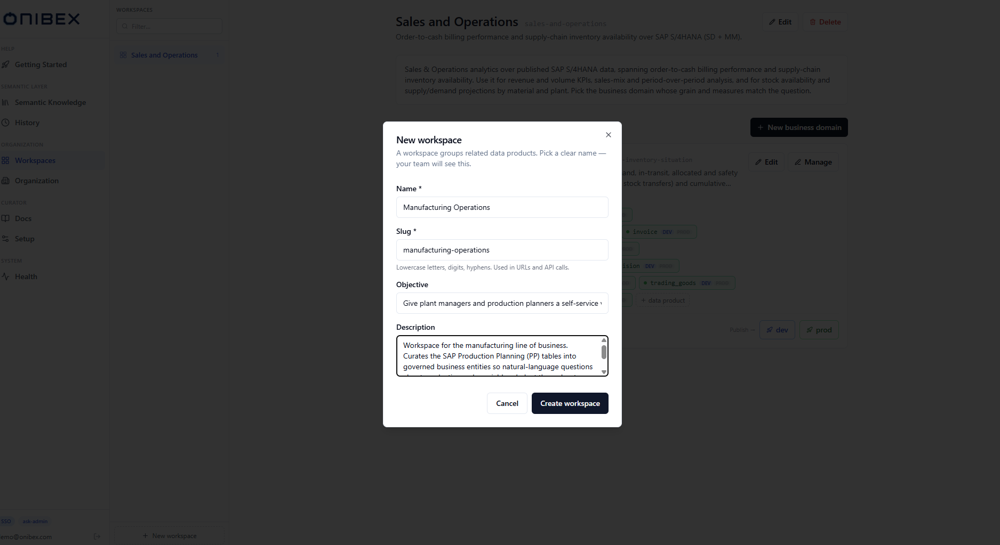
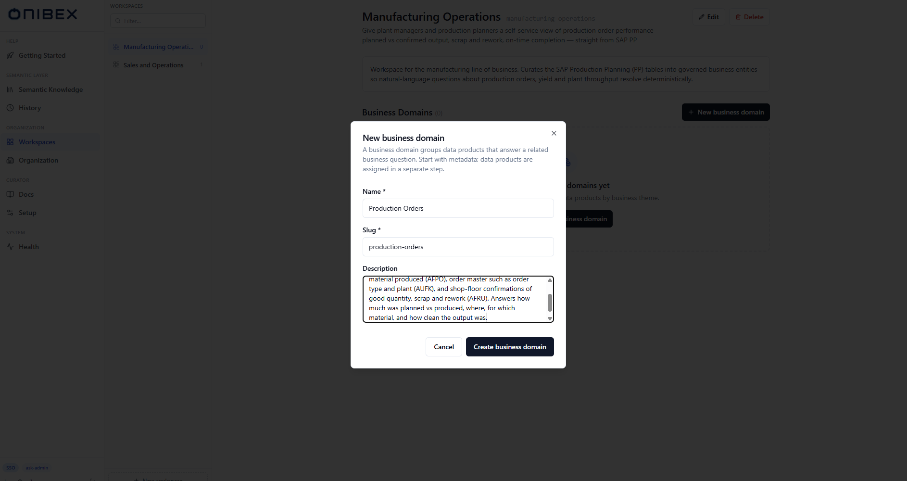
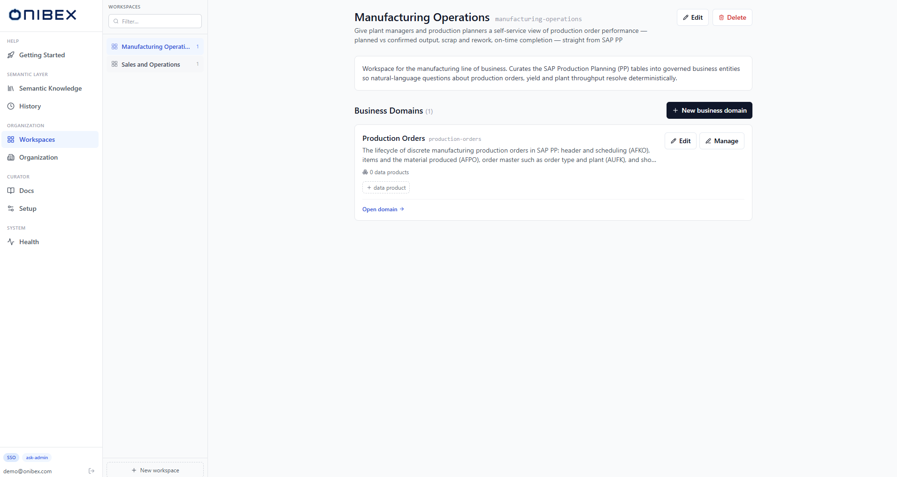
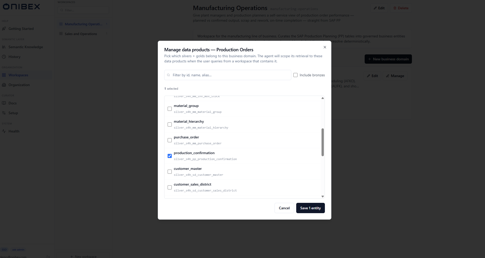

# ASK Admin · Workspaces & Business Domains

> **Flow 1 of the ASK Admin manual.** Create the containers your data lives in — a
> **Workspace** and the **Business Domains** inside it — and assign Data Products to a domain.

| | |
|---|---|
| **Who** | Administrator / data steward |
| **Time** | ~3 minutes |
| **Prerequisites** | You can sign in to **ASK Admin** (see [Installation](../01-installation.md)). |
| **You'll end with** | A workspace containing at least one business domain, ready to hold Data Products. |

**Where this fits:** Configure → **Author — containers (you are here)** → Add Data Products → Publish → Ask

> The screenshots and sample values below use an illustrative **SAP Production Planning** example (Production Orders). Substitute your own Data Products — the exact demo names and questions won't exist in your system.

---

## Concepts (30-second version)

- A **Workspace** is the top-level container the chat scopes to — it backs a deployment
  (`dev` / `prod`). Think "Manufacturing Operations".
- A **Business Domain** is a group of Data Products inside a workspace that answer a related
  business question — e.g. "Production Orders". The same Data Product can be reused in several
  domains.
- A **Data Product** is one entity definition (a Bronze/Silver/Gold YAML). You create those
  in [Flow 2 · Add Data Products](02-add-data-products.md); here you just organize them.

---

## 1. Open Workspaces

In the left sidebar, under **Organization**, click **Workspaces**. The screen is split: a
**rail** of all workspaces on the left, and the selected workspace's detail on the right.

If no workspace is selected yet you'll see a **Pick a workspace** empty state with a
**New workspace** button.

## 2. Create a Workspace

Click **New workspace** (in the rail header, or on the empty state). Fill the dialog:

| Field | Required | Notes |
|---|---|---|
| **Name** | Yes | What your team sees, e.g. *Manufacturing Operations*. |
| **Slug** | Yes | Auto-derived from the name. Lowercase letters, digits, hyphens. **Used in URLs and API calls** — pick well, it identifies the workspace. |
| **Objective** | No | One-line summary shown under the workspace title. |
| **Description** | No | Longer context (optional). |

Click **Create workspace**. You're taken straight into the new workspace.

> **Tip — the slug is the identity.** It appears in the URL (`/workspaces/<slug>`) and in
> API calls. The server enforces uniqueness and rejects reserved words with a clear message.

## 3. Create a Business Domain

Inside the workspace, find the **Business Domains** section and click **New business domain**.

| Field | Required | Notes |
|---|---|---|
| **Name** | Yes | e.g. *Production Orders*. |
| **Slug** | Yes | Auto-derived; used in the domain URL. |
| **Description** | No | One paragraph — **this is fed into the agent's prompt context**, so describe what the domain covers in business terms. |

Click **Create business domain**. The new domain appears as a card in the workspace.

Each card shows the domain's Data Products as **chips** (colour = layer, dot = lifecycle
status), a count, and actions: **Open domain** (the canvas), **Edit**, **Manage**, and
**Publish → dev / prod**.

## 4. Assign Data Products to the domain

A new domain is empty. To fill it you assign **existing** Data Products (create them first in
[Flow 2](02-add-data-products.md)).

Click **Manage** on the domain card (or the dashed **+ data product** button). In the dialog,
search the catalog and select the Data Products this domain should expose, then confirm.

The chosen Data Products now appear as chips on the card. A chip marked **reused** belongs to
more than one domain — that's expected and encouraged.

> **Order of operations.** You can create the workspace and domain first and assign Data
> Products later. Nothing is queryable until the domain is **published** — see
> [Flow 5 · Publish & Deploy](05-publish-deploy.md).

## Editing & deleting

- **Edit** (on the workspace header or a domain card) changes name / slug / description.
  Changing a slug updates its URL.
- **Delete** a workspace removes it and its business domains. **Your entity YAMLs are not
  touched** — they stay in the semantic-layer repo on disk; only the grouping is removed.

---

## What's next

→ **[Flow 2 · Add Data Products](02-add-data-products.md)** — create the entities that fill
your domains (Manual / Upload YAML / DDL + AI / From OneConnect).
