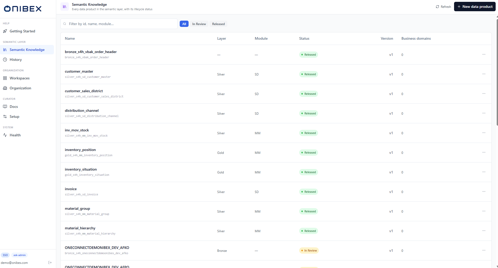
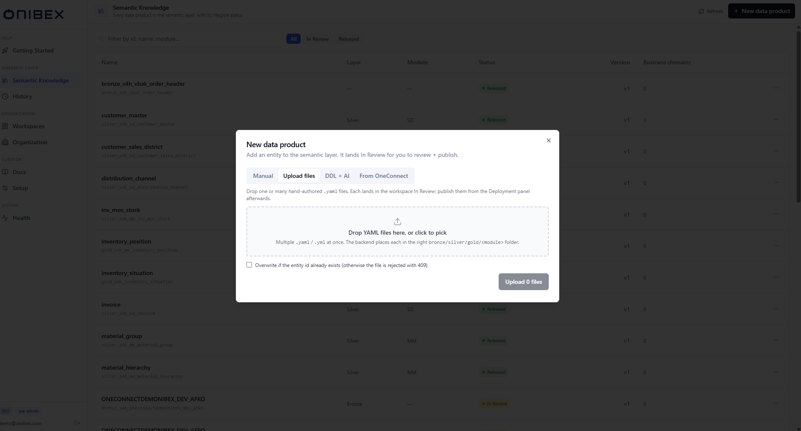
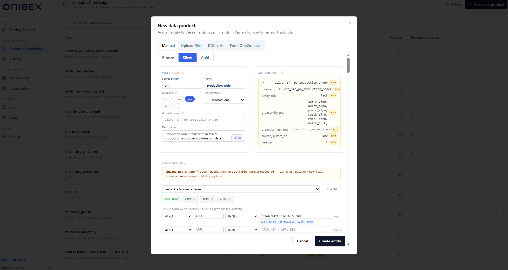
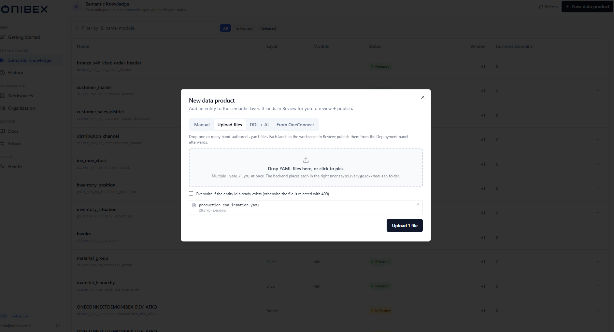
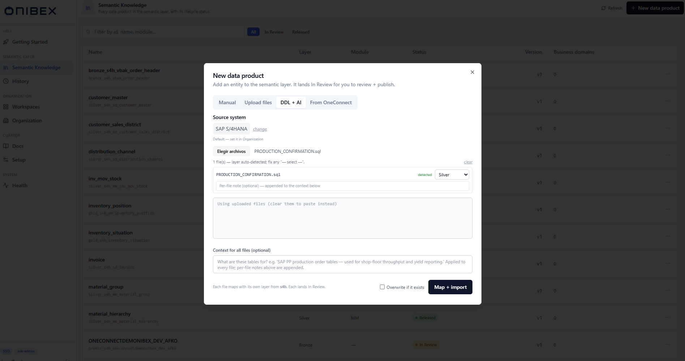
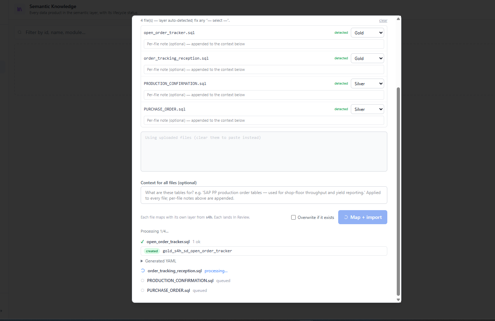
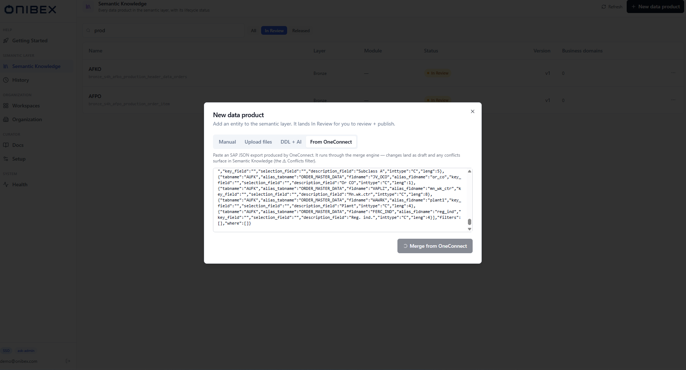
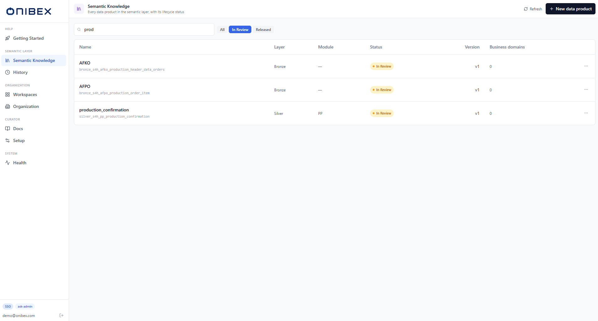

# ASK Admin · Add Data Products

> **Flow 2 of the ASK Admin manual.** Create the entities that make up your semantic layer —
> the **Data Products** the agent maps questions to. There are **four ways** to add one;
> this page covers when to use each and how.

| | |
|---|---|
| **Who** | Administrator / data steward |
| **Time** | 2–10 minutes depending on the mode |
| **Prerequisites** | Signed in to **ASK Admin**; a provider configured (see [ASK Setup](../ask-setup/00-overview.md)) for the AI-assisted modes. |
| **You'll end with** | One or more Data Products in **In Review** status, ready to edit, organize, and publish. |

**Where this fits:** Configure → **Author — Data Products (you are here)** → Organize → Publish → Ask

> The screenshots and sample values below use an illustrative **SAP Production Planning** example (Production Orders). Substitute your own Data Products — the exact demo names and questions won't exist in your system.

---

## What's a Data Product, and the three layers

A **Data Product** is one entity definition (a YAML). Every Data Product sits in a **layer**:

| Layer | What it is | You typically create it by… |
|---|---|---|
| **Bronze** | A raw source table — columns and keys, no join logic. | DDL + AI, OneConnect, Upload |
| **Silver** | A curated business entity that **owns the join topology** (how tables connect). | Manual, Upload, OneConnect |
| **Gold** | A denormalized analytics table you can query directly. | Manual, DDL + AI, Upload |

Don't worry about getting every field perfect on creation — everything lands **In Review** so
you can refine it in [Flow 3 · Edit & Enrich](03-edit-enrich.md) before publishing.

---

## Open the create dialog

Go to the sidebar → **Semantic Layer** → **Semantic Knowledge**. This is the global catalog of
all Data Products. Click **New data product** (top-right).

The dialog opens with four tabs:

> Whatever mode you choose, the result lands **In Review**. After creating, the catalog
> auto-filters to **In Review** so you see your new Data Product in the review queue.

---

## Mode A — Manual

**Use when:** you're authoring from scratch and want full control, or defining a Silver/Gold
by hand.

Pick the **Manual** tab. Fill the structured form: header (layer, name, description, source
system), then **fields** (name, type, role, alias), and optionally **relationships** (joins).

Field roles and authoring rules are covered in
[Flow 3 · Edit & Enrich](03-edit-enrich.md) and the
[ASK specification](../../definition/README.md) (Bronze / Silver / Gold layer definitions).

## Mode B — Upload files

**Use when:** you already have hand-authored ASK YAML files.

Pick **Upload files** (the default tab) and drop one or many `.yaml` files. Each is imported
into the workspace **In Review**; publish them later from the Deployment panel.

## Mode C — DDL + AI

**Use when:** you have SQL DDL and want the AI to map it into ASK YAML for you.

The importer is **dialect-tolerant across all nine supported engines** (PostgreSQL, SAP HANA,
ClickHouse, IBM Db2, Snowflake, Databricks, BigQuery, SQL Server, Microsoft
Fabric) and accepts **`CREATE TABLE`, `CREATE VIEW`, and `CREATE MATERIALIZED VIEW`**, as well
as Snowflake **`DYNAMIC` / `TRANSIENT` / `ICEBERG`** tables. It can map **Silver and Gold**
entities too — not just Bronze — with guardrails: it will not fabricate joins from a bare
`CREATE TABLE`, and it never guesses a layer (see the note below).

Pick **DDL + AI**, then:

1. **Source system** — defaults from your [Organization](08-organization.md) profile (e.g.
   `s4h`). Click **change** to override with another profile; this tunes the AI prompt.
2. **Provide the DDL** — either:
   - **Upload `.sql` / `.ddl` / `.txt` files** (multiple allowed). The **layer is
     auto-detected per file** from the `CREATE TABLE` name (the `SILVER_` / `GOLD_` naming
     convention). Files that can't be detected show **pick layer** and you must choose
     **Bronze / Silver / Gold** before importing. Auto-detect only fires on that
     `CREATE TABLE` naming, so a pasted or uploaded **view** (or any other relation) always
     falls to a manual **pick layer**.
   - **…or paste a single DDL script** in the text box. If the layer can't be detected from
     the name, a **Layer** selector appears and is **required**.
3. **Context for all files (optional)** — a sentence about what these tables are for; it
   enriches the AI mapping. Per-file notes can be added too.
4. Optionally tick **Overwrite if it exists**.
5. Click **Map + import**.

Each source is processed in sequence with a **live progress list** (queued → processing →
done), showing how many items imported OK vs. failed, with an expandable **Generated YAML**
preview per file.

> **No silent assumptions.** The importer never guesses Bronze — if it can't detect a layer
> it blocks import until you pick one. If the AI returns malformed YAML it's surfaced as a
> per-file error so one bad file never hides the rest.

## Mode D — From OneConnect

**Use when:** you have a SAP metadata export produced by **OneConnect** (a JSON payload). The
platform runs it through the **merge engine**: new content is applied as a draft and any
differences against an existing Data Product surface as **conflicts** to resolve.

Pick **From OneConnect**, paste the SAP JSON, and click **Merge from OneConnect**.

The result summary shows the entity id, how many changes were **auto-applied**, and how many
**conflicts** need manual resolution. Resolve conflicts in
[Flow 7 · Conflicts & Merge](07-conflicts-merge.md) (the **Conflicts** filter in Semantic
Knowledge).

---

## After creating: the review queue

Whatever mode you used, your Data Product is now in **In Review**. The Semantic Knowledge
catalog filters to **In Review** so you can find it. From a row you can **Edit**, view
**History**, resolve **Conflicts**, or **Delete**.

---

## What's next

→ **[Flow 3 · Edit & Enrich](03-edit-enrich.md)** — refine fields, relationships, and let AI
improve descriptions and synonyms.
→ **[Flow 1 · Workspaces & Business Domains](01-workspaces-domains.md)** — assign this Data
Product to a domain.
→ **[Flow 5 · Publish & Deploy](05-publish-deploy.md)** — make it queryable in the chat.
