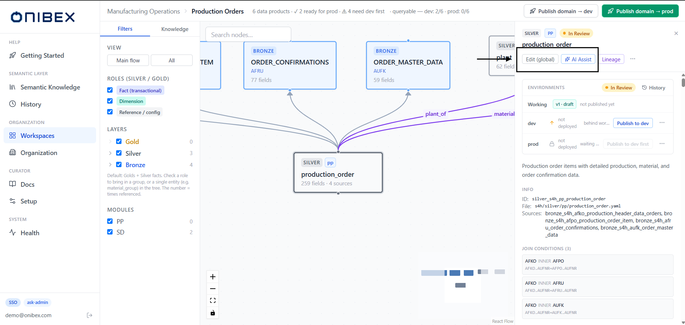
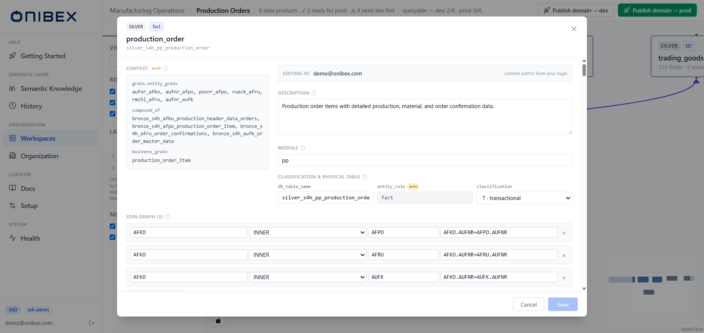
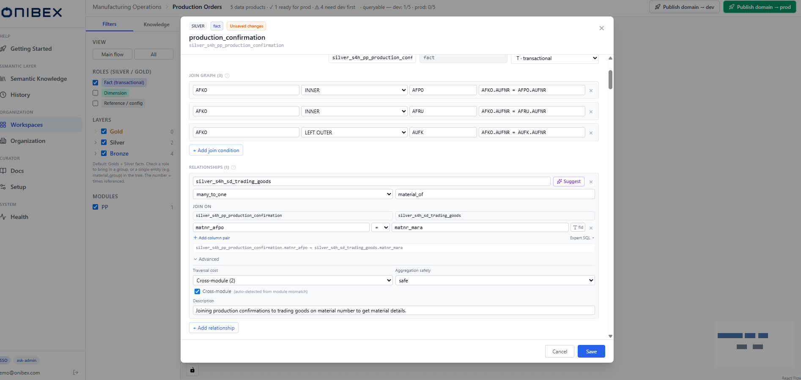
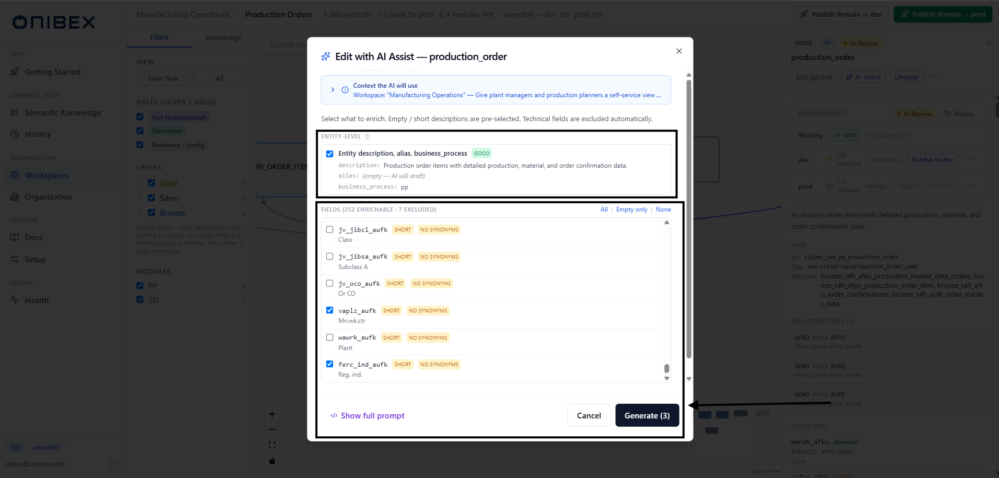
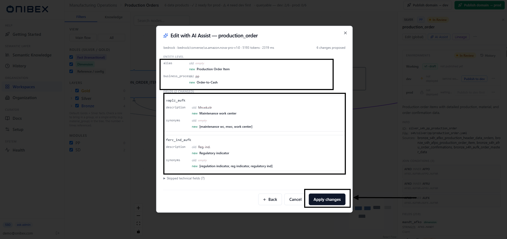

# ASK Admin · Edit & Enrich Data Products

> **Flow 3 of the ASK Admin manual.** Refine a Data Product after you've created it — fix its
> **fields**, **relationships** and **join conditions** by hand, then let **AI Assist** improve
> descriptions and synonyms. Everything here happens *before* you publish.

| | |
|---|---|
| **Who** | Administrator / data steward |
| **Time** | 3–10 minutes per Data Product |
| **Prerequisites** | At least one Data Product exists (see [Flow 2 · Add Data Products](02-add-data-products.md)); a provider configured (see [ASK Setup](../config/00-overview.md)) for AI Assist. |
| **You'll end with** | A cleaned-up Data Product — correct fields, join topology and descriptions — back in **In Review**, ready to publish. |

**Where this fits:** Configure → **Author — refine (you are here)** → Organize → Publish → Ask

> The screenshots and sample values below use an illustrative **SAP Production Planning** example (Production Orders). Substitute your own Data Products — the exact demo names and questions won't exist in your system.

---

## Concepts (30-second version)

- **Editing is global.** A Data Product's YAML is shared across every Business Domain that
  reuses it. When you change a field here, the change lands in **all** of those domains — the
  panel warns you with a **reused ×N** badge when that's the case.
- **Two ways to refine.** *Edit* is manual and structural (add / remove / rename columns, fix
  join conditions, wire relationships). *AI Assist* is LLM-drafted prose — better descriptions
  and synonyms — that you review as a **before/after diff** and apply all-or-nothing.
- **Some values are auto-derived, not editable.** `entity_role`, `grain.entity_grain` and
  `composed_of` are recomputed server-side on save from what you *can* edit (classification,
  field roles, the bronze picker). The editor shows them live, marked **auto**, so you see what
  will be persisted.
- **Every edit returns the entity to *In Review*.** Applying an enrichment or saving a manual
  edit is a commit; the entity goes back to **In Review** so the change is re-checked before it
  reaches an environment.

---

## 1. Open a Data Product

There are two entry points, and both land on the same editor:

- **From Semantic Knowledge** — the global catalog. On a row, open the **actions menu** and
  click **Edit**. This opens the full-screen **Edit** panel directly.
- **From the Domain Canvas** — open a domain (Flow 1) and click an entity node. The **inspector**
  (DetailPanel) slides in on the right; from there you click **Edit** to open the same editor, or
  **AI Assist** to enrich.

The inspector is the read-only summary of the selected entity — layer / module / status badges,
the description, **Info** (ID, file, sources), **Join conditions**, and the **Fields** list. Its
action row is where you launch every refinement.

| Inspector action | What it does |
|---|---|
| **Edit** *(or **Edit (global)** on the canvas)** | Opens the full structural editor (step 2). The tooltip warns when the entity is reused across domains. |
| **AI Assist** | Opens the AI enrichment dialog (step 3). |
| **Lineage** | Isolates this entity's ancestors + descendants on the graph (view-only). |
| **More actions** | On the canvas only — **Remove from *domain*** (membership only; never deletes the YAML). |

> **Tip — editing is global.** If the inspector shows **reused ×N**, this entity feeds N
> Business Domains and your edit affects all of them. That's expected and encouraged for shared
> reference data — just be deliberate.

---

## 2. Edit (manual & structural)

Click **Edit**. The editor opens as a full-screen dialog. Its header shows the **layer** badge,
the auto-derived **entity role** (Silver/Gold), the entity **name** and **id**, and an
**Unsaved changes** badge once you touch anything. An **Editing as** banner names the commit
author (your login).

> The backdrop is intentionally *not* click-to-close — you won't lose edits by clicking outside.
> Close only via the **×**, **Cancel**, or a successful **Save**.

### 2a. Entity-level fields

For a **Silver / Gold** entity the top of the editor exposes:

| Field | Editable? | Notes |
|---|---|---|
| **Description** | Yes | What the entity is, its grain, when to use it. Fed into the agent's retrieval — signal, not filler. |
| **Module** | Yes (Silver/Gold) | SAP module tag, e.g. `pp`. Blank for cross-module/shared entities. |
| **db_table_name** | Yes (Silver/Gold) | The physical table the agent queries, e.g. `GOLD_SD_SALES_PERFORMANCE`. |
| **classification** | Yes (Silver/Gold) | `M · master` / `T · transactional` / `C · configuration`. **This drives** `entity_role`. |
| **entity_role** | **No — auto** | Derived from classification (section 5.1): C→reference, M→dimension, T→fact\|dimension. Recomputed on save. |
| **Context** (`grain.entity_grain`, `composed_of`, `business_grain`) | **No — auto** | Shown read-only in the left **Context** column, marked **auto**. `grain.entity_grain` = the fields whose role is `identifier`; `composed_of` = the Bronze tables set on create. |

A **Bronze** entity *is* a raw SAP table, so it has no classification, `entity_role`, `grain` or
`composed_of` — the editor hides those and shows only the description + field list.

### 2b. Fields

The **Fields** table is fully editable — add, remove, rename, retype and re-key columns. Use the
**filter by name…** box to jump to a column in a wide table. Columns shown depend on the layer:

| Column | Bronze | Silver | Gold | Notes |
|---|---|---|---|---|
| **Name** | Yes | Yes | Yes | The column name. Bronze also shows a **key** checkbox (drives the primary key). |
| **Type** | Yes | Yes | Yes | Canonical data type; type dimensions live in **Advanced**. |
| **Alias** | Yes | — | — | Bronze-only business alias. |
| **Source** | — | Yes | — | Silver-only Bronze lineage, e.g. `AFRU.LMNGA`. Gold = `{db_table_name}.{name}` (auto). |
| **Role** | — | Yes | Yes | `measure` · `dimension` · `identifier` · `timestamp` · `attribute` · `status_flag`. On Silver/Gold a key is expressed as role = `identifier` (there is no `key_field`). |
| **Description** | Yes | Yes | Yes | Add only when it changes a decision (disambiguation, hazard). |

Each row has a **Advanced** expander for the less-common props — type dimensions,
**aggregation** behavior and **synonyms** — and a **trash** icon to remove the column. Use
**+ Add field** at the bottom to append a new column.

> **Warning — `entity_role` and the Context block are auto-derived.** You can't type them
> directly. To change the role, set **classification** (and mark the right fields as
> `identifier` for the grain). The server recomputes both on **Save**; the client is never
> authoritative.

### 2c. Relationships & join conditions

For **Silver / Gold** entities the editor also carries the **Relationships** section — the
lineage edges to other Silvers/Golds that drive JOIN path-finding. Each relationship card has:

| Control | Notes |
|---|---|
| **Target entity id** | Type or pick a `silver_…` / `gold_…` id. A **not found** flag appears if the id isn't in the catalog. |
| **Relationship type** | `one_to_one` · `one_to_many` · `many_to_one` · `many_to_many`. Also auto-sets aggregation safety. |
| **Semantic label** | Short business verb shown on the graph edge, e.g. `sold_to`. |
| **Join on** | The column-pair editor (below). |
| **Suggest** | Asks the AI to fill join + cardinality + cost for the chosen target. |
| **Advanced** | Traversal cost preset (Direct FK · Indirect · Cross-module · Heavy / dedup, or Custom), aggregation safety, cross-module toggle, description. |

The **Join on** control is the **JoinConditionEditor**. It has two modes:

- **Compact mode** (the default, covers most FK joins): pick a **this.field**, an **operator**
  (`=` and the range/inequality ops), and a right side that is either a **target.field** picker
  or a **literal** — toggle with the **fld / lit** button. Add composite-key clauses with
  **+ Add column pair**. A greyed **live SQL preview** shows exactly what gets persisted; the
  two alias inputs (THIS / TARGET) are exposed but rarely need changing.
- **Expert SQL** (a toggle): a free-text SQL box for casts, `OR`-logic or
  multi-table joins. The editor opens in Expert mode automatically when it can't parse the
  existing SQL as simple AND-ed equalities; **Try compact mode** switches back when possible.

> **Silver Join graph vs. Relationships.** On a Silver the editor also shows a **Join graph**
> block — how the composed *Bronze* tables join *during assembly* (build/lineage, not a runtime
> join). Relationships are the edges *between* Silvers/Golds that the path-finder traverses at
> query time. Both use the same column-pair editor.

### 2d. Save

Click **Save**. Save is enabled only when there are unsaved changes. The server normalizes types,
recomputes the derived fields, writes the YAML with your login as the commit author, and returns
the entity to **In Review**. Errors surface in the footer; **Cancel** discards everything.

---

## 3. AI Assist (enrich descriptions & synonyms)

AI Assist drafts better **descriptions** and **synonyms** with one LLM call, shows you a
**before/after diff**, and applies it all-or-nothing. It never touches structure (types, roles,
joins) — only prose. Open it from the inspector's **AI Assist** button (titled *Edit with AI
Assist*).

> **Enrich Silver/Gold, not raw Bronze.** Bronze tables are raw SAP fields; the agent benefits
> most from good descriptions on the **Silver / Gold** that consume them. The button's tooltip
> says as much on a Bronze entity.

### Step 1 — Scope checklist

The dialog opens on a **scope** checklist. Empty and short descriptions are **pre-selected**;
technical / system fields (audit columns, `MANDT`, etc.) are **excluded automatically** and
listed under **Excluded technical fields**.

| Region | What it is |
|---|---|
| **Context the AI will use** | Collapsible panel showing the workspace framing (objective + Data Products + sibling entities) sent verbatim to the model. Present only when a workspace is active. |
| **Entity-level** | One checkbox for the entity's own **description, alias, business_process**. A **priority badge** (EMPTY / SHORT / GOOD) shows how much it needs work. |
| **Fields** | One row per enrichable field, each with a checkbox, priority badge, and a `flag?` / `no synonyms` hint where relevant. Quick-select links: **All** · **Empty only** · **None**. |

For the demo, enrich a **measure that has only a terse description** — the scope checklist
pre-selects it as **SHORT**, flagging that it needs work.

Optionally click **Show full prompt** (bottom-left) to inspect the exact **SYSTEM** and **USER**
messages the model will receive — no LLM call, no tokens spent. When ready, click
**Generate (N)** (N = selected items).

> **Tip — audit before you spend tokens.** *Show full prompt* opens a read-only view of the
> composed system + user messages (with char counts and the target model). Use it to confirm the
> workspace/organization/standards context looks right; the role/rules section is editable at
> `/v1/admin/prompts/enrichment`.

### Step 2 — Review the diff and Apply

After one LLM call the dialog shows the **diff**: a header with **provider · model · tokens ·
elapsed**, then **Entity-level** and **Fields** sections listing each changed value as **old**
(struck through) → **new**. Synonyms render as a list.

You should see each terse description rewritten into a richer one — what the column means, its
unit, and how it should be aggregated — plus a list of suggested **synonyms** that help the agent
map users' words to that field.

Review, then click **Apply changes** (disabled when the model proposed nothing). The dialog:

- **Preservation guard.** If a rewrite would have dropped an existing value mapping
  (`'C' = CLOSE`) or a source citation (`VBAK.NETWR`), the backend cancels *that* rewrite and
  lists it under **Preserved by the guard** — the original stays. Edit those manually if you
  really want new wording.
- **Zero-change diagnostic.** If the model returns no changes (or a truncated reply), a
  **Diagnostic** block explains why — often "descriptions already good" or a truncated response
  — and suggests narrowing the scope and re-running.
- **All-or-nothing apply.** Apply writes through the same path as the manual editor, tagged as
  provenance `ai_assist` in the commit, and returns the entity to **In Review**. **Back** returns
  to the scope step; **Cancel** discards.

> **Warning — Apply commits.** Applying an enrichment writes the YAML and moves the entity to
> **In Review**, exactly like a manual Save. Re-check it before publishing to an environment.

---

## What's next

→ **[Flow 5 · Publish & Deploy](05-publish-deploy.md)** — promote the refined Data Product to
`dev` / `prod` so the chat can answer against it.
→ **[Flow 1 · Workspaces & Business Domains](01-workspaces-domains.md)** — assign it to a domain.
→ **[Flow 2 · Add Data Products](02-add-data-products.md)** — create more entities.
