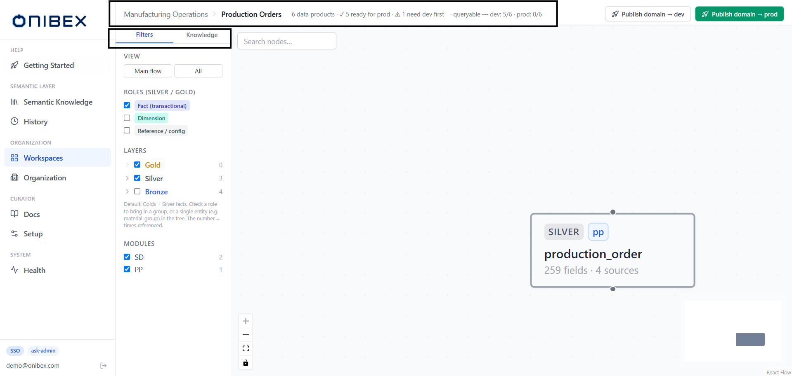
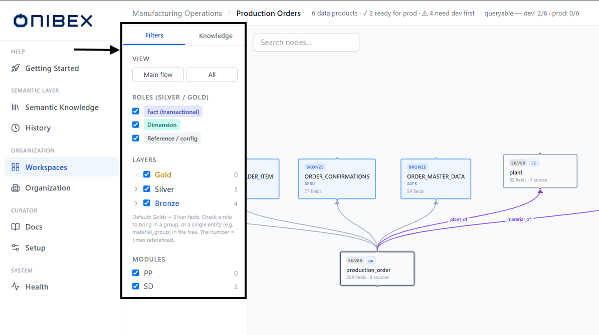
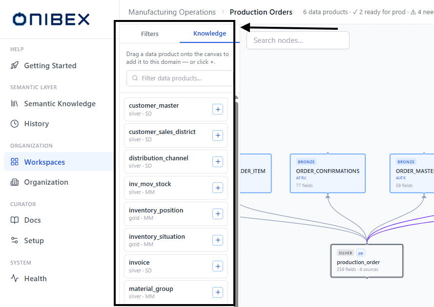
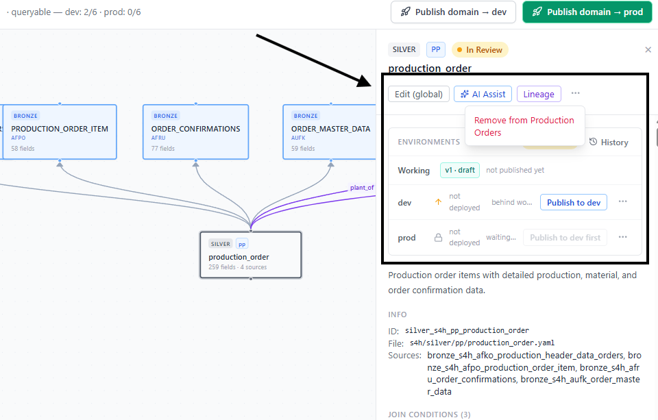

# ASK Admin · Domain Canvas (Graph)

> **Flow 4 of the ASK Admin manual.** Open a single **Business Domain** to see its
> **canvas** — the scoped graph of the Data Products it contains and how they relate.
> This is where you visually curate a domain: add or remove Data Products, inspect any
> node, and read the layer topology at a glance.

| | |
|---|---|
| **Who** | Administrator / data steward |
| **Time** | ~5 minutes |
| **Prerequisites** | A workspace with at least one **Business Domain** that has a few Data Products assigned (see [Flow 1 · Workspaces & Business Domains](01-workspaces-domains.md)). |
| **You'll end with** | A clear picture of one domain's entities and relationships, and the ability to add / remove Data Products from it. |

**Where this fits:** Configure → **Author — Domain Canvas (you are here)** → Publish → Ask

> The screenshots and sample values below use an illustrative **SAP Production Planning** example (Production Orders). Substitute your own Data Products — the exact demo names and questions won't exist in your system.

---

## Concepts (30-second version)

- **The canvas *is* the graph.** There is no separate global graph tab — opening a domain
  lands you on its scoped canvas.
- The canvas shows the domain's Data Products as **nodes**, coloured by **layer**
  (Bronze / Silver / Gold), with edges for the relationships between them.
- The server resolves the domain to its members **plus one hop** of related entities: when a
  Silver is in the domain, its source **Bronze** tables (`composed_of`) come along as graph
  context so you see the full topology, not orphan nodes. Membership itself stays Silver/Gold
  only — the bronzes are context, re-derived on each load.
- The left **rail** has two tabs: **Filters** (narrow what's shown) and **Knowledge** (the pool
  of Data Products you can add to this domain).
- Clicking a node opens the **inspector** (Detail panel) on the right.

---

## 1. Open the domain

From a workspace, find the domain's card and click **Open domain** (see
[Flow 1](01-workspaces-domains.md)). You land on the canvas, scoped to that one domain.

The header shows a breadcrumb — **Workspace → Domain** — followed by a small summary of the
domain's deployment state (`N data products · M ready for prod · K need dev first`, plus a
`queryable — dev / prod` count) and the two **Publish domain → dev** / **Publish domain → prod**
buttons. Publishing is covered in [Flow 5 · Publish & Deploy](05-publish-deploy.md); this page
is about the canvas itself.

### Reading the graph

| Layer | Node colour | Shown on the node |
|---|---|---|
| **Bronze** | Blue | The **Bronze** tag, its alias (or name), the raw SAP table name, and a field count. |
| **Silver** | Grey | The **Silver** tag, its module, name, and a `fields · sources` count. |
| **Gold** | Yellow / amber | The **Gold** tag, its module, name, and a field count. |

A selected node is outlined with a coloured ring. Bottom-right you get the standard graph
**Controls** (zoom / fit / lock) and a **MiniMap** tinted by the same layer colours (blue =
Bronze, grey = Silver, amber = Gold).

> **Tip — search on the canvas.** The **Search nodes…** box at the top-left of the graph dims
> non-matching nodes and shows an `N found` count, so you can spotlight one entity in a busy
> domain without changing the layout.

## 2. Filters rail — narrow what's shown

The rail's **Filters** tab controls which nodes are drawn. It does **not** change domain
membership — it only changes the view.

| Control | What it does |
|---|---|
| **View** — **Main flow** / **All** | Presets. **Main flow** shows Golds + Silver facts (the transactional flow); **All** shows every layer and role. |
| **Roles (Silver / Gold)** — **Fact (transactional)** / **Dimension** / **Reference / config** | Bring a whole role group in or out. |
| **Layers** — **Gold** / **Silver** / **Bronze** | Toggle a layer on/off. Each layer expands to a per-entity tree, so you can check a **single** entity (the count on the right is how many times it's referenced). |
| **Modules** | When the domain spans SAP modules (e.g. `PP`), toggle a module in or out. |

If any Data Product in the domain has an unresolved merge conflict, a **Pending conflicts**
inbox appears at the top of the rail — click an entry to jump straight to that node (resolve it
in [Flow 7 · Conflicts & Merge](07-conflicts-merge.md)).

> **Tip — focus a lineage.** Selecting a node and choosing **Lineage** in the inspector
> isolates just that entity's ancestors and descendants; a violet **Lineage of *name*** pill
> appears with an **Exit** button, and the filters pause until you exit.

## 3. Knowledge rail — add Data Products to the domain

Switch the rail to the **Knowledge** tab to see every Data Product **not yet in this domain**
(only Silver and Gold entities are pickable — Bronze tables are never standalone members; they
nest via `composed_of`). Use the **Filter data products…** box to narrow the list.

There are two ways to add one:

1. **Drag** a row from the Knowledge list and drop it onto the canvas, or
2. click the **+** button on the row.

Either way the Data Product is added to the domain (membership only), the node appears on the
canvas, and — because a Silver arrives **with its source bronzes** — you'll also see its
`composed_of` tables show up as context.

> **Warning — membership, not creation.** The Knowledge rail only *adds existing* Data
> Products to the domain. Create new entities first in
> [Flow 2 · Add Data Products](02-add-data-products.md); adding to a domain never edits or
> publishes a YAML.

## 4. Inspect a node

Click any node to open the **inspector** on the right. It shows:

- The node's **layer** and **module** badges, its **name**, alias, and lifecycle
  **status pill**.
- Actions: **Edit** (opens the full editor; labelled **Edit (global)** here because an edit to
  the shared YAML affects **every** domain that reuses it — a **reused ×N** badge appears when
  it's shared), **AI Assist** (AI-assisted enrichment), and **Lineage** (isolate this entity's
  ancestors/descendants).
- A **Deployment & Versions** panel (per-env publish / diff / history — see
  [Flow 5](05-publish-deploy.md)).
- The **description**, **Info** (ID, file path, sources), **Join conditions**, and the full
  **Fields** table.

## 5. Remove a Data Product from the domain

With a node selected, open the inspector's **More actions** menu and choose **Remove from
*&lt;domain&gt;***. This is **membership-only**: it drops the entity from this domain and — if
they're not still referenced by another loaded entity — its orphaned source bronzes disappear
from the canvas too. It **never** deletes the YAML and **never** unpublishes the entity from an
environment.

> **Warning — removing is not deleting.** *Remove from domain* only changes grouping. The entity YAML
> stays in the semantic-layer repo and, if published, stays answerable in whatever env it was
> published to. To take an entity out of an environment, unpublish it (from the Deployment
> panel); to delete it entirely, use Semantic Knowledge.

---

## What's next

→ **[Flow 5 · Publish & Deploy](05-publish-deploy.md)** — publish the domain (or a single Data
Product) to **dev** / **prod** so the chat can answer over it.
→ **[Flow 3 · Edit & Enrich](03-edit-enrich.md)** — refine a node's fields, relationships, and
descriptions from the inspector's **Edit** action.
→ **[Flow 1 · Workspaces & Business Domains](01-workspaces-domains.md)** — the workspace view
where you first open a domain.
