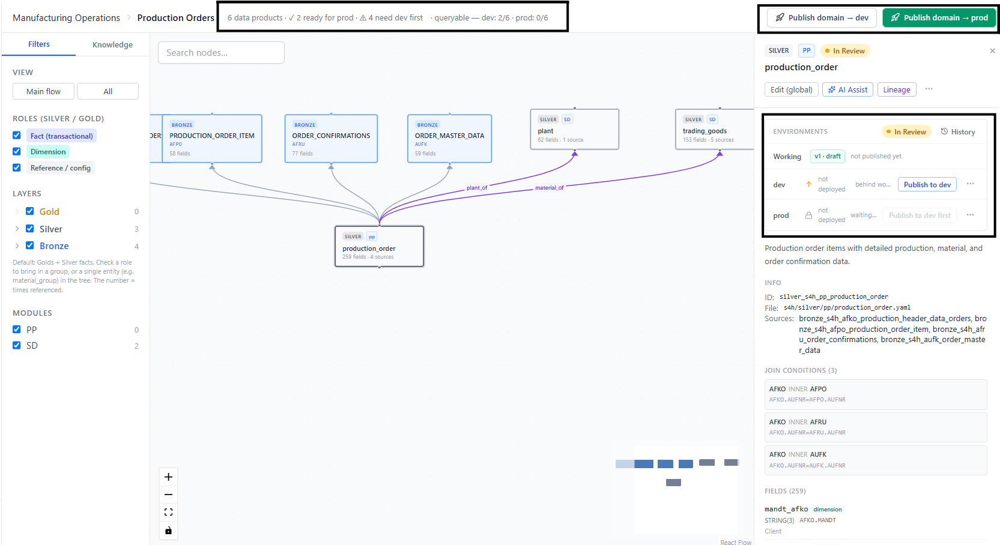
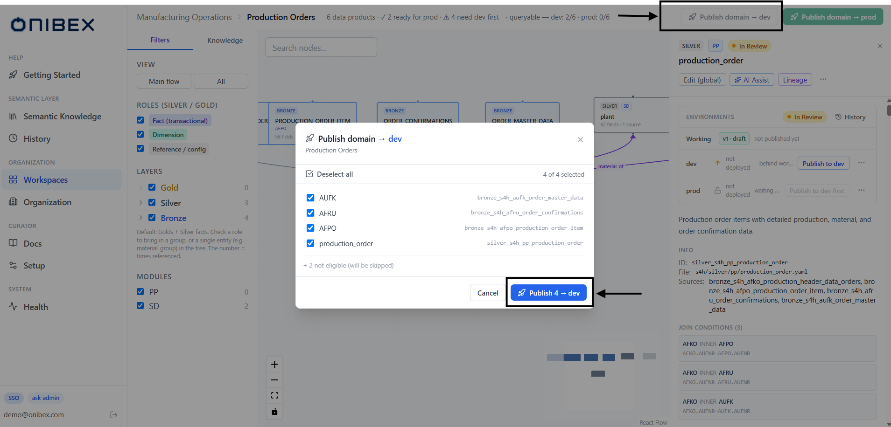
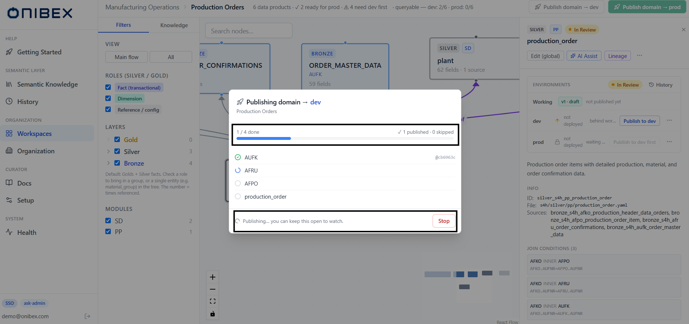

# ASK Admin · Publish & Deploy (dev → prod)

> **Flow 5 of the ASK Admin manual.** Nothing you author is queryable until it is
> **published**. This page covers how a Data Product moves from your **Working** draft to
> **dev**, then is promoted to **prod** — one Data Product at a time, or a whole domain at once.

| | |
|---|---|
| **Who** | Administrator / data steward |
| **Time** | ~2 minutes per Data Product; a domain publish streams in the background |
| **Prerequisites** | At least one Data Product exists ([Flow 2](02-add-data-products.md)) and is assigned to a domain ([Flow 1](01-workspaces-domains.md)). |
| **You'll end with** | Data Products **Released** and answerable in the chat for the target environment. |

**Where this fits:** Configure → Author → **Publish — dev → prod (you are here)** → Ask

> The screenshots and sample values below use an illustrative **SAP Production Planning** example (Production Orders). Substitute your own Data Products — the exact demo names and questions won't exist in your system.

---

## Concepts (30-second version)

- **Working** is your live draft — whatever you last saved in the editor. A draft that differs
  from what's deployed shows the status **In Review**.
- **dev** and **prod** are two independent environments the chat can target. Publishing to an
  environment deploys the current version *into* it; the chat only answers from what a given
  environment holds.
- **The gate.** You must publish to **dev first**. **prod** stays locked until dev is current —
  you can only promote to prod the exact version that already lives in dev. This prevents an
  untested definition from reaching production.
- **Status pill.** **In Review** (amber) = the working definition differs from dev.
  **Released** (green) = working matches dev. See [Status pills](#status-pills-and-versions) below.

---

## Two ways to publish

| | Per Data Product | Per Business Domain |
|---|---|---|
| **Where** | The **Deployment & Versions** panel in the [DetailPanel](03-edit-enrich.md) | The **Publish → dev / prod** buttons on a domain card ([Flow 1](01-workspaces-domains.md)) |
| **Scope** | One entity | Every member of the domain that has pending changes |
| **Best for** | Reviewing and shipping a single definition | Rolling out a whole domain in one pass |

Both go through the same server-side gate and land the same result. Use the per-Data-Product
panel while you iterate; use the domain publish to roll out the finished set.

---

## 1. Publish one Data Product (Deployment & Versions)

Open a Data Product to reveal its detail. In the detail panel find the **Environments** panel
(the **Deployment & Versions** section). It has up to three rows — **Working**, **dev**, and
**prod** — each with its version chip, a state note, and an action button.

| Row | Version chip | Note & icon | Action button |
|---|---|---|---|
| **Working** | teal `v{n} · draft` | *not published yet* (teal dot) — shown **only** while the status is **In Review** | (none) |
| **dev** | blue `v{n}`, or *not deployed* | green **current** (`current · date · author`) when it matches Working; otherwise amber *behind working* | **Publish to dev** (blue), or **Up to date** (disabled) |
| **prod** | red `v{n}`, or *not deployed* | green **current** (`current · date · author`) when it matches dev; grey *waiting on dev*; *ready for first prod publish* the first time (dev published, prod not yet); amber *N versions behind* | **Publish to prod** (green), **Publish to dev first** (disabled), or **Up to date** (disabled) |

Click the button for the environment you want. A confirmation dialog appears:

- **Publish to dev** → *"Deploys the working version of \"…\" to dev."*
- **Publish to prod** → *"Promotes the dev version of \"…\" to prod."*

Confirm with **Publish to dev** / **Publish to prod**. The button shows a spinner while the
publish runs, then the row updates — dev turns green (**Released**), and prod unlocks.

> **Tip — the top-right History link.** The **History** button (clock icon) opens the version
> history across **Working / dev / prod** for this entity, so you can see exactly which version
> is where. The **actions** menu on each environment row also offers **Diff vs dev / prod** (compare
> your working copy against what's deployed) and, when published, **Unpublish**.

## 2. Why "Publish to prod" is disabled

This is the most common question, so it's worth stating plainly. The **prod** button is disabled
(and the row shows a grey lock) in exactly these cases:

| prod row shows | Meaning | What to do |
|---|---|---|
| **Publish to dev first** — *waiting on dev* | The entity has **never** been published to dev. prod is hard-gated behind dev. | Publish to **dev** first; prod unlocks the moment dev has a version. |
| **Up to date** | prod already holds the exact version that's in dev (`prod.sha == dev.sha`). | Nothing to do — prod is current. Push a new dev version first if you have changes. |
| **Publish to prod** (enabled) | dev is ahead of prod, or prod has never been published yet (the note reads *ready for first prod publish*). | Click to promote the dev version to prod. |

> **Warning — you promote dev, not Working.** Publishing to prod ships whatever version is
> currently in **dev**, not your latest unsaved edits. If you changed the definition after the
> last dev publish, dev will read **behind working** — publish to dev again first so the version
> you promote to prod is the one you actually tested.

> **Tip — unpublish order mirrors the gate.** You cannot unpublish from **dev** while the entity
> is still published to **prod** (the menu item reads *"Unpublish from dev — unpublish prod first"*).
> Remove prod first, then dev.

---

## 3. Publish a whole Business Domain

When a domain's Data Products are ready, publish them together. On the workspace screen, each
domain card has a **Publish →** label with **dev** and **prod** buttons ([Flow 1](01-workspaces-domains.md)).
Click **dev** (blue) or **prod** (green) for the domain you want. The **Publish domain** dialog
opens in two phases.

### Phase 1 — the plan (checklist)

The dialog lists every domain member that has **pending changes** for the target environment,
each pre-checked. Deselect any you want to skip.

Behavior of the plan:

- **Select all / Deselect all** toggles the whole checklist; the header shows *N of M selected*.
- Members that are already current (or, for prod, not yet on dev) are **not** in the checklist —
  they're summarized as **"+ K not eligible (will be skipped)"** underneath.
- When publishing to **prod**, if some members still need a dev publish first, the skipped line
  adds an amber note **"— some need a dev publish first"**.
- If nothing needs publishing, the dialog says *"Nothing to publish — everything is up to date."*

Click **Publish N → dev** (or **→ prod**) to start.

### Phase 2 — live progress (streaming)

The dialog switches to a progress view and publishes **one Data Product at a time**, streaming
each result as it lands. A progress bar and a per-row status list update live.

| Marker | Status | Meaning |
|---|---|---|
| spinner (blue) | **publishing** | This Data Product is being published right now. |
| green | **published** | Landed successfully; a short `@sha` commit ref is shown. |
| grey | **skipped** | Nothing to do (already up to date). |
| red | **error** | This one failed; the reason is shown. One failure does not stop the rest. |
| amber | **stopped** | You clicked **Stop** before it ran. |

- The header counters read **"X / Y done"** on the left and **"N published · K skipped"** (plus
  **"K failed"** if any) on the right.
- A **Stop** button aborts the run. Anything not yet published is flagged **stopped** so it's
  clear what did *not* ship — partial progress is kept.
- While a publish is in flight the dialog is **locked** (you can't dismiss it by clicking away or
  the ×). Use **Stop** first.
- When the run settles, the footer shows **"Publish complete."** (or **"K failed — review above."**)
  and a **Done** button.

> **Tip — keep it open to watch, or walk away.** The stream runs on the server; the dialog just
> shows progress. Closing after it finishes refreshes the domain card's chips and status dots.

---

## Status pills and versions

Every Data Product carries a **status pill**:

| Pill | Colour | Meaning |
|---|---|---|
| **In Review** | amber | The working definition differs from what's deployed to **dev** — there are changes to publish. |
| **Released** | green | The working definition matches **dev** — nothing pending for dev. |

Versions are tracked **per environment**: the version chips (`v{n}`) on the Working / dev / prod
rows tell you which version each environment holds. When dev is ahead of prod, the prod note
reads **"N versions behind"** so you know the size of the gap before you promote.

> The chat scopes its answers to the environment it targets (dev or prod) — see
> [the chat manual](../ask-chat/00-overview.md). Publishing to **dev** makes a Data Product
> answerable in the dev-targeted chat; promoting to **prod** makes it answerable in production.

---

## What's next

→ **[Flow 1 · Workspaces & Business Domains](01-workspaces-domains.md)** — the domain cards whose
**Publish →** buttons launch the domain publish.
→ **[Flow 3 · Edit & Enrich](03-edit-enrich.md)** — where the Deployment & Versions panel lives,
alongside the editor that produces the working draft.
→ **[Flow 2 · Add Data Products](02-add-data-products.md)** — create the entities you publish here.
