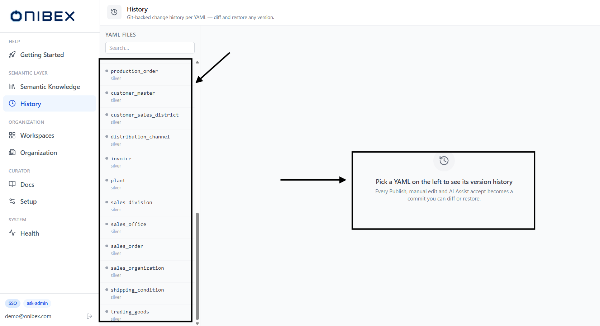
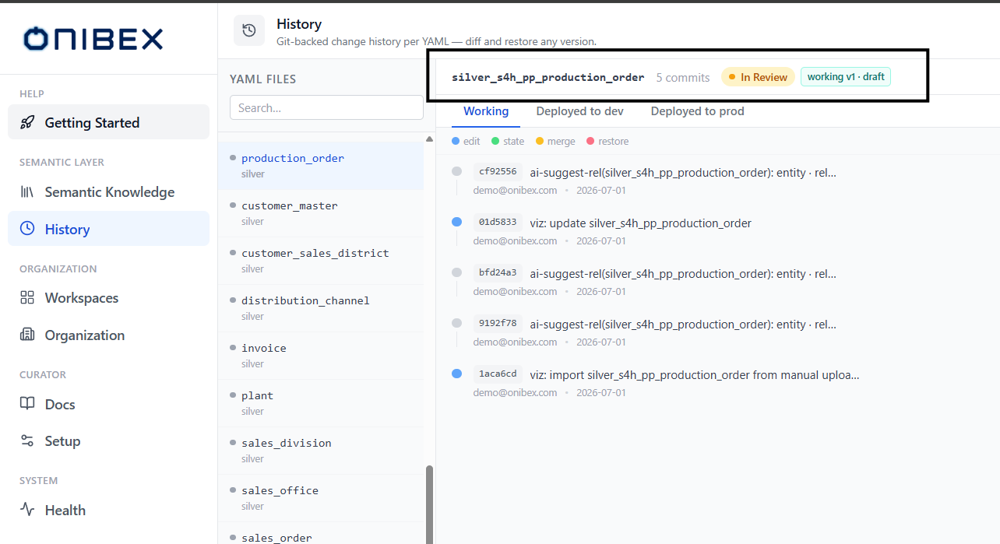
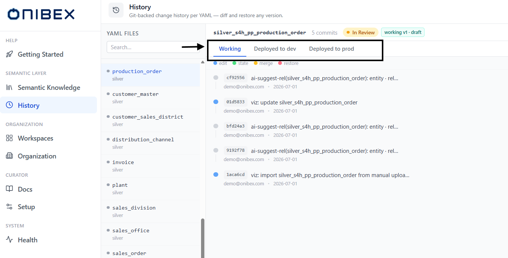
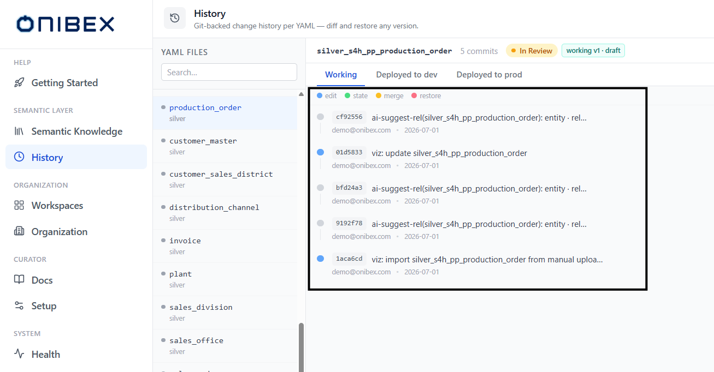
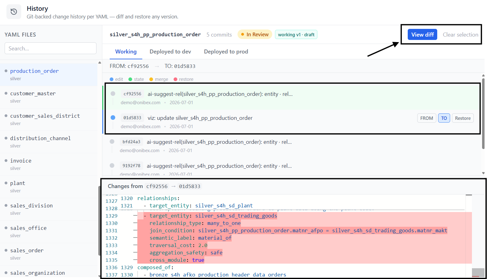

# ASK Admin · History (Audit, Diff, Restore)

> **Flow 6 of the ASK Admin manual.** Every Data Product is Git-backed. This page shows how to
> **audit** the changes to a Data Product over time, **diff** any two versions side by side, and
> **restore** an earlier version — all keyed to the person who made each change.

| | |
|---|---|
| **Who** | Administrator / data steward |
| **Time** | ~2 minutes |
| **Prerequisites** | Signed in to **ASK Admin**; at least one Data Product with a change or two (create one in [Flow 2 · Add Data Products](02-add-data-products.md)). |
| **You'll end with** | Confidence in what changed, when, and by whom — plus a restored version if you needed one. |

**Where this fits:** Configure → **Author — History (you are here)** → Publish → Ask

> The screenshots and sample values below use an illustrative **SAP Production Planning** example (Production Orders). Substitute your own Data Products — the exact demo names and questions won't exist in your system.

---

## Concepts (30-second version)

- Every **Publish**, manual edit and AI Assist accept becomes a **commit** — a point-in-time
  snapshot of the Data Product's YAML, stamped with an author and a timestamp.
- **History** is scoped to **one Data Product at a time** and to a **branch**: **Working**
  (your live draft), **Deployed to dev**, or **Deployed to prod**.
- The commit **author is the logged-in user** — the change is attributed to whoever was signed
  in when it was made, not to a shared machine account.
- You never lose an old version: pick any commit and **Restore** brings its YAML back as a new
  commit on Working.

---

## 1. Open History

In the left sidebar, click **History**. The page header reads **History** with the subtitle
*"Git-backed change history per YAML — diff and restore any version."*

The screen is split: a **YAML Files** rail on the left (the entity picker), and the selected
Data Product's timeline on the right. Until you pick one you'll see a **"Pick a YAML on the
left to see its version history"** empty state.

> **Tip — deep link.** You usually arrive here already scoped. The **History** action on a
> Data Product (from the canvas inspector or a **Semantic Knowledge** row) opens
> `/history?yaml=<id>` and lands straight on that entity's timeline, skipping the picker.

## 2. Pick a Data Product

In the **YAML Files** rail, type in the **Search…** box to filter by id or name, then click a
row. Each row shows a **layer dot** (Bronze = blue, Silver = grey, Gold = yellow) and the
entity's name and layer.

Select **`production_order`** (the demo Silver). The right pane now shows a header row with:

| Element | What it tells you |
|---|---|
| The entity **id** | e.g. `silver_s4h_pp_production_order` (monospace). |
| **N commits** | The total number of commits on the current branch. |
| **Status pill** | The lifecycle status (In Review / Released). |
| **working v`N`** chip | The working version (with **· draft** when In Review). |
| **dev v`N`** / **prod v`N`** chips | The versions currently published to each environment (shown only when published). |

## 3. Choose a branch

Under the header sit three tabs. Selecting a Data Product resets you to **Working**.

| Tab | Shows |
|---|---|
| **Working** | The live draft history (main branch) — every edit, enrich accept and state change. |
| **Deployed to dev** | Only the commits that were published to the **dev** environment. |
| **Deployed to prod** | Only the commits that were published to the **prod** environment. |

When you're on **Deployed to dev** or **Deployed to prod**, a note appears on the right:
*"Restoring from here writes to Working (main) — re-publish to redeploy."* If the entity was
never deployed to that environment you'll see a **"Not deployed to `<env>` yet"** message
instead of a timeline.

## 4. Read the commit timeline

The timeline lists commits newest-first. A small **legend** at the top maps the coloured dot on
each commit to its kind: **edit**, **state**, **merge**, **restore**.

Each commit row shows:

| Element | Meaning |
|---|---|
| **Coloured dot** | The commit kind (edit / state / merge / restore). |
| **Short SHA** | The 7-character commit id (monospace chip), e.g. `a1b2c3d`. |
| **Message** | The commit message (truncated). |
| **Author email** | **Who made the change** — the logged-in user at the time. |
| **Date** | The commit date (`YYYY-MM-DD`). |

If there are more commits than are loaded, a **Load more…** link at the bottom fetches the next
page.

> **Tip — author = login.** The **author email** on each commit is taken from the signed-in
> user. That's your audit trail: it answers *who* changed the model, not just *what* changed.

## 5. Diff two versions

Hover a commit to reveal three actions: **FROM**, **TO** and **Restore**.

1. Hover the **older** commit and click **FROM** (it highlights green).
2. Hover the **newer** commit and click **TO** (it highlights blue).
3. A banner at the top confirms the selection — **FROM: `<sha>` → TO: `<sha>`**.
4. Click **View diff** (top-right, blue). Use **Clear selection** to start over.

The diff loads in the lower half of the screen. When the API returns both file versions you get
a **side-by-side** viewer (the same engine VS Code uses — syntax-highlighted YAML, line numbers,
read-only). When only a unified diff is available it falls back to a line-by-line viewer:
**added** lines green, **removed** lines red. Either way the header reads
**Changes from `<from-sha>` → `<to-sha>`**.

> **Tip — pick order doesn't matter for reading.** FROM is the left (earlier) pane and TO is
> the right (later) pane. If you set them the wrong way round, just re-click the intended
> commit for each role — the last click wins.

## 6. Restore an earlier version

Found the version you want back? Hover its commit and click **Restore**. The
**Restore to previous version** dialog opens.

| Field / element | Notes |
|---|---|
| Confirmation line | *"This will create a new commit restoring this YAML to version `<sha>`."* Nothing is overwritten in place. |
| **Author** | Pre-filled from your login — *"(from your login)"*. This is who the restore is attributed to. |
| **Reason (optional)** | A short note, e.g. *"Reverting incorrect field removal"*. Stored on the restore commit. |
| **Cancel** / **Confirm restore** | Confirm creates the restore commit. |

Click **Confirm restore**. The restore is written as a **new commit on Working** — the earlier
YAML is brought forward, the history is left intact, and the working version bumps. The timeline
and the version chips refresh automatically.

> **Warning — restore lands on Working, not on an environment.** A restore always writes to
> **Working (main)**, even if you triggered it from the **dev** or **prod** tab. To put the
> restored version back into an environment, **re-publish** it — see
> [Flow 5 · Publish & Deploy](05-publish-deploy.md).

---

## What's next

→ **[Flow 5 · Publish & Deploy](05-publish-deploy.md)** — re-publish a restored version to dev
or prod.
→ **[Flow 3 · Edit & Enrich](03-edit-enrich.md)** — the edits that become the commits you see
here.
→ **[Flow 7 · Conflicts & Merge](07-conflicts-merge.md)** — how **merge** commits get into the
timeline.
