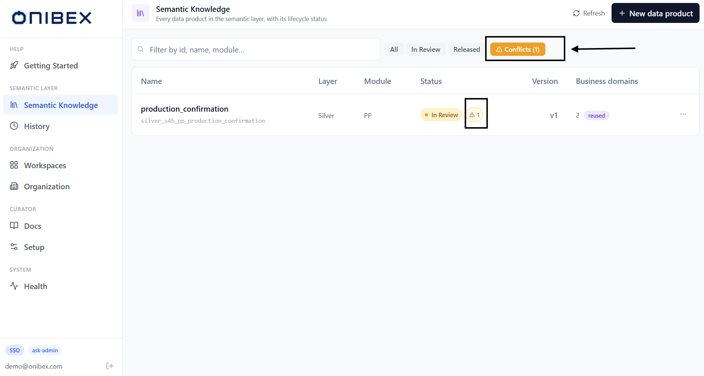
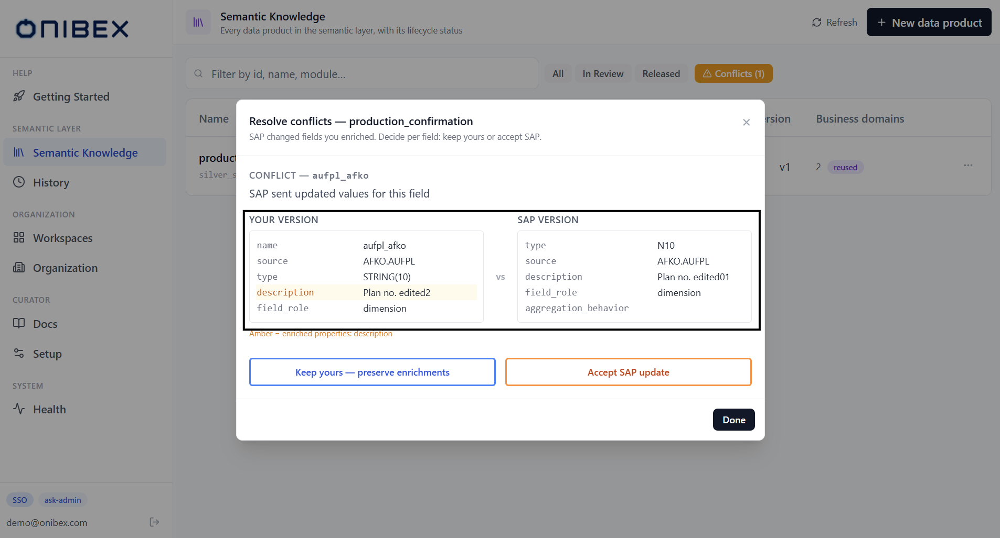

# ASK Admin · Conflicts & OneConnect Merge

> **Flow 7 of the ASK Admin manual.** When a fresh **OneConnect** export disagrees
> with a Data Product you already curated, the platform records the differences as
> **conflicts**. This page shows how to find them and resolve them, field by field.

| | |
|---|---|
| **Who** | Administrator / data steward |
| **Time** | ~2 minutes per conflicted entity |
| **Prerequisites** | A Data Product created earlier **From OneConnect** (see [Flow 2 · Add Data Products](02-add-data-products.md)), then re-merged with a changed export. |
| **You'll end with** | A reconciled Data Product — every field either keeps your enriched value or accepts the incoming SAP value. |

**Where this fits:** Configure → Author → **Reconcile — conflicts (you are here)** → Publish → Ask

> The screenshots and sample values below use an illustrative **SAP Production Planning** example (Production Orders). Substitute your own Data Products — the exact demo names and questions won't exist in your system.

---

## Concepts (30-second version)

- A **conflict** is a field where a re-imported **OneConnect** JSON differs from the
  **working** Data Product you already have. The merge engine applies everything that
  matches, and parks each disagreement as a conflict instead of silently overwriting your work.
- Conflicts are **not a lifecycle status** — they're an orthogonal flag. A Data Product can be
  **In Review** or **Released** *and* carry unresolved conflicts at the same time.
- There are three kinds the engine reports:

| Conflict type | What it means |
|---|---|
| **SAP sent updated values for this field** | SAP changed one or more field properties (e.g. a description). |
| **SAP changed the data type of this field** | The incoming type differs from your current type. |
| **SAP removed this field from its schema** | The field no longer exists in the SAP export. |

- Resolution is **per field**: for each conflict you either **keep yours** (preserve the value
  you enriched) or **accept SAP** (take the incoming value). Nothing changes until you choose.

---

## 1. Find the conflicts

Go to the sidebar → **Semantic Layer** → **Semantic Knowledge**. Two things surface a conflict:

- A **Conflicts (N)** filter pill appears next to the status filters (**All · In Review ·
  Released**) whenever any entity carries an unresolved conflict. `N` is the number of conflicted
  entities. The pill only shows when `N > 0`.
- On a conflicted row, a small **warning badge** with a count sits beside the status pill.

Click **Conflicts (N)** to narrow the table to just the entities that need reconciling.

> **Tip — the badge is the shortcut.** You don't have to switch filters. Clicking the **warning badge**
> on a row opens that entity's conflict resolver directly.

## 2. Open the conflict resolver

Click the **warning badge** on the conflicted row (or open the row from the **Conflicts** filter). The
**Resolve conflicts** dialog opens for that entity, subtitled *"SAP changed fields you enriched.
Decide per field: keep yours or accept SAP."* Each pending conflict is shown as its own block.

Every conflict block presents a **side-by-side comparison**:

| Region | What it shows |
|---|---|
| **Conflict — `<field>`** | The field name and which kind of change it is (one of the three types above). |
| **Your version** | The current working value. Properties you enriched are highlighted in **amber**, with an *"Amber = enriched properties"* note listing them. |
| **vs** | Divider between the two sides. |
| **SAP version** | The incoming value from the OneConnect export. |

## 3. Resolve each field

For each conflict, click one of the two buttons:

| Button | Effect |
|---|---|
| **Keep yours — preserve enrichments** | Retains your current value; the SAP change is discarded for this field. |
| **Accept SAP update** | Replaces your value with the incoming SAP value for this field. |

A choice resolves that one conflict immediately and drops it from the pending list. Work through
each block until none remain. When the entity is fully reconciled the dialog shows
**No pending conflicts — this entity is reconciled.** Click **Done** to close.

> **Partial resolution is fine.** Each decision is saved on its own. You can resolve some fields,
> close with **Done**, and come back later — the **warning badge** and the **Conflicts (N)** count update
> live to reflect what's left.

> **Warning — resolving does not re-publish.** Reconciling conflicts updates the **working** copy
> of the Data Product. To make the reconciled version queryable in the chat, publish it to `dev` /
> `prod` — see [Flow 5 · Publish & Deploy](05-publish-deploy.md).

---

## 4. How a conflict arises

A conflict appears when a **re-imported** SAP export differs from a Data Product you have
already edited. In practice:

1. Import a SAP export via **Semantic Knowledge → New data product → From OneConnect** and
   click **Merge from OneConnect**. This creates the Data Product.
2. (Optional, to make the conflict meaningful) enrich the `total_order_quantity` field
   (`AFKO.GAMNG`) — for example give it a richer description — so it counts as an enriched property.
3. Edit the same JSON: change the `description_field` for `AFKO.GAMNG` to
   `"Planned build quantity (header)"`, **keep the same `id` (4101)**, and run
   **Merge from OneConnect** again.
4. Because the id matches an existing Data Product and one field now differs, the merge parks a
   **conflict** on that field instead of overwriting it. It appears under the **Conflicts (N)**
   filter and as a **warning badge** on the `production_order` row.

> **Why keep the same id?** The merge engine keys on the entity `id`. A **new** id would create a
> separate Data Product; the **same** id (`4101`) re-merges into the existing one, which is what
> surfaces the difference as a conflict.

---

## What's next

→ **[Flow 2 · Add Data Products](02-add-data-products.md)** — where the **From OneConnect** merge
that produces conflicts is triggered.
→ **[Flow 5 · Publish & Deploy](05-publish-deploy.md)** — publish the reconciled Data Product so
the chat sees it.
→ **[Flow 3 · Edit & Enrich](03-edit-enrich.md)** — the enrichments that a conflict asks you to
preserve or discard.
