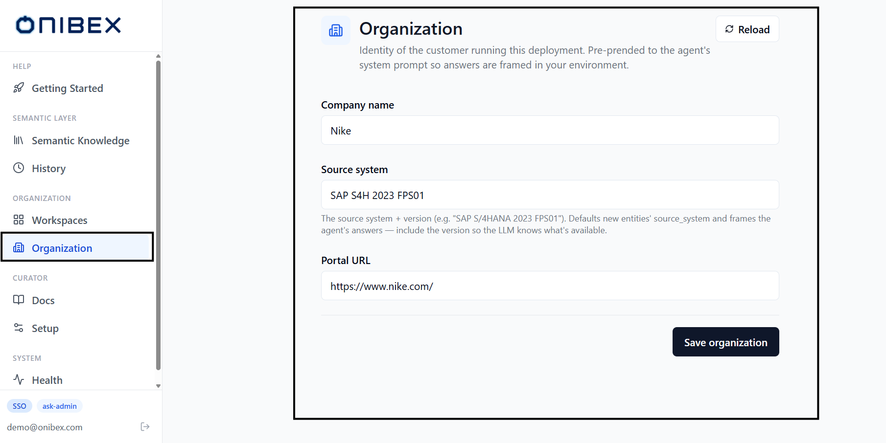
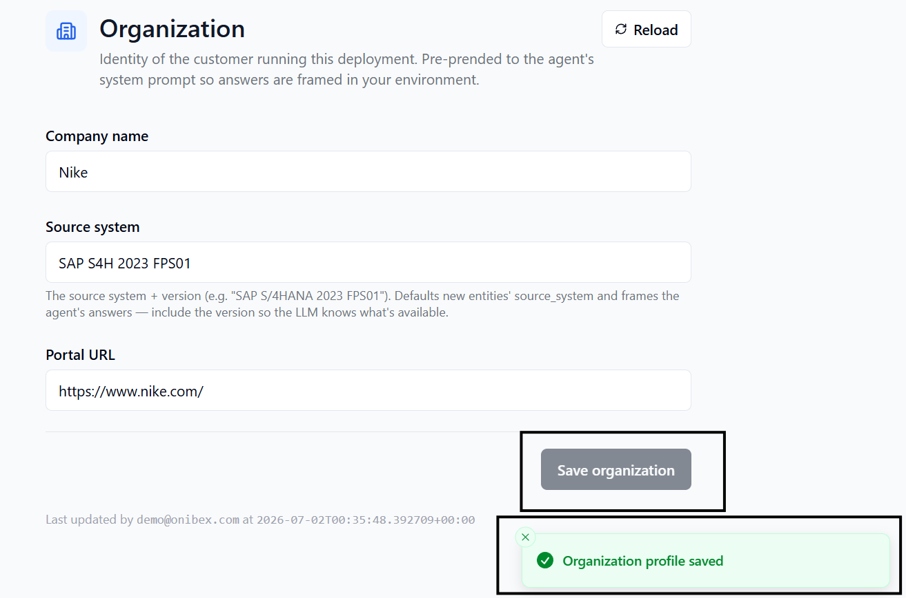

# ASK Admin · Organization Profile

> **Flow 8 of the ASK Admin manual.** Set the singleton **Organization profile** — the
> customer's identity (company name, source system, portal URL) that is prepended to the
> agent's system prompt so every answer is framed in your environment.

| | |
|---|---|
| **Who** | Administrator |
| **Time** | ~1 minute |
| **Prerequisites** | You can sign in to **ASK Admin** (see [Installation](../01-installation.md)). |
| **You'll end with** | A saved Organization profile the agent uses on every query, and a source system that pre-fills new Data Products. |

**Where this fits:** **Configure — Organization (you are here)** → Author → Publish → Ask

> The screenshots and sample values below use an illustrative **SAP Production Planning** example (Production Orders). Substitute your own Data Products — the exact demo names and questions won't exist in your system.

---

## Concepts (30-second version)

- The Organization profile is a **singleton** — there is exactly one per deployment. Saving it
  again **overwrites** the previous values (an idempotent upsert), it does not create a second
  record.
- Its values are **prepended to the agent's system prompt** on every query, so answers are
  framed in the customer's context (e.g. "for *Pinnacle Industrial Manufacturing* running
  *SAP S/4HANA 2023 FPS01* …").
- The **Source system** value also becomes the **default `source_system`** for new Data
  Products, including the pre-filled source in [Flow 2 · DDL + AI](02-add-data-products.md).

---

## 1. Open the Organization page

In the left sidebar, under **Organization**, click **Organization**. The page shows a short
form with three fields, a **Reload** button in the top-right, and a **Save organization**
button at the bottom.

If the profile has never been saved, the fields open empty with placeholder hints.

## 2. Fill the profile

Enter your organization's details:

| Field | Required | Notes |
|---|---|---|
| **Company name** | Yes | The customer running this deployment — demo: *Pinnacle Industrial Manufacturing*. |
| **Source system** | Yes | The source system **and version**, demo: *SAP S/4HANA 2023 FPS01*. This value frames the agent's answers **and** defaults new entities' `source_system` — include the version so the LLM knows what's available. |
| **Portal URL** | No | The customer's portal address — demo: *https://ask.pinnacle-mfg.com*. |

> **Tip — include the version.** The **Source system** field is free text; write the system
> and its release together (e.g. *SAP S/4HANA 2023 FPS01*, or *Salesforce* / *PostgreSQL 15*
> for non-SAP sources). The version tells the agent which features and tables to assume.

## 3. Save

Click **Save organization**. The button is enabled only when there are unsaved changes; on
success a confirmation toast appears and the form reflects the stored values.

After saving, a small line shows **who** last changed the profile and **when** —
*Last updated by `<user>` at `<timestamp>`*.

> **Warning — the profile is shared.** There is only one Organization profile for the whole
> deployment. Saving replaces the existing values for everyone. Use the **Reload** button
> (top-right) to discard unsaved edits and re-fetch the stored profile.

---

## Where the profile is used

- **Agent prompt** — the orchestrator reads the profile on every query and prepends the
  company name, source system and version to the system prompt.
- **New Data Products** — the **Source system** value defaults the `source_system` of entities
  you create, and pre-fills the source in [Flow 2 · DDL + AI](02-add-data-products.md) (where
  you can override it per import).

---

## What's next

→ **[Flow 1 · Workspaces & Business Domains](01-workspaces-domains.md)** — create the containers
your data lives in.
→ **[Flow 2 · Add Data Products](02-add-data-products.md)** — the **Source system** you set here
pre-fills DDL + AI imports.
