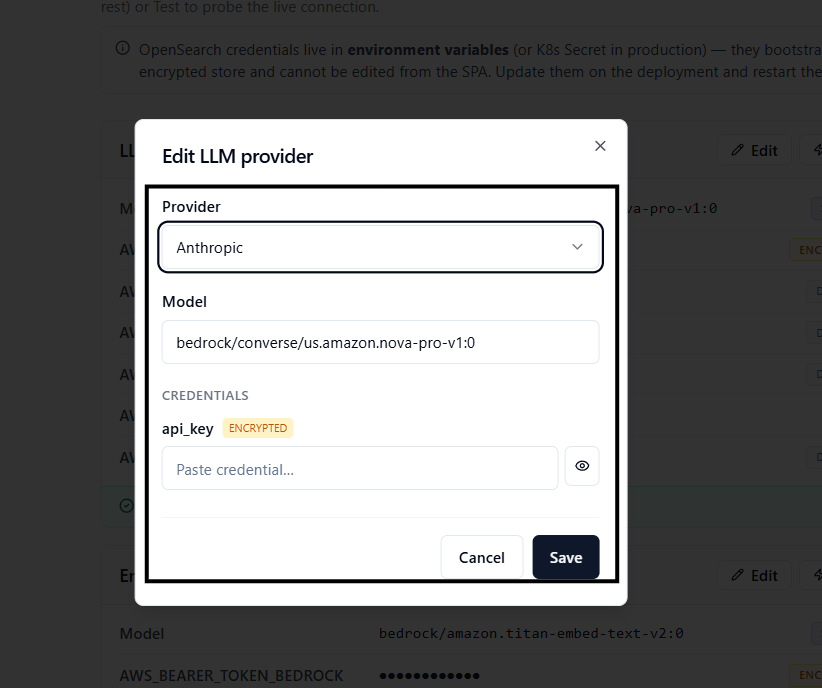

# ASK Admin · Providers & Document Ingestion

> **Flow 9 of the ASK Admin manual.** Two Curator tools that keep the platform's
> plumbing healthy: **System Setup** — view and test the LLM, Embedder and OpenSearch
> providers and edit their credentials — and **Docs** — upload documentation files into the
> RAG index so the agent can answer documentation questions.

| | |
|---|---|
| **Who** | Administrator / platform curator |
| **Time** | ~5 minutes |
| **Prerequisites** | Signed in to **ASK Admin**; provider credentials to hand (paste-ready) for any card you intend to edit. |
| **You'll end with** | Verified LLM / Embedder / OpenSearch connections, and any documentation files indexed for the agent's docs-query mode. |

**Where this fits:** **Configure — providers (you are here)** → Author → Publish → Ask

> Use a **real** provider here (Bedrock, OpenAI, Azure, …); the values shown are an
> illustrative example. **Never expose a real API key** — redact every credential field.

---

## Concepts (30-second version)

- **System Setup** shows one **card per system concern** — **LLM**, **Embedder** and
  **OpenSearch**. Each card lists the provider's fields (model, region, credentials…), a
  **source badge** per field, and a **Test** button that probes the live connection.
- Credentials for **LLM** and **Embedder** are stored **encrypted at rest** (Fernet, in the
  `ask-system-settings-v1` OpenSearch index) and are editable from the SPA via the **Edit**
  dialog.
- **OpenSearch** credentials are **read-only here** — they bootstrap the encrypted store, so
  they must live in **environment variables** (a K8s Secret in production) and are changed on
  the deployment, not in the UI.
- **Docs** is a separate concern from the semantic-YAML layer: it ingests documentation files
  (PDF / DOCX / MD / TXT) into a **RAG index** so the agent's docs-query mode can cite them.

---

## Part A — System Setup

### 1. Open System Setup

In the left sidebar, open **System Setup**. The page header reads **System Setup** with the
subtitle *"Provider config for LLM, Embedder, and OpenSearch. Click Edit to update credentials
(encrypted at rest) or Test to probe the live connection."* A **Refresh** button sits top-right.

A slate **info banner** below the header reminds you that OpenSearch credentials live in
environment variables and cannot be edited from the SPA.

### 2. Read a provider card

Each card has a header (**title** + **provider label**, e.g. *LLM · AWS Bedrock*), the buttons
**Edit** and **Test** on the right (Edit only appears on the LLM and Embedder cards), and one
row per field. Every field row carries a **source badge** on the right edge telling you where
that value came from:

| Badge | Source | Meaning |
|---|---|---|
| **ENV** | Environment variable | Loaded from a process env var (K8s Secret in prod, shell in dev). |
| **FILE** | `config/settings.json` | Loaded from the settings file on disk. |
| **ENCRYPTED** | OpenSearch (encrypted) | Fernet-encrypted in `ask-system-settings-v1` — the value never leaves the server. |
| **STORED** | OpenSearch (plain) | Stored in `ask-system-settings-v1` as a non-sensitive value. |
| **DEFAULT** | Internal default | No value set — the platform's built-in default is used. |

> **Tip — secrets are masked, not truncated.** Sensitive fields render as a fixed-length mask
> regardless of the real length, so a screenshot can never leak how long a key
> is. Non-secret values longer than 50 characters truncate with an ellipsis and are
> click-to-copy.

### 3. Test a connection

Click **Test** on a card. The button shows **Testing…** with a spinner while the probe runs,
then a coloured result strip appears at the bottom of the card:

| Outcome | What you see |
|---|---|
| Success | A green strip: the returned **detail** plus the round-trip **latency in ms** (e.g. *"OK · 142 ms"*), and a toast *"LLM ok · 142 ms"*. |
| Failure | A red strip: **"Test failed · N ms"** with the error message in monospace below, and a *"… test failed"* toast. |

The result stays visible until you run the next test.

- **LLM** and **Embedder** tests run against the **stored encrypted config** (no payload
  override) via the secrets test endpoint.
- **OpenSearch** tests probe the live cluster directly.

> **Warning — a failing Test is a real signal.** If a Test fails, the agent's corresponding
> capability (SQL generation, embeddings, or retrieval) will fail too. Fix the credentials via
> **Edit** (LLM / Embedder) or on the deployment (OpenSearch) before publishing a workspace.

### 4. Edit provider credentials (LLM / Embedder)

Click **Edit** on the **LLM** or **Embedder** card to open the **Edit LLM provider** (or **Edit
Embedder provider**) dialog. The form is driven by the backend provider registry, so the
available providers reflect what the deployment supports.

| Control | Behaviour |
|---|---|
| **Provider** | A dropdown of registered providers (e.g. *AWS Bedrock*). Switching provider drops any credential fields the new provider doesn't declare. |
| **Model** | Free-text model id. Placeholder shows the expected shape — for LLM `e.g. bedrock/converse/us.amazon.nova-lite-v1:0`, for Embedder `e.g. bedrock/amazon.titan-embed-text-v2:0`. |
| **Credentials** | One input per field the selected provider declares. Sensitive fields carry an **ENCRYPTED** tag, are password-typed, and have an eye toggle to reveal. |

Sensitive fields are **pre-populated empty**. When a value is already stored, the placeholder
reads **"Leave blank to keep the existing value"** — type only if you want to overwrite it.
Plain (non-secret) fields are pre-filled with their current value. If a provider declares no
credential fields, the dialog notes it relies on **environment variables seeded by the
deployment**.

Click **Save**. The button shows **Saving…**, a *"LLM provider saved"* (or *"Embedder provider
saved"*) toast confirms, and the Setup page reloads so the card reflects the new values.

> **Warning — never screenshot a live secret.** Keys, client secrets and DB passwords must be
> blank, masked, or blurred in every image. Leaving a sensitive field blank on Save is safe —
> the backend keeps the existing encrypted value; sending an empty **plain** field, however,
> explicitly clears it.

### 5. OpenSearch is read-only here

The **OpenSearch** card has a **Test** button but **no Edit** button. To change its host, port
or credentials, update the environment variables (or K8s Secret) on the deployment and restart
the pods, as the info banner explains. The encrypted store depends on OpenSearch to boot, which
is why these values can't live inside it.

---

## Part B — Docs (documentation ingestion)

### 6. Open Docs

In the left sidebar, open **Docs**. The page header reads **Docs** with the subtitle *"Upload
documentation (PDFs, Markdown, text) into the RAG index for the agent's docs-query mode."* The
semantic-YAML lifecycle (upload / edit / publish) lives elsewhere — see
[Flow 2 · Add Data Products](02-add-data-products.md) and
[Flow 1 · Workspaces & Business Domains](01-workspaces-domains.md).

### 7. Upload and index a document

| Field | Notes |
|---|---|
| **Document file (.pdf, .docx, .txt, .md)** | The file picker. Accepts `.pdf`, `.docx`, `.txt`, `.md` and `.rst`. |
| **Collection name** | The target RAG index/collection. Defaults to **`rag_docs`**; change it to route docs into a separate collection. |

Pick a file, confirm (or change) the **Collection name**, then click **Ingest Document**. The
button shows **Indexing…** with a spinner while the file is chunked, embedded and written to
the index.

On success a green **Document indexed** panel reports:

| Line | Meaning |
|---|---|
| **Chunks indexed** | How many text chunks were written to the index. |
| **Batches sent** | How many write batches the ingest used. |
| **Collection** | The collection the chunks landed in. |

A toast confirms *"Indexed N chunks from `<filename>`"*. If ingestion fails, a red panel and an
*"Ingest failed: …"* toast surface the error instead.

> **Tip — this feeds the documentation-query mode.** Ingested docs power questions like the
> Documentation example in the demo pack — *"How is the yield rate defined in this model, and
> which SAP fields does it use?"*. Keep model-definition notes, KPI glossaries and process docs
> here so the agent can cite them.

---

## What's next

→ **[Flow 1 · Workspaces & Business Domains](01-workspaces-domains.md)** — organize Data
Products once your providers are green.
→ **[Flow 2 · Add Data Products](02-add-data-products.md)** — the AI-assisted create modes rely
on a working **LLM** provider (Test it here first).
→ For the full provider matrix and secrets strategy, see
[Configuration](../config/configuration-app.md).
