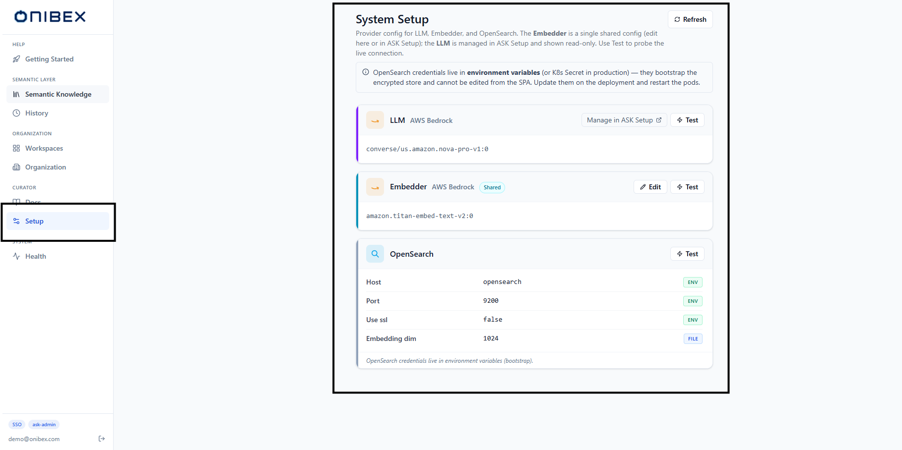
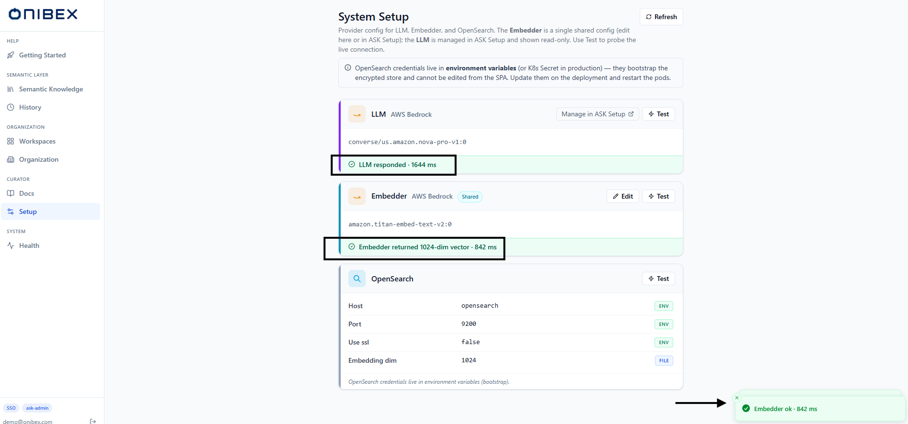
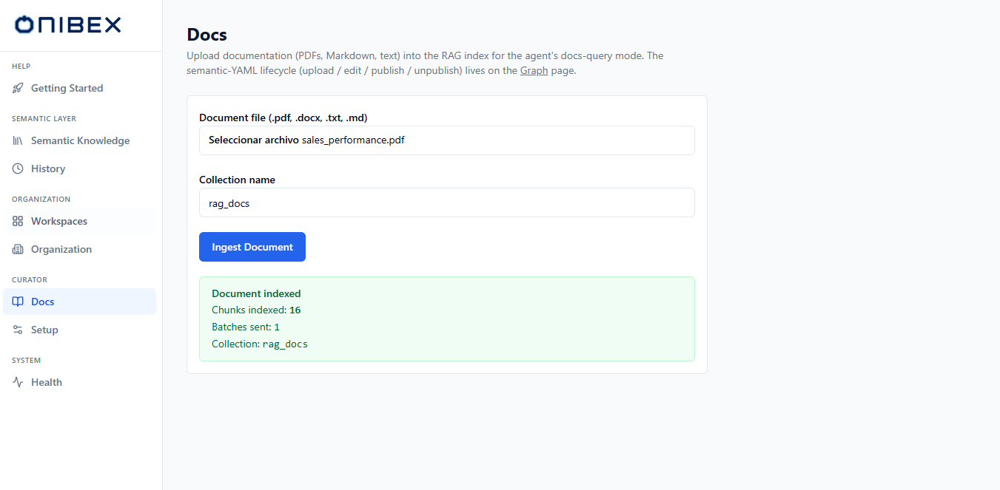

# ASK Admin · System Setup & Document Ingestion

> **Flow 9 of the ASK Admin manual.** Two curator tools that remain in ASK Admin now that most
> configuration has moved to ASK Setup: **System Setup** — view the LLM, Embedder and
> OpenSearch providers and edit the shared **Embedder** — and **Docs** — upload documentation
> files into the RAG index so the agent can answer documentation questions.

| | |
|---|---|
| **Who** | Administrator / platform curator |
| **Time** | ~5 minutes |
| **Prerequisites** | Signed in to **ASK Admin**; embedder credentials to hand (paste-ready) if you intend to edit the Embedder. |
| **You'll end with** | A verified Embedder connection and any documentation files indexed for the agent's docs-query mode. |

**Where this fits:** **Configure — System Setup & Docs (you are here)** → Author → Publish → Ask

> **Provider, model, database and identity configuration now live in ASK Setup**, not here —
> see the [ASK Setup overview](../config/00-overview.md). This page covers only the two
> concerns that remain in ASK Admin: the **shared Embedder** and **document ingestion**. Use a
> **real** provider when editing the Embedder; **never expose a real API key** — redact every
> credential field before capturing a screenshot.

---

## Concepts (30-second version)

- **System Setup** shows one **card per system concern** — **LLM**, **Embedder** and
  **OpenSearch**. Only the **Embedder** is editable here; it is a **single shared config**
  used across ASK Admin and ASK Setup.
- The **LLM** card is **read-only** in ASK Admin. It is managed in ASK Setup — the card links
  out with **Manage in ASK Setup**. LLM and Embedder each render as a clean **model-summary
  line**, not a list of credential rows.
- The **OpenSearch** card lists its fields with a **source badge** per row (where each value
  came from) and is **read-only** — its credentials must live in environment variables because
  they bootstrap the encrypted store.
- **Docs** is a separate concern from the semantic-YAML layer: it ingests documentation files
  (PDF / DOCX / TXT / MD / RST) into a **RAG index** so the agent's docs-query mode can cite
  them.

---

## Part A — System Setup

### 1. Open System Setup

In the left sidebar, open **Setup**. The page header reads **System Setup** with the subtitle
*"Provider config for LLM, Embedder, and OpenSearch. The Embedder is a single shared config
(edit here or in ASK Setup); the LLM is managed in ASK Setup and shown read-only. Use Test to
probe the live connection."* A **Refresh** button sits top-right.

A slate **info banner** below the header reminds you that OpenSearch credentials live in
environment variables (a K8s Secret in production), bootstrap the encrypted store, and cannot
be edited from the SPA.

### 2. Read the LLM card (read-only)

The **LLM** card shows the provider label (e.g. *AWS Bedrock*) and a single **model-summary
line** — the configured model id — rather than credential rows. On the right it carries a
**Manage in ASK Setup** link and a **Test** button; there is **no Edit** button.

To change the LLM provider, model or credentials, follow the **Manage in ASK Setup** link and
edit them on the [LLM Providers](../config/03-llm-providers.md) page in ASK Setup. This page
only reflects what is configured there.

### 3. Edit the Embedder (the one editable provider)

The **Embedder** card carries a **Shared** badge, a model-summary line, and both an **Edit**
and a **Test** button. It is the only provider you edit from ASK Admin, and the same config is
shared with ASK Setup.

Click **Edit** to open the **Edit embedder** drawer (a right-side panel). Its subtitle reads
*"Shared with ASK Setup — one embedder for the whole org. Blank secret fields keep the stored
value."*

| Control | Behaviour |
|---|---|
| **Provider** | A dropdown of registered providers. Selecting one shows only the credential fields that provider declares. |
| **Model** | Required. Free-text model id (a suggestion list is offered per provider, e.g. `amazon.titan-embed-text-v2:0`). Enter just the model id — the provider is already selected. |
| **Credentials** | One input per field the provider declares. Sensitive fields are tagged **encrypted**, are password-typed, and read *"leave blank to keep"* — type only to overwrite. |

Click **Save embedder**. A toast — *"Embedder saved — shared with ASK Setup"* — confirms, and
the Setup page reloads.

> **Warning — changing the embedder provider or model rebuilds every vector space.** Rotating
> credentials is safe. But if you change the **provider or model**, the drawer shows a red
> warning and requires you to confirm — every existing embedding (knowledge graph, semantic
> dictionary and docs, across dev and prod) becomes incompatible and must be **re-ingested and
> re-embedded**. This is not automatic, and switching back won't restore rebuilt data.

### 4. Read the OpenSearch card (read-only)

The **OpenSearch** card lists its connection fields as rows, each with a **source badge** on
the right edge telling you where that value came from:

| Badge | Source | Meaning |
|---|---|---|
| **ENV** | Environment variable | Loaded from a process env var (K8s Secret in prod, shell in dev). |
| **FILE** | `config/settings.json` | Loaded from the settings file on disk. |
| **ENCRYPTED** | OpenSearch (encrypted) | Fernet-encrypted in `ask-system-settings-v1` — the value never leaves the server. |
| **STORED** | OpenSearch (plain) | Stored in `ask-system-settings-v1` as a non-sensitive value. |
| **DEFAULT** | Internal default | No value set — the platform's built-in default is used. |

The OpenSearch card has a **Test** button but **no Edit** button. To change its host, port or
credentials, update the environment variables (or K8s Secret) on the deployment and restart
the pods, as the info banner explains. The encrypted store depends on OpenSearch to boot,
which is why these values can't live inside it.

> **Tip — secrets are masked, not truncated.** Sensitive values render as a fixed-length mask
> regardless of the real length, so a screenshot can never leak how long a key is. Non-secret
> values longer than 50 characters truncate with an ellipsis and are click-to-copy.

### 5. Test a connection

Click **Test** on any card. The button shows **Testing…** with a spinner while the probe runs,
then a coloured result strip appears at the bottom of the card:

| Outcome | What you see |
|---|---|
| Success | A green strip: the returned **detail** plus the round-trip **latency in ms**, and a toast *"`<card>` ok · N ms"*. |
| Failure | A red strip: **"Test failed · N ms"** with the error message in monospace below, and a *"`<card>` test failed"* toast. |

- **LLM** and **Embedder** tests run against the **stored encrypted config** (no payload
  override) via the secrets test endpoint.
- **OpenSearch** tests probe the live cluster directly.

> **Warning — a failing Test is a real signal.** If a Test fails, the agent's corresponding
> capability (SQL generation, embeddings, or retrieval) will fail too. Fix the Embedder here,
> the LLM in [ASK Setup](../config/03-llm-providers.md), or OpenSearch on the deployment before
> publishing a workspace.

---

## Part B — Docs (documentation ingestion)

### 6. Open Docs

In the left sidebar, open **Docs**. The page header reads **Docs** with the subtitle *"Upload
documentation (PDFs, Markdown, text) into the RAG index for the agent's docs-query mode."* The
semantic-YAML lifecycle (upload / edit / publish) lives elsewhere — see
[Flow 2 · Add Data Products](02-add-data-products.md) and
[Flow 1 · Workspaces & Business Domains](01-workspaces-domains.md).

### 7. Upload and index a document

| Field | Notes |
|---|---|
| **Document file (.pdf, .docx, .txt, .md)** | The file picker. Accepts `.pdf`, `.docx`, `.txt`, `.md` and `.rst`. |
| **Collection name** | The target RAG index/collection. Defaults to **`rag_docs`**; change it to route docs into a separate collection. |

Pick a file, confirm (or change) the **Collection name**, then click **Ingest Document**. The
button shows **Indexing…** with a spinner while the file is chunked, embedded and written to
the index.

On success a green **Document indexed** panel reports:

| Line | Meaning |
|---|---|
| **Chunks indexed** | How many text chunks were written to the index. |
| **Batches sent** | How many write batches the ingest used. |
| **Collection** | The collection the chunks landed in. |

A toast confirms *"Indexed N chunks from `<filename>`"*. If ingestion fails, a red panel and an
*"Ingest failed: …"* toast surface the error instead.

> **Tip — this feeds the documentation-query mode.** Ingested docs power questions like the
> Documentation example in the demo pack — *"How is the yield rate defined in this model, and
> which SAP fields does it use?"*. Keep model-definition notes, KPI glossaries and process docs
> here so the agent can cite them.

---

## What's next

→ **[Flow 1 · Workspaces & Business Domains](01-workspaces-domains.md)** — organize Data
Products once your Embedder is green.
→ **[Flow 2 · Add Data Products](02-add-data-products.md)** — the AI-assisted create modes rely
on a working **LLM** provider (managed in [ASK Setup](../config/03-llm-providers.md)).
→ For the full provider, database and identity configuration, see the
[ASK Setup overview](../config/00-overview.md).
