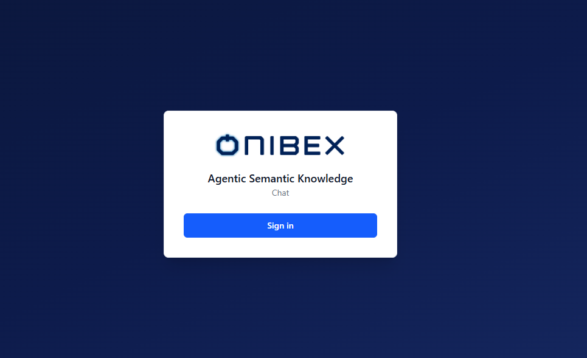
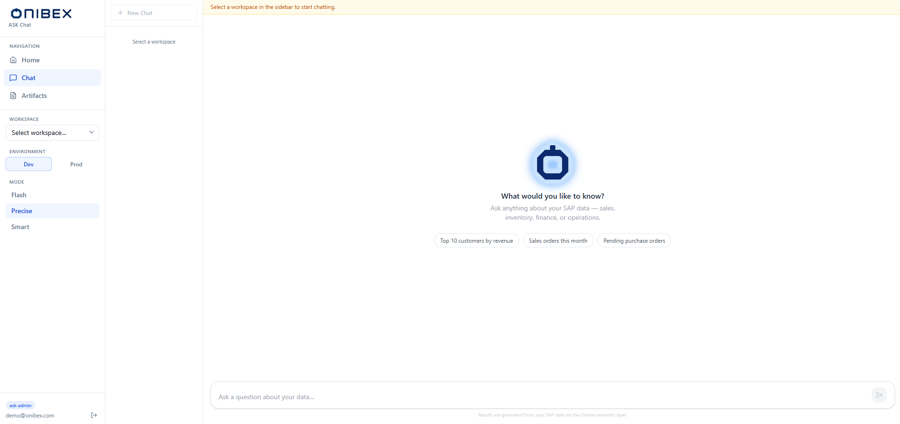
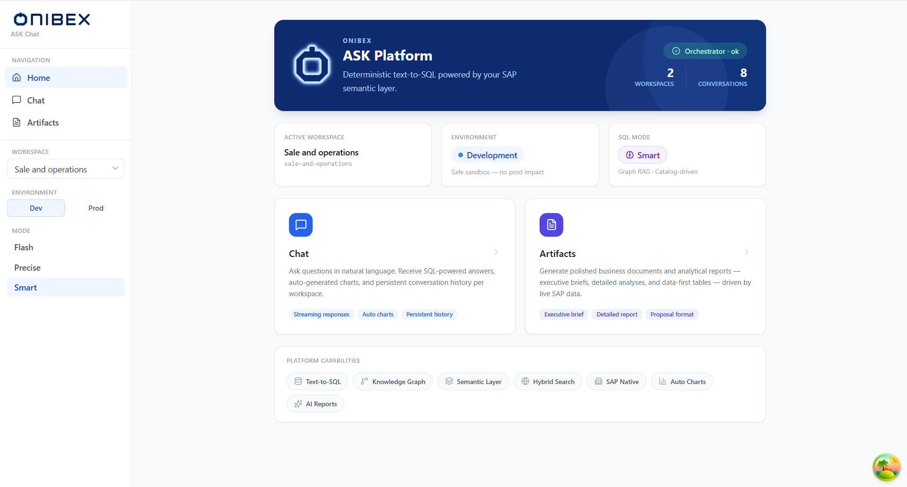

# ASK Chat · Overview & Navigation

> **Flow 0 of the ASK Chat manual — the map.** Get oriented in **ASK Chat**: how you sign
> in, what each sidebar section controls, and which flow doc to open next. Every other flow
> (01–03) is reachable from here.

| | |
|---|---|
| **Who** | Business user / analyst — anyone who queries enterprise data in plain language |
| **Time** | ~2 minutes to read |
| **Prerequisites** | The SPA is installed and reachable (see [Installation](../01-installation.md)). |
| **You'll end with** | A clear picture of the navigation and where every task lives. |

**Where this fits:** Configure → Author → Publish → **Ask — get oriented (you are here)**

> The screenshots and sample values below use an illustrative **SAP Sales & Distribution**
> example (Sales Orders). Substitute your own Data Products — the exact demo names and
> questions won't exist in your system.

---

## Concepts (30-second version)

- **ASK Chat** is the natural-language query interface. You type a question; the agent answers
  from the governed semantic layer — a written answer, a results table, an auto-generated chart,
  and optionally the SQL behind it.
- It is one of two user surfaces. ASK Chat is for **querying**. **ASK Setup**
  (see [ASK Setup](../config/00-overview.md)) is for technical setup by admins.
- Three controls in the sidebar scope every query: **Workspace** (what data the agent sees),
  **Environment** (`dev` or `prod` database), and **Mode** (`Flash` / `Precise` / `Smart` SQL
  strategy).
- A separate **Artifacts** section lets you generate shareable business documents — reports,
  executive briefs, and data tables — without writing a single line of SQL.

---

## 1. Sign in

Open the app URL. If you are not already authenticated you see the Onibex-branded **sign-in**
screen.

| Auth mode | What happens |
|---|---|
| **Keycloak (SSO)** | Redirects to your identity provider, then back to the app. Production mode. |
| **Dev bypass** | A *Continue without authentication* button enters the app directly — local development only. |

> **Warning —** *Continue without authentication* only appears when the deployment is
> explicitly set to dev-bypass mode. Never run production with the bypass enabled.

---

## 2. The navigation sidebar

Once signed in, the left sidebar is your permanent map. It is always visible, regardless of
which page you are on.

| Section | What it does |
|---|---|
| **Home** nav link | The dashboard — orchestrator health, active configuration, and links to Chat and Artifacts. |
| **Chat** nav link | The conversational interface — ask questions, read answers, browse session history. |
| **Artifacts** nav link | Generate, view, and download AI-produced business documents. |
| **Workspace** dropdown | Scopes every query to a specific data product collection. Required before asking anything. |
| **Environment** toggle | Switches between the `dev` (development) and `prod` (production) database. |
| **Mode** selector | Picks the SQL resolution strategy — **Flash**, **Precise**, or **Smart**. |

All three settings (Workspace, Environment, Mode) are **persisted to local storage** — they
survive page refreshes and browser restarts.

---

## 3. The Home dashboard

Opening the app takes you to the **Home** page. It shows:

1. **System status** — a live health check of the orchestrator backend; a green badge means
   queries are ready to run.
2. **Active configuration** — three cards confirming the workspace, environment, and mode
   currently in effect.
3. **Feature cards** — two clickable panels for navigating directly to Chat or Artifacts.
4. **Capabilities strip** — a row of feature badges (Text-to-SQL, Knowledge Graph, Hybrid
   Search, SAP Native, Auto Charts, AI Reports).

From here, follow the flows in order:

1. [Flow 1 · Workspace, Environment & Mode](01-workspace-environment-mode.md) — configure the three sidebar controls before asking anything.
2. [Flow 2 · Using the Chat](02-chat.md) — ask questions and read governed SQL answers.
3. [Flow 3 · Artifacts](03-artifacts.md) — generate and download business documents.

---

## What's next

→ **[Flow 1 · Workspace, Environment & Mode](01-workspace-environment-mode.md)** — set up the
three controls that scope every query.
