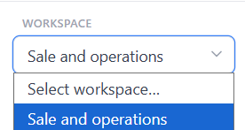
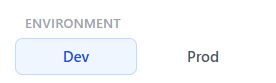
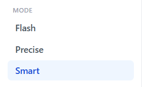

# ASK Chat · Workspace, Environment & Mode

> **Flow 1 of the ASK Chat manual.** Configure the three sidebar controls that scope every
> query — **Workspace**, **Environment**, and **Mode** — before you ask your first question.

| | |
|---|---|
| **Who** | Business user / analyst |
| **Time** | ~2 minutes |
| **Prerequisites** | You are signed in to ASK Chat (see [Overview](00-overview.md)). |
| **You'll end with** | A workspace selected, an environment chosen, and a query mode set — the chat is ready to use. |

**Where this fits:** Configure → Author → Publish → **Ask — set controls (you are here)** → Chat → Artifacts

> The screenshots and sample values below use an illustrative **SAP Sales & Distribution**
> example (Sales Orders). Substitute your own Data Products — the exact demo names and
> questions won't exist in your system.

---

## Concepts (30-second version)

- **Workspace** is the hard scope — the agent can only see Data Products that belong to the
  workspace you pick. Without one selected, every query is refused.
- **Environment** picks the database: `dev` for the development connection, `prod` for production.
  A Data Product that has only been ingested for `dev` is invisible when the chat is set to `prod`.
- **Mode** decides how thoroughly the agent plans the SQL. It never changes *what* data you
  can access — only *how* the agent resolves your question to a query.
- All three settings persist to local storage, so you only need to configure them once per
  browser.

---

## 1. Pick a Workspace

In the left sidebar, open the **Workspace** dropdown and select the workspace you want to
query. Workspaces are loaded from the admin API and listed by name.

| Control | Behaviour |
|---|---|
| **Workspace** (dropdown) | Scopes the agent to a specific collection of Data Products. Shows each workspace as its display name. |
| Workspace count (Home page) | The Home dashboard shows how many workspaces are available as a quick reference. |

> **Warning —** If the dropdown is empty, no workspace has been configured yet or the admin API
> is unreachable. Ask an administrator to create a workspace in the admin app, then refresh
> the page.

> **Warning —** Until a workspace is selected, the Chat page shows an amber banner and refuses
> to send messages. The Artifacts page similarly requires a workspace before generating a document.

---

## 2. Pick an Environment

Under **Environment** in the sidebar, click one of the two pill buttons:

| Option | Label | What it targets |
|---|---|---|
| **dev** *(default)* | `dev` · "Safe sandbox — no prod impact" | The development database connection configured in ASK Setup. |
| **prod** | `prod` · "Live production data" | The production database connection. Only available if the administrator has configured a prod connection. |

> **Tip —** start in `dev` while the semantic layer is being built or reviewed. Switch to
> `prod` once an administrator has confirmed the production database is connected and the
> semantic layer is validated.

> **Warning —** If the `prod` database is not configured, prod queries return a clear error
> rather than silently falling back to dev. See
> [ASK Setup · Database Connections](../ask-setup/02-database-connections.md).

---

## 3. Choose a Mode

Under **Mode** in the sidebar, click one of the three options:

| Mode | When to use it |
|---|---|
| **Flash** | Quick exploration. One LLM call, no join planning, no scope check. Fastest and cheapest; least rigorous. Use when latency matters more than guarantees. |
| **Precise** *(default)* | Auditable, reproducible answers. Extracts a semantic plan, ranks Data Products deterministically, plans joins with Dijkstra, and validates the SQL against allowed tables — retrying once if needed. The default for everyday, auditable use. |
| **Smart** | The all-rounder. Shows the LLM a compact catalog, lets it pick the relevant Data Products, then resolves joins deterministically. Useful for broad or unusually phrased questions. |

The mode is forwarded as a parameter on every `/query` and `/artifact` call. It does not
affect **Schema** questions, **Documentation** questions, or **Action** questions — only
data queries that produce SQL.

> **Tip —** Leave the mode on **Precise** for normal, auditable answers. Use **Flash** for
> fast, exploratory lookups where you will validate the result yourself, and **Smart** when a
> question is broad or unusually phrased and you want the agent to pick the Data Products.

---

## What's next

→ **[Flow 2 · Using the Chat](02-chat.md)** — ask your first question and read the answer.
→ **[Flow 3 · Artifacts](03-artifacts.md)** — generate business documents from your data.
