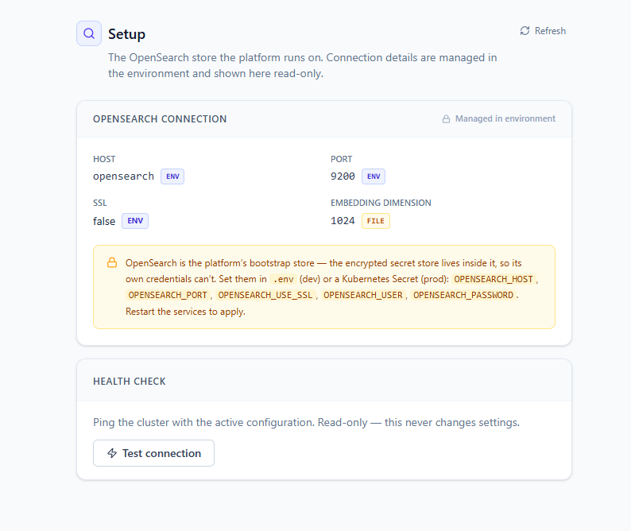

# ASK Setup · Infrastructure (OpenSearch)

> **The store the whole platform runs on.** The **Setup** page shows the **OpenSearch** connection
> ASK Platform uses for its semantic index and its encrypted secret store. It is **read-only** —
> the connection is supplied by the environment — and gives you a one-click **health check** to
> confirm the cluster is reachable.

| | |
|---|---|
| **Who** | Administrator (**ask-admin** role) |
| **Time** | ~1 minute to review; changes are made outside the UI |
| **Prerequisites** | The platform is installed with OpenSearch running (see [Installation](../01-installation.md)). |
| **You'll end with** | Confidence that the platform is pointed at the right OpenSearch cluster and that it responds. |

**Where this fits:** **Configure — Setup (you are here)** → Author → Publish → Ask

> The screenshots and sample values below use the illustrative demo environment: OpenSearch at host
> `opensearch`, port `9200`, SSL off. Substitute your own host — never screenshot a real password.

---

## Concepts (30-second version)

- **OpenSearch is the platform's bootstrap store.** It holds the semantic index *and* the encrypted
  secret store that every other Setup page writes to. Because the secret store lives inside
  OpenSearch, OpenSearch's own credentials cannot be stored there — they come from the environment.
- **This page is a read-only mirror.** You cannot edit the connection here. It reflects what the
  running services were given, so you can verify it and test it — nothing more.
- **Source chips tell you where each value came from.** Every field carries a small chip:
  **env**, **file**, **encrypted**, **config** or **default**.

---

## 1. Open the Setup page

In the left sidebar, click **Setup**. The page header reads **Setup**, with a **Refresh** button in
the top-right that re-reads the live configuration from the server.

The body has two cards: **OpenSearch Connection** (read-only) and **Health check**.

## 2. Read the OpenSearch connection

The **OpenSearch Connection** card is labelled **Managed in environment** (with a lock). It lists
the fields the platform is using:

| Field | Notes |
|---|---|
| **Host** | The OpenSearch host — demo: `opensearch`. |
| **Port** | The port — demo: `9200`. |
| **SSL** | Whether TLS is used for the connection. |
| **Embedding dimension** | The vector width the index expects — the platform uses `1024`. |
| **Username** | The OpenSearch user, when authentication is enabled. |
| **Password** | Never displayed; a stored value shows as set, never in clear text. |

Any field with no value reads **not set**.

### Source chips

Each field carries a chip showing where its live value originated:

| Chip | Meaning |
|---|---|
| **env** | Supplied by an environment variable (this is the normal case for OpenSearch). |
| **file** | Read from an on-disk config file. |
| **encrypted** | Read from the encrypted store in OpenSearch. |
| **config** | A plain (non-secret) config value. |
| **default** | No value was supplied; the platform's built-in default is in effect. |

> **Tip — the chips reveal precedence.** When a value could come from more than one place, an
> environment variable wins. If a field reads **env**, that is the value in force regardless of what
> a file or the store may also contain.

## 3. Test the connection

The **Health check** card pings the cluster with the active configuration. As its note says, it is
**read-only — this never changes settings**.

Click **Test connection**. The button shows **Testing…** while it runs, then a result banner:

- **Success (green):** the cluster name, its status and the round-trip latency, for example
  *Cluster 'docker-cluster' is green · 12 ms*.
- **Failure (red):** the error returned — typically an unreachable host, a refused port, or bad
  credentials.

A matching toast appears in the top-right corner.

---

## How to change the OpenSearch connection

Because this page is read-only, you change the connection **in the environment**, not in the UI.
Set these variables in your `.env` file (development) or a **Kubernetes Secret** (production):

| Variable | Purpose |
|---|---|
| `OPENSEARCH_HOST` | Cluster host. |
| `OPENSEARCH_PORT` | Cluster port. |
| `OPENSEARCH_USE_SSL` | Whether to connect over TLS. |
| `OPENSEARCH_USER` | Username, when authentication is enabled. |
| `OPENSEARCH_PASSWORD` | Password for that user. |

> **Warning — restart to apply.** Environment changes are read at startup. After editing `.env` or
> the Secret, **restart the services** for the new connection to take effect, then return here and
> click **Refresh**, then **Test connection**, to confirm.

---

## What's next

→ **[Database Connections](02-database-connections.md)** — register the databases the agent queries.
→ **[ASK Setup · Overview](00-overview.md)** — the storage model behind the source chips.
→ **[Installation](../01-installation.md)** — where the `OPENSEARCH_*` variables are defined.
