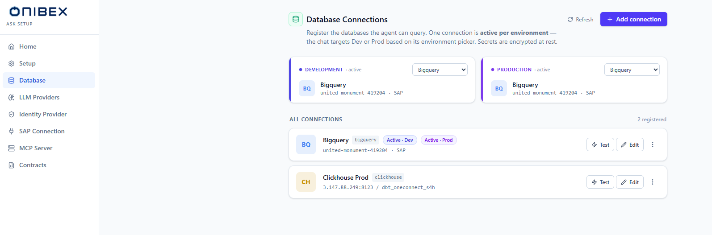
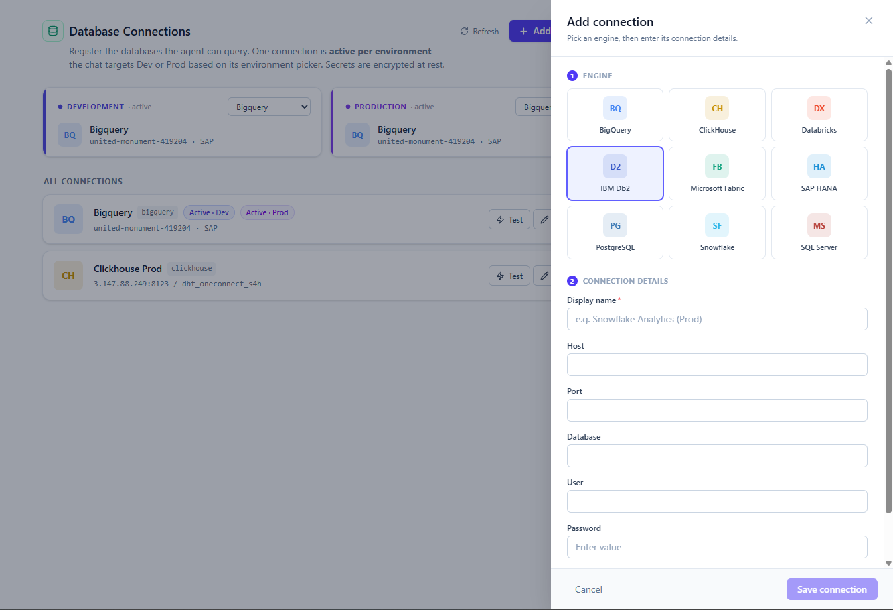

# ASK Setup · Database Connections

> **The databases the agent can query.** The **Database** page is a registry: you can hold as many
> named connections as you like, across nine SQL engines, and mark **one active per environment**
> (Development and Production). The chat runs its generated SQL against whichever connection is
> active for the environment it targets.

| | |
|---|---|
| **Who** | Administrator (**ask-admin** role) |
| **Time** | ~2 minutes per connection |
| **Prerequisites** | The platform is running ([Installation](../01-installation.md)) and reachable network access to your database. |
| **You'll end with** | At least one registered connection, marked active for **Development** and/or **Production**, so the chat can answer data questions. |

**Where this fits:** **Configure — Database (you are here)** → Author → Publish → Ask

> The screenshots and sample values below use the illustrative demo target: an **SAP HANA**
> connection (host shown, port `443`, schema `US_ONEC_TECH`). Substitute your own engine and
> credentials — never screenshot a real database password or service-account key.

---

## Concepts (30-second version)

- **A registry, not a single connection.** You register any number of connections; each has a
  **Display name** and an engine. Registering one does not make it live.
- **One active per environment.** Exactly one connection can be **active for Development** and one
  **active for Production**. The chat's environment picker (Dev / Prod) decides which one a question
  runs against.
- **Secrets are encrypted at rest.** Passwords, tokens and key files are encrypted inside
  OpenSearch. When you edit a connection, sensitive fields come back **blank** — leaving them blank
  keeps the stored value.
- **No active connection blocks the chat.** If an environment has no active connection, chat queries
  for that environment are blocked until you pick one.

---

## 1. Open the Database page

In the left sidebar, click **Database**. The header reads **Database Connections**, with **Refresh**
and **Add connection** buttons in the top-right.

The page has two zones: an **active per environment** row at the top (two cards, **Development** and
**Production**), and the full **All connections** list beneath it.

### The active-per-environment cards

Each of the two cards — **Development** and **Production** — shows which connection is active for
that environment and lets you change it from a dropdown:

- When a connection is active, the card shows its engine monogram, name and a one-line target
  summary (for example `host:443 / US_ONEC_TECH`).
- When none is active, the card shows an amber warning: **No active connection — {env} chat queries
  are blocked**.
- The dropdown lists every registered connection plus **— none —** to clear the active choice.

### The connection list

**All connections** lists every registered connection with a count (**N registered**). Each row
shows the engine monogram, the **Display name**, the engine's technical id, and badges where they
apply:

| Badge | Meaning |
|---|---|
| **Active · Dev** | This connection is active for Development. |
| **Active · Prod** | This connection is active for Production. |
| **Incomplete** | The connection is missing required fields — finish it before using it. |

If nothing is registered yet, an empty state invites you to **Add connection**.

## 2. Add a connection

Click **Add connection**. A drawer slides in from the right titled **Add connection**, with two
steps.

### Step 1 — Engine

Pick the engine from the grid. The platform supports nine:

| Engine | Key fields |
|---|---|
| **PostgreSQL** | Host, Port, Database, User, Password, SSL mode |
| **SAP HANA** | Host, Port, User, Password, Schema |
| **ClickHouse** | Host, Port, Username, Password, Database, Secure (TLS), FINAL modifier |
| **IBM Db2** | Host, Port, Database, User, Password, Security |
| **Snowflake** | Account, User, Password, Private key file (path), Warehouse, Database, Schema, Role |
| **Databricks** | Server hostname, HTTP path, Access token, Catalog, Schema |
| **BigQuery** | Project ID, Credentials path (ADC), Service account key (JSON), Dataset, Location, Max bytes billed |
| **SQL Server** | Host, Port, Database, User, Password, ODBC driver, Encrypt, Trust server certificate |
| **Microsoft Fabric** | SQL endpoint, Database, Tenant ID, Client ID, Client secret, ODBC driver |

### Step 2 — Connection details

Selecting an engine reveals its form. Fill in:

- **Display name** (required) — a human-friendly label, for example *SAP HANA (Prod)*. This is what
  the cards, badges and dropdowns show.
- The engine-specific fields, which adapt to the field type:
  - **Text and number** fields for hosts, ports, databases and the like.
  - **Password** fields for secrets — these are masked.
  - **Toggles** for on/off options (for example ClickHouse **Secure (TLS)**).
  - **Dropdowns** for fixed choices (for example PostgreSQL **SSL mode**, SQL Server **Encrypt**).
  - A **file upload** for BigQuery's **Service account key (JSON)** — click the field to choose your
    service-account JSON key; it is encrypted on save.

Click **Save connection**. The drawer closes and the new connection appears in the list. **Save
connection** stays disabled until at least the **Display name** and an engine are set.

> **Tip — the connection is not live until you activate it.** Saving only registers the connection.
> Set it active for an environment (next step) before the chat will use it.

## 3. Set a connection active for an environment

There are two ways to choose the active connection for an environment:

- **From the top cards** — use the dropdown on the **Development** or **Production** card and pick a
  connection (or **— none —**).
- **From a connection's actions menu** — click the **⋯** (more) button on a row, then under **Set
  active for** choose **Development** or **Production**. A check marks the environment it is already
  active for.

A confirmation toast reports the change, and the row picks up its **Active · Dev** / **Active ·
Prod** badge.

> **Warning — no active connection blocks that environment.** If **Development** or **Production**
> has no active connection, the chat cannot answer data questions for that environment — the card
> shows **No active connection — {env} chat queries are blocked**. Always leave each environment you
> use pointed at a working connection.

## 4. Test a connection

Each row has a **Test** button. Click it to open a live connection to that database using its stored
credentials. A toast reports success with the round-trip latency, or the error if it fails.

> **Tip — test before you activate.** Run **Test** on a new connection before marking it active, so
> a bad host or credential surfaces here rather than as a failed chat answer.

## 5. Edit or delete a connection

- **Edit** — click **Edit** on a row to reopen the drawer as **Edit connection**. The engine is
  fixed (you cannot change an existing connection's engine). Sensitive fields show blank with a
  *leave blank to keep* placeholder — type a new value only if you want to replace the stored one.
- **Delete** — open the **⋯** menu and choose **Delete**. A confirmation dialog asks **Delete
  "{name}"?**. If the connection is currently active for an environment, the dialog warns that
  deleting it leaves that environment without a target and blocks its chat queries until you pick
  another. Deleting also removes the connection's encrypted credentials and cannot be undone.

---

## What's next

→ **[LLM Providers](03-llm-providers.md)** — register the language model the agent uses to write SQL.
→ **[Infrastructure (OpenSearch)](01-setup.md)** — the store where these encrypted credentials live.
→ **[Publish & Deploy](../ask-admin/05-publish-deploy.md)** — how the chat's dev / prod environments map to the active connections here.
