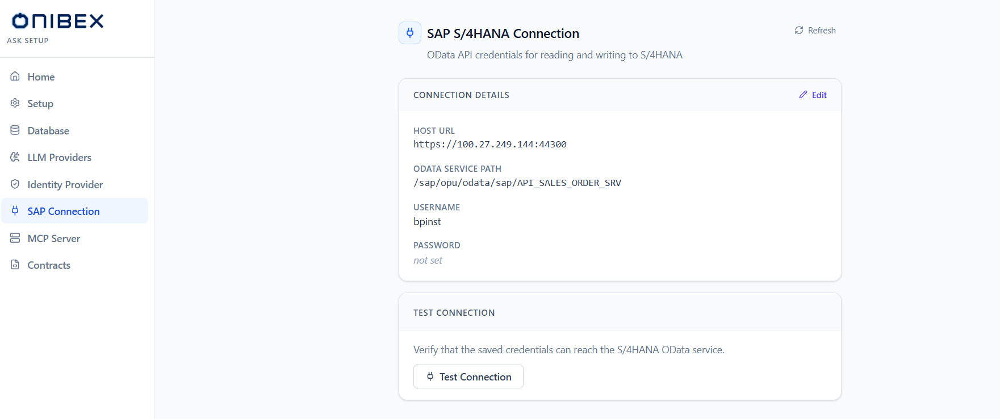

# ASK Setup · SAP Connection

> **Configuration flow.** Store the **S/4HANA OData API credentials** the platform uses to read from
> and write to SAP. It is a small form — host, service path, username, password — with a **Test**
> button to confirm the platform can reach the service.

| | |
|---|---|
| **Who** | Administrator |
| **Time** | ~2 minutes |
| **Prerequisites** | You can sign in to **ASK Setup** (see [Installation](../01-installation.md)), and you have an S/4HANA OData user (host, user, password) for the service you want to expose. |
| **You'll end with** | Saved S/4HANA OData credentials, verified with a live **Test Connection**. |

**Where this fits:** **Configure — SAP Connection (you are here)** → Author → Publish → Ask

> The screenshots below use an illustrative host and username. Substitute your own — and never type
> or screenshot a real S/4HANA password (the page masks it once saved).

---

## Concepts (30-second version)

- This page holds the credentials for the **S/4HANA OData API** — the endpoint the platform calls to
  read SAP data and to perform write actions.
- The form has four fields: **Host URL**, **OData Service Path**, **Username** and **Password**. The
  service path defaults to `/sap/opu/odata/sap/API_SALES_ORDER_SRV`.
- **Saving simply writes the configuration through the config API.** There is no Kubernetes
  Secret/ConfigMap edit, no pod restart, and no progress bar — the change takes effect
  immediately.
- The **password is write-only in the UI**: once saved it is shown masked, and you leave the field
  blank on a later edit to keep it unchanged.
- **Test Connection** makes a live call to the saved credentials so you can confirm reachability
  before relying on them.

---

## 1. Open the SAP Connection page

In the ASK Setup sidebar, open **SAP Connection**. The page shows a **Connection Details** card and a
**Test Connection** card. A **Refresh** button (top-right) re-fetches the stored configuration.

In read mode the **Connection Details** card lists **Host URL**, **OData Service Path**, **Username**
and **Password** (shown masked when one is stored). Fields that were never set read
*"not set."*

## 2. Edit the connection details

Click **Edit** on the **Connection Details** card. The card switches to a form:

| Field | Required | Notes |
|---|---|---|
| **Host URL** | Yes | Include protocol and port, e.g. `https://your-s4hana-host:44300`. |
| **OData Service Path** | Yes | Defaults to `/sap/opu/odata/sap/API_SALES_ORDER_SRV`. Change it to the OData service you expose. |
| **Username** | Yes | The S/4HANA service user (demo placeholder: `BPINST`). |
| **Password** | Conditional | Use the eye icon to reveal it while typing. If a password is already stored, the hint reads *"A password is already set. Leave blank to keep it unchanged."* |

> **Tip — one service path per connection.** The default path targets the Sales Order API. Point
> **OData Service Path** at whichever OData service the platform should call for your scenario.

## 3. Save

Click **Save**. Host and username are required — if either is empty the page reports *"Host and
username are required"* and does not save. On success a toast confirms *"SAP connection saved"* and
the card returns to read mode with the password masked.

> **Note — no restart needed.** Saving writes straight through the configuration API; the platform
> picks up the new credentials right away — there is no secret/ConfigMap step and no pod restart.

> **Warning — leaving the password blank keeps the old one.** On an edit, an empty **Password** field
> means *keep the stored password*. Type a value only when you intend to replace it.

## 4. Test the connection

On the **Test Connection** card, click **Test Connection**. The platform verifies that the saved
credentials can reach the S/4HANA OData service. A green banner shows **Connection successful**; a red
banner shows the failure reason. The button is disabled until a configuration has been saved.

> **Tip — test after every change.** Run the test after saving new credentials, after rotating the
> password, or whenever SAP-backed answers start failing, to isolate a connectivity problem from a
> modelling one.

---

## What's next

→ **[ASK Setup · MCP Server](06-mcp-server.md)** — the internal MCP endpoint that carries SAP write
actions.
→ **[ASK Setup · Contracts](07-contracts.md)** — register an OpenAPI contract as MCP tools the agent
can call against SAP.
→ **[ASK Setup · Identity Provider](04-identity-provider.md)** — who signs in, and how.
