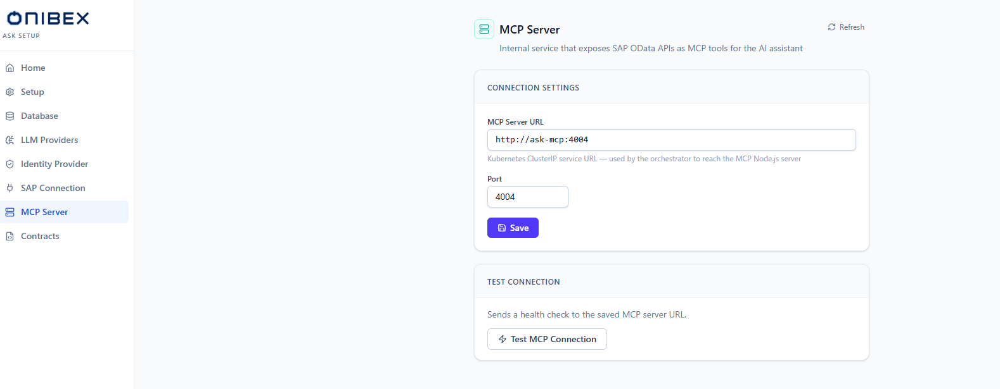

# ASK Setup · MCP Server

> **ASK Setup configuration — MCP Server.** Point the platform at the internal **MCP
> Server** — the tool bridge the agent uses to make SAP OData write and action calls. This
> page stores the endpoint (URL + port) the orchestrator uses to reach that service and lets
> you verify it is live.

| | |
|---|---|
| **Who** | Administrator |
| **Time** | ~2 minutes |
| **Prerequisites** | You can sign in to **ASK Setup**; the MCP service is deployed in your cluster. |
| **You'll end with** | A saved MCP endpoint the agent uses for SAP OData actions, verified reachable with a health check. |

**Where this fits:** **Configure — MCP Server (you are here)** → Author → Publish → Ask

> The screenshots and values below use the platform's default in-cluster endpoint
> (`http://agenticai-mcp-service:4004`). Substitute your own deployment's service name and
> port if they differ.

---

## Concepts (30-second version)

- **MCP** (Model Context Protocol) is the **tool bridge** the agent uses to call SAP OData
  services — for example, to create or update a sales order. It runs as a separate internal
  service in the cluster; this page only tells the orchestrator **where** to reach it.
- The endpoint is stored as **configuration** (an MCP URL and port). Saving it takes effect
  for the next query — there is no pod restart or container rebuild involved.
- The **tools** the MCP server exposes are defined by the OpenAPI specs you register on the
  [Contracts](07-contracts.md) page. This page is the address; Contracts is the catalog.
- **Test** sends a health check to the **saved** URL, so save your changes before you test.

---

## 1. Open the MCP Server page

In the left sidebar, click **MCP Server**. The page header reads **MCP Server** with the
subtitle *"Internal service that exposes SAP OData APIs as MCP tools for the AI assistant"*. A
**Refresh** button sits top-right and re-fetches the stored values.

## 2. Set the endpoint and save

The **Connection Settings** card holds two fields:

| Field | Notes |
|---|---|
| **MCP Server URL** | The service address the orchestrator calls. Defaults to `http://agenticai-mcp-service:4004` — the Kubernetes ClusterIP service that fronts the MCP Node.js server. A trailing slash is trimmed on save. |
| **Port** | The MCP service port. Defaults to `4004`. |

Enter your values, then click **Save**. A confirmation toast — *"MCP Server configuration
saved"* — reports success.

> **Tip — internal address, not a public URL.** The default host
> (`agenticai-mcp-service`) is a cluster-internal service name resolved by Kubernetes DNS. It
> is reached by the orchestrator inside the cluster, not from your browser, so it does not
> need to be publicly routable.

## 3. Test the connection

Open the **Test Connection** card and click **Test MCP Connection**. The button shows
**Testing…** with a spinner while a health check is sent to the **saved** URL, then a result
strip appears below it:

| Outcome | What you see |
|---|---|
| Success | A green strip — *"MCP server responded"* (with the HTTP status when returned) — and a toast *"MCP server is reachable"*. |
| Failure | A red strip with the error message, and a toast *"MCP unreachable: …"*. |

> **Warning — a failing test only affects actions.** If the MCP server is unreachable, the
> agent's **action-execution** capability (SAP OData writes) will fail. Read-only questions
> that generate and run SQL are unaffected. Save the correct endpoint and confirm the test is
> green before relying on write actions.

---

## What's next

→ **[Contracts](07-contracts.md)** — register the OpenAPI specs that turn SAP OData services
into the tools this MCP server exposes.
→ **[SAP Connection](05-sap-connection.md)** — set the S/4HANA OData credentials the MCP
server uses to reach SAP.
