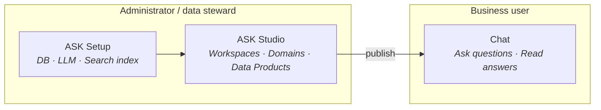
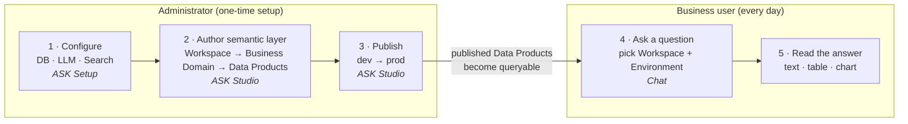
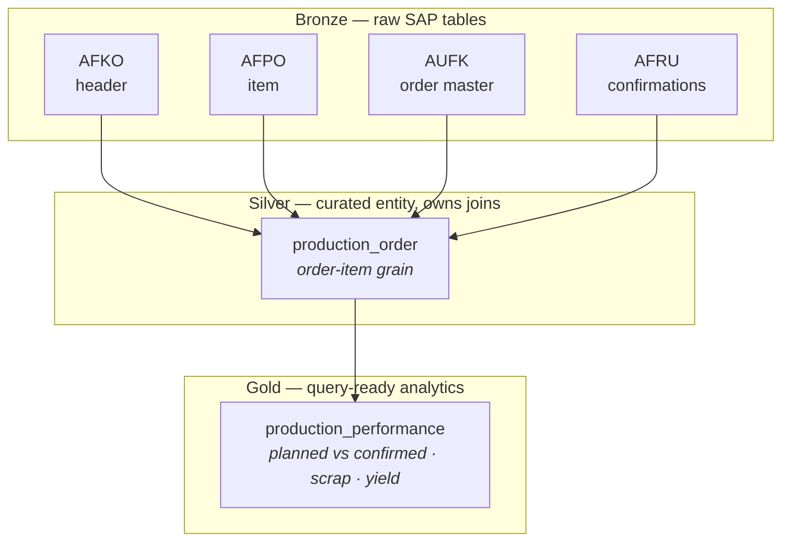
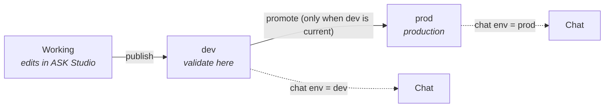
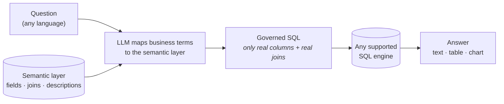
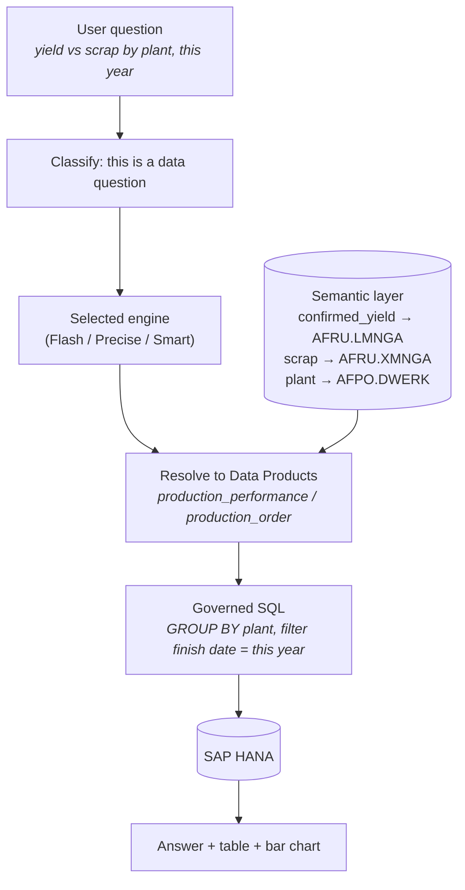

# Concepts & Architecture

> **The mental model for the whole platform.** Read this once and the rest of the manual
> falls into place: the two surfaces you work in and the one you configure first, the two
> roles that use them, how the
> **semantic layer** is organized, why the SQL is **governed**, and how the three chat
> engines differ.

| | |
|---|---|
| **Who** | Everyone — administrators, data stewards, and business users. |
| **Time** | ~8 minutes to read. |
| **Prerequisites** | None. This is the orientation page; no login required. |
| **You'll end with** | A clear picture of how a natural-language question becomes a governed SQL answer, and where each task in this manual fits. |

[Manual](README.md) › [Foundations](README.md#foundations) › **Concepts & Architecture**

> The screenshots and sample values below use an illustrative **SAP Production Planning** example (Production Orders). Substitute your own Data Products — the exact demo names and questions won't exist in your system.

---

## Concepts (30-second version)

- The platform turns a **natural-language question** into **governed SQL** over your SAP
  data, runs it, and returns a written answer plus a table and an automatic chart.
- **Governed** is the key word: the agent never invents column names or guesses at joins.
  It can only use the **Data Products** an administrator has defined and published.
- Preparing that governed layer is a one-time (and occasional) **administrator** job.
  Asking questions is the everyday **business-user** job.
- Nothing is answerable until a business domain is **published** to the environment the
  chat is querying (`dev` or `prod`). This is the single most common source of empty
  answers.

---

## 1. Three surfaces, two roles

The platform is three applications, used by two kinds of people — but they are not three peers.
**ASK Setup is the precondition for the other two**, which is why it is listed first here and
first in the manual.

| Surface | Who uses it | What it's for |
|---|---|---|
| **ASK Setup** | Administrator | The technical prerequisite: database connections, LLM / embeddings provider, search index. Set once; nothing else functions before it. |
| **ASK Studio** | Administrator / data steward | Author and publish the **semantic layer**: workspaces, business domains, Data Products. |
| **ASK Chat** | Business user | Ask questions in natural language and read the answers. |

The two roles map cleanly onto the surfaces:

- The **administrator** (or data steward) configures **ASK Setup** once, then works in **ASK
  Studio**. They connect the database, pick the model provider, model the SAP tables into
  business Data Products, and publish them.
- The **business user** works only in the **Chat**. They pick a workspace, ask a question
  in plain language, and read the answer — no SQL, no schema knowledge required.

> **How the two roles are enforced.** Access is governed by two platform roles: **ask-admin**
> (full authoring and configuration — ASK Studio and ASK Setup) and **ask-user** (the chat).
> Every user of the realm is auto-granted **ask-user**, so business users can ask questions
> without extra setup; **ask-admin** is assigned deliberately to the people who author and
> configure the platform.



> **Tip —** If you are here to *ask questions*, you only need the Chat. The rest of this
> page explains what an administrator set up on your behalf so you understand why an answer
> looks the way it does.

---

## 2. The journey at a glance

A question can only be answered once an administrator has (1) **configured** the system,
(2) **authored** a semantic layer, and (3) **published** it to the environment the user
queries. The diagram below is the full path from an empty platform to a first answer.



> **Warning — the dependency that trips people up.** The chat only sees Data Products that
> have been **published to the environment it is querying** (`dev` or `prod`). If nothing is
> published, the user gets empty answers even though the platform is otherwise working.
> Always publish before asking.

---

## 3. The semantic layer

The **semantic layer** is the curated description of your data in business terms. It is what
makes answers governed and reproducible. It has two dimensions: a **hierarchy** (how things
are organized) and **layers** (the medallion Bronze / Silver / Gold model).

### 3.1 Hierarchy: Workspace → Business Domain → Data Product

```
Workspace  ─►  Business Domain  ─►  Data Products (Bronze / Silver / Gold)
```

| Level | What it is | Demo example |
|---|---|---|
| **Workspace** | The top-level container the chat scopes to. It backs a deployment (`dev` / `prod`). | *Manufacturing Operations* |
| **Business Domain** | A group of Data Products that answer a related business question. The same Data Product can be reused across several domains. | *Production Orders* |
| **Data Product** | One entity definition (a YAML): its fields, roles, relationships, and descriptions. | `production_order`, `production_performance` |

You create workspaces and domains in
[ASK Studio · Workspaces & Business Domains](ask-studio/01-workspaces-domains.md), and Data
Products in [ASK Studio · Add Data Products](ask-studio/02-add-data-products.md).

### 3.2 The three layers (Bronze / Silver / Gold)

Every Data Product sits in a **layer**. The layers form a medallion model — raw at the
bottom, analytics-ready at the top.

| Layer | What it is | Demo example |
|---|---|---|
| **Bronze** | A raw source table — columns and keys, **no join logic**. | `afko_order_header` (AFKO), `afpo_order_item` (AFPO), `aufk_order_master` (AUFK), `afru_order_confirmation` (AFRU) |
| **Silver** | A curated business entity that **owns the join topology** — how tables connect. This is the single source of truth for joins. | `production_order` (AFKO + AFPO + AUFK + AFRU, at order-item grain) |
| **Gold** | A denormalized analytics table you can query directly, with dimensions flattened in as columns. | `production_performance` (planned vs confirmed, scrap/yield by plant / order type / material / month) |



Two rules from the [ASK specification](../../definition/README.md) are worth
knowing even at the concept level, because they explain how the agent chooses what to query:

- **Silver owns the joins.** A Silver fact must be able to reach its dimensions through *its
  own* relationships. This "Silver plane" is the fallback the agent uses when no Gold covers
  a question.
- **The agent resolves gold-first.** If a Gold table already covers the metrics, dimensions
  and grain a question needs, the agent answers from that Gold alone — the cheapest, most
  deterministic path. Otherwise it falls back to the Silver plane and computes the joins.

### 3.3 Environments and publish (dev → prod)

Authoring changes are **not visible to the chat** until you **publish** them. Publishing is
**gated**: you publish to **dev** first, and can only promote to **prod** once dev is
current. This ensures nothing reaches production without first being validated in dev.



The chat's **environment** selector (`dev` / `prod`) decides which published snapshot the
user queries. A Data Product published only to `dev` is invisible when the chat is set to
`prod`. Publishing is covered in the ASK Studio publish flow; **History** lets you audit
changes per branch (working / dev / prod) and restore an earlier version.

---

## 4. Governed SQL: the LLM is a compiler, not an inventor

The whole point of the semantic layer is to make the language model **write** SQL, never
**invent** it. The [ASK specification](../../definition/README.md) puts it plainly:
the layer exists "for one purpose: to let the agent build **deterministic SQL**."

Three consequences follow, and they are why answers are trustworthy:

1. **Every field maps to a real, selectable column.** The `source` of a field is a physical
   `TABLE.COLUMN` (for example `production_order.confirmed_yield` → `AFRU.LMNGA`).
2. **Every relationship is a real JOIN.** Relationships are not documentation — they are the
   exact join predicates the agent is allowed to emit.
3. **The agent maps your words to the layer; it does not go beyond it.** If a term isn't in
   the layer (or the semantic dictionary), the agent asks for clarification rather than
   guessing a column.



Field **descriptions** and **synonyms** are what let the agent map a user's words to the
right column — for example mapping "good output" or "yield" to `AFRU.LMNGA`. Good
descriptions therefore directly improve answer quality; see the
[ASK specification](../../definition/README.md) for the authoring rules.

---

## 5. The three chat engines (Flash / Precise / Smart)

For data questions, the chat offers three engines that trade **speed**, **cost**, and
**rigor** differently. They all return the same shape of answer (SQL + rows + written
answer + chart); they differ in *how* they decide which tables and joins to use.

- **Flash** — one LLM call, straight from free-text schema chunks to SQL. Fastest and
  cheapest; no computed join planning.
- **Precise** — selection *and* joins computed, then the emitted SQL is audited against the
  entities it was allowed to touch. Most reproducible; slowest.
- **Smart** — the default. The LLM picks Data Products from a scoped catalog; the joins are
  computed. Balanced and production-grade.

The difference that matters is **where determinism lives**: Precise computes the selection,
Smart computes the join planning, Flash computes neither. All three emit governed SQL over the
same database and the same workspace scope, and none of them can answer a business question
from a raw table.

→ **[The three chat engines](explain/engines.md)** covers the trade-offs, the comparison table,
and how to choose.

---

## 6. Putting it together: a demo question

With the *Production Orders* domain published to **dev**, a business user asks:

> *"What is the total confirmed yield versus scrap quantity by plant for production orders
> finished this year?"*

Here is what happens, end to end:



- The question is classified as a **data question**.
- The chosen engine resolves it to the relevant Data Products (the Gold
  `production_performance` if it covers the question, otherwise the Silver
  `production_order` with its joins).
- Business terms map to real columns — "confirmed yield" → `AFRU.LMNGA`, "scrap" →
  `AFRU.XMNGA`, "plant" → `AFPO.DWERK`.
- The agent emits governed SQL (a grouped aggregate by plant, filtered to this year),
  executes it against the database, and returns a written answer, a results table, and —
  because the result has multiple rows — an automatic bar chart.

---

## What's next

→ **[ASK Studio · Workspaces & Business Domains](ask-studio/01-workspaces-domains.md)** —
create the containers your data lives in.
→ **[ASK Studio · Add Data Products](ask-studio/02-add-data-products.md)** — create the
entities the agent maps questions to.
→ **[ASK specification](../../definition/README.md)** — the Bronze / Silver / Gold layer definitions and the
authoring rules behind governed SQL.
→ **[The three chat engines](explain/engines.md)** — what each one computes rather than
guesses, and how to choose between them.

---

[← Back to the manual](README.md)
