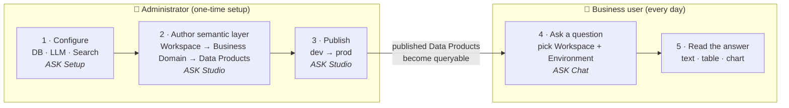

# Getting Started with the Onibex ASK Platform

> **Goal of this guide:** take you from *zero* to *your first answered question* — no live
> demo required. It covers both roles: the **administrator** who prepares the platform and
> the **business user** who asks questions in natural language.

If you only do one thing, read [The journey at a glance](#2-the-journey-at-a-glance). It
explains why a question can only be answered after an administrator has published a
**semantic layer** — the single most common source of "why do I get no results?".

---

## Table of contents

1. [What is the Onibex ASK Platform?](#1-what-is-the-onibex-ask-platform)
2. [The journey at a glance](#2-the-journey-at-a-glance)
3. [Before you begin](#3-before-you-begin)
4. [Part A · Administrator — prepare the platform](#4-part-a--administrator--prepare-the-platform)
   - [A1. Configure the system](#a1-configure-the-system-ask-setup)
   - [A2. Build your semantic layer](#a2-build-your-semantic-layer-admin-spa)
   - [A3. Publish: dev → prod](#a3-publish-dev--prod)
   - [A4. Optional: dictionary & documents](#a4-optional-dictionary--documents)
5. [Part B · Business user — ask your first question](#5-part-b--business-user--ask-your-first-question)
6. [Troubleshooting & FAQ](#6-troubleshooting--faq)
7. [Glossary](#7-glossary)
8. [Where to go next](#8-where-to-go-next)

---

## 1. What is the Onibex ASK Platform?

The **Onibex ASK Platform** (short: *ASK Platform*) turns **natural-language questions into
governed SQL** over your SAP data. You ask *"What were total sales by region last quarter?"*
in plain language; the platform resolves your business terms against a curated **semantic
layer**, builds the correct SQL (with the right joins), runs it against your database
(SAP HANA or PostgreSQL), and returns a written answer plus a table and an automatic chart.

The key word is **governed**: the agent does not invent column names or guess at joins. It
can only use the Data Products an administrator has defined and published. That is what makes
answers reproducible and trustworthy — and it is why setup matters before you can ask.

### Three surfaces, two roles

All three surfaces are React single-page apps talking to two REST backends (the
**orchestrator** answers questions, the **admin API** owns configuration and the semantic layer).

| Surface | Who uses it | What it's for |
|---|---|---|
| **ASK Studio** | Administrator / data steward | Author and publish the **semantic layer**: workspaces, business domains, Data Products. |
| **ASK Setup** | Administrator | Technical setup: database connections, LLM/embeddings provider, identity provider, search index. |
| **ASK Chat** | Business user | Ask questions in natural language and read the answers. |

> This guide describes the chat at the level of **concepts and flow** (pick a workspace, ask,
> read results) so it stays accurate as the UI evolves.

---

## 2. The journey at a glance

A question can only be answered once an administrator has (1) configured the system,
(2) authored a semantic layer, and (3) **published** it to the environment the user
queries. The diagram shows the full path from an empty platform to a first answer.



**The dependency that trips people up:** the chat only sees Data Products that have been
**published to the environment it is querying** (`dev` or `prod`). If nothing is published,
the user gets empty answers — even though the platform is "working". Always publish before
asking.

---

## 3. Before you begin

This guide assumes the platform is **already deployed and running**. If you are the person
installing it, start with the install runbook instead:
[`docs/runbooks/local-development.md`](runbooks/local-development.md) (Docker Compose or
native).

You need:

- **Access URLs** for the three surfaces (defaults for a local Docker deployment shown below).
- **Login credentials** — the platform authenticates through an identity provider
  (Keycloak). Your administrator provides your account.

| Surface | Default local URL |
|---|---|
| ASK Studio | `http://localhost:5173` |
| ASK Chat | `http://localhost:5174` |
| ASK Setup | `http://localhost:5175` |
| Login (Keycloak) | `http://localhost:8180` |

> Those are the host ports `docker-compose.yml` publishes for the three SPAs. Production
> deployments use your organization's hostnames — ask your administrator for the exact links.

---

## 4. Part A · Administrator — prepare the platform

This is the one-time (and occasional) work that makes the platform answerable. If your
platform is already configured and populated, you can skip to
[Part B](#5-part-b--business-user--ask-your-first-question).

### A1. Configure the system (ASK Setup)

Open **ASK Setup** (`http://localhost:5175`). Configure, in this order:

1. **Database** — choose your engine (**PostgreSQL** or **SAP HANA Cloud**) and enter the
   connection for the **dev** environment (mandatory). Optionally add **prod**. Test the
   connection before saving.
   - *PostgreSQL needs:* host, port (default `5432`), database, user, password.
   - *SAP HANA Cloud needs:* host, port (default `443`), user, password (schema optional).
2. **LLM & Embeddings provider** — pick your model stack:
   - **Direct** (LiteLLM): OpenAI, Anthropic, Azure, AWS Bedrock, Databricks, Vertex AI,
     and others. Enter model + API key, then **Test**.
   - **Managed** (SAP AI Core): select your deployment IDs for the LLM and embeddings.
3. **Search index (OpenSearch)** — host, port (default `9200`), optional credentials. This
   index powers semantic search; it is not your transactional database.

After saving, the platform reloads the affected services automatically. Return to the
ASK Setup home page and confirm it shows the configuration as active.

### A2. Build your semantic layer (ASK Studio)

Open the **ASK Studio** (`http://localhost:5173`). This is where you describe your data in
business terms. The hierarchy is:

```
Workspace  ─►  Business Domain  ─►  Data Products (Bronze / Silver / Gold)
```

**Step 1 — Create a Workspace.** A workspace is the top-level container the chat scopes to
(a deployment boundary backing `dev`/`prod`). From the **Workspaces** page, create one and
give it a name.

**Step 2 — Create a Business Domain.** Inside the workspace, create a business domain
(e.g., *Sales*, *Procurement*). A business domain is the set of Data Products the user can
query together. A single Data Product can be reused across domains.

**Step 3 — Add Data Products.** Open the create dialog (the **+** action) and choose the
input that matches what you have:

| Mode | Use it when… |
|---|---|
| **Manual** | You want to define a Data Product field-by-field in a form. |
| **Upload files** | You already have Data Product definitions as YAML files (drag-and-drop, batch supported). |
| **DDL + AI** | You have a SQL `CREATE TABLE` statement; the platform derives a Data Product from it with AI assistance. |
| **From OneConnect** | You have a SAP metadata export (JSON); the platform parses it and helps you merge it. |

Data Products live in three layers (see the [Glossary](#7-glossary)):

- **Bronze** — a raw source table (columns + keys).
- **Silver** — a curated Data Product that owns the join topology (how tables connect).
- **Gold** — a denormalized analytics table you can query directly.

New Data Products land in **In Review** status. Open one to review or edit its fields,
**relationships** (joins), and descriptions. Optionally use **Enrich** (the sparkles
action) to have AI suggest better descriptions and synonyms — review the diff and apply.

> Good descriptions and synonyms directly improve answer quality: they are how the agent
> maps a user's words to your columns. See
> [`semantic-layer/`](semantic-layer/README.md) for authoring rules.

### A3. Publish: dev → prod

Authoring changes are not visible to the chat until you **publish** them. Publishing is
**gated**: you publish to **dev** first, then promote to **prod**.

1. **Publish to dev** — from a Data Product's detail panel, or publish a whole business
   domain at once (the domain publish dialog streams progress for each Data Product). Data
   Products published to dev become queryable when the chat's environment selector is set to
   **dev**.
2. **Publish to prod** — becomes available only once **dev is current**. This gate ensures
   nothing reaches production without first being validated in dev.

Use **History** to audit changes per branch (working / dev / prod), compare versions, and
restore an earlier one if needed.

### A4. Optional: dictionary & documents

- **Semantic dictionary** — pre-agree business terms (synonyms, examples, preferred ID vs.
  description columns) per SAP module to sharpen disambiguation. Managed through the admin
  API's dictionary endpoints (`/v1/admin/dictionary`).
- **Document ingestion** (ASK Studio → **Docs**) — upload business documentation (PDF, Word,
  Markdown). This powers **documentation questions** (the agent can answer from your docs, not
  just your tables).

---

## 5. Part B · Business user — ask your first question

Once an administrator has published at least one business domain, you can ask away. Open
**ASK Chat** (`http://localhost:5174` locally). The flow is the same regardless of the exact UI:

**1 — Pick a Workspace.** This is **required**: it scopes the agent to a set of data. If you
see *"No workspaces configured"*, an administrator still needs to create one — see
[Troubleshooting](#6-troubleshooting--faq).

**2 — Pick an Environment.** Choose **dev** or **prod**. The agent only sees Data Products
published to that environment. If `prod` returns nothing, your data may only be published to
`dev` yet.

**3 — Pick an Agent Mode.** Three engines trade speed, cost, and rigor:

| Mode | In plain English | Best for |
|---|---|---|
| **Flash** | Fastest. Searches your schema as text and writes SQL in one shot. No deep validation. | Quick, exploratory questions; well-indexed data. |
| **Precise** | Most rigorous and reproducible. Extracts a plan, ranks Data Products deterministically, picks optimal joins, validates scope. | Audit, compliance, "explain exactly why this table/join". |
| **Smart** | The balanced default. Uses the Data Product catalog as context, picks Data Products naturally, resolves joins through the graph. Efficient and production-grade. | Everyday use and high volume. |

If unsure, start with **Smart**.

**4 — Ask your question.** Type in natural language — any language works. Examples:

- *Data question* → *"Total net sales by region for the last quarter."*
- *Schema question* → *"What columns does the sales order Data Product have?"*
- *Documentation question* → *"How is 'net value' defined in our glossary?"*

**5 — Read the answer.** You get a written answer, and for data questions a **results
table** and an **automatic chart** when there is more than one row. Depending on the UI you
can also reveal the **generated SQL** and a **token/trace breakdown** to see how the answer
was produced.

**Tips for good questions**

- Name the **measure** and the **grouping** ("revenue **by** customer", "count **by**
  month").
- Add the **time frame** ("last quarter", "in 2025").
- Use the business terms your administrator defined; if a term isn't recognized, ask your
  administrator to add it to the semantic dictionary.
- If an answer looks off, switch to **Precise** to get a more rigorously validated result.

---

## 6. Troubleshooting & FAQ

| Symptom | Likely cause | What to do |
|---|---|---|
| **"No workspaces configured"** in chat | No workspace exists yet. | Administrator: create one in the ASK Studio → Workspaces. |
| Chat returns **empty results** | Nothing published to the selected environment. | Switch environment to **dev**, or have the administrator publish the business domain. |
| **`prod` returns nothing**, `dev` works | Data Products are published to dev only. | Promote them to prod (ASK Studio, after dev is current). |
| Answer uses the **wrong column** | Missing synonyms / ambiguous term. | Administrator: enrich the Data Product or add the term to the semantic dictionary. |
| **404 / "could not reach LLM/embeddings"** | Provider misconfigured. | Administrator: re-test the provider in ASK Setup. |
| **401 / Unauthorized** | Expired or missing login. | Sign in again; verify provider credentials in ASK Setup. |
| **First question is slow** | Cold start (model/provider warm-up). | Expected on the first call; subsequent questions are faster. |

---

## 7. Glossary

| Term | Meaning |
|---|---|
| **Workspace** | Top-level container the chat scopes to; a deployment boundary backing dev/prod. Holds business domains. |
| **Business Domain** | A set of Data Products that can be queried together (e.g., Sales). A Data Product may belong to several domains. |
| **Data Product** | A definition (YAML) of a table or business object: its fields, roles, relationships, and descriptions. Lives in a layer (Bronze/Silver/Gold). |
| **Bronze** | A raw source table — columns and keys, no join logic. |
| **Silver** | A curated Data Product that owns the join topology (how tables connect). |
| **Gold** | A denormalized analytics table you can query directly. |
| **Publish** | Promote authored changes so the chat can see them; gated **dev → prod**. |
| **Environment (dev / prod)** | Which published snapshot the chat queries. |
| **Agent Mode (Flash / Precise / Smart)** | The SQL engine used for data questions — speed vs. rigor vs. balance. |
| **Semantic dictionary** | Pre-agreed business terms (synonyms, examples) that sharpen term-to-column mapping. |

---

## 8. Where to go next

- **Semantic-layer authoring rules** → [`semantic-layer/`](semantic-layer/README.md)
- **How each engine works** → [`FLASH.md`](FLASH.md) · [`PRECISE.md`](PRECISE.md) · [`SMART.md`](SMART.md)
- **Install & run the platform** → [`runbooks/local-development.md`](runbooks/local-development.md)
- **Developer overview & architecture** → [`../CLAUDE.md`](../CLAUDE.md)
- **In-product on-ramp** → the **Getting Started** page inside the ASK Studio.

---

*Found something inaccurate or confusing? That's a documentation bug — open an issue or ping
the platform team so the next person doesn't hit it.*
