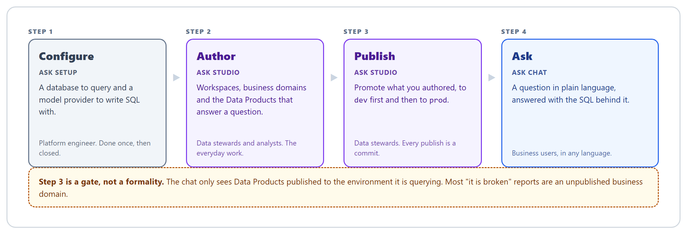

# The Onibex Agentic Semantic Knowledge Platform manual

> The complete user manual for the **Onibex Agentic Semantic Knowledge Platform**. Install it,
> author a semantic layer, publish it dev to prod, and let business users query enterprise data
> in plain language.

**New here? Start with [Getting Started](GETTING_STARTED.md).** It is one guided path from an
empty machine to a real answer, in about 45 minutes. Everything below is the reference you
come back to afterwards, when you need one specific thing.

> Part of the [Onibex Agentic Semantic Knowledge (ASK) repository](../../README.md). The root
> overview has the two tracks; the contract those Data Products are written against is the
> [Onibex Agentic Semantic Knowledge Definition](../../definition/README.md).

**About the examples.** Every walkthrough uses one of two demonstration datasets: **SAP
Production Planning** (Production Orders) for authoring and configuration, **Sales &
Distribution** (Sales Orders) for the chat. Substitute your own Data Products as you read: the
demo names will not exist in your system, and the sample questions return results only against
matching data. This is said here rather than on every page.

---

## Start here

**[Getting Started](GETTING_STARTED.md)** walks the platform's one journey end to end on a
single table. It is the only page that needs to be read in a particular order.

## Every page, by area

### Foundations
- [Install and run the platform](01-installation.md)
- [Concepts and architecture](02-concepts.md)

### [Understanding how it works](explain/README.md)
- [Why not just point an LLM at the schema?](explain/why-not-raw-schema.md). What a curated semantic layer computes that a schema cannot say
- [The three chat engines](explain/engines.md). Flash / Precise / Smart: what each computes rather than guesses, and how to choose
- [ASK specification](../../definition/README.md). The normative Bronze / Silver / Gold contract
- [Resolution Specification](../../definition/docs/RESOLUTION.md). Which layer the agent reaches for, the two planes, and what a conforming resolver must do

### [Everyday tasks](guides/README.md)
- [Sign in to ASK](guides/sign-in.md). The three authentication modes, the role model, and what 401 / 403 mean

### [Configure the platform first · ASK Setup](ask-setup/README.md)

**Nothing in ASK Studio or ASK Chat works until this section is done.** ASK Setup is a
prerequisite, not a third product: the platform needs a database connection and a model
provider before there is anything to author against or answer from. The first two pages are
required; the rest are optional or read-only.

- [Connect a database](ask-setup/02-database-connections.md). Multi-engine registry, one active per environment
- [Connect an LLM provider](ask-setup/03-llm-providers.md). The LLM registry and the shared embedder
- [Connect to SAP](ask-setup/05-sap-connection.md). S/4HANA URL, credentials, OAuth endpoint
- [Enable the MCP server](ask-setup/06-mcp-server.md). The endpoint for write-back actions
- [Register an OpenAPI contract](ask-setup/07-contracts.md). Turn a spec into MCP tools
- [Review the identity provider](ask-setup/04-identity-provider.md). Read-only: the active provider and your session
- [Check the search index](ask-setup/01-setup.md). Read-only: the OpenSearch connection

### [Author the semantic layer · ASK Studio](ask-studio/README.md)
- [Create workspaces and business domains](ask-studio/01-workspaces-domains.md). The containers everything else lives in
- [Add Data Products](ask-studio/02-add-data-products.md). Manual, upload, DDL + AI, or OneConnect
- [Edit and enrich Data Products](ask-studio/03-edit-enrich.md). Fields, relationships, AI-drafted descriptions
- [Inspect a domain as a graph](ask-studio/04-domain-canvas.md). See the join paths the agent will use
- [Publish and deploy](ask-studio/05-publish-deploy.md). Dev first, then prod
- [Resolve conflicts on a OneConnect merge](ask-studio/07-conflicts-merge.md)
- [Audit, compare and restore versions](ask-studio/06-history.md)
- [Set the organization profile](ask-studio/08-organization.md). Defaults that pre-fill authoring
- [Check the embedder and search index](ask-studio/09-check-providers.md). The one provider you edit here

### [Ask questions · ASK Chat](ask-chat/README.md)
- [Scope a question](ask-chat/01-workspace-environment-mode.md). Workspace, environment and mode
- [Using the Chat](ask-chat/02-chat.md). Ask, read the answer, see the SQL
- [Generate a report or brief](ask-chat/03-artifacts.md). Shareable documents, no SQL required

### [Operating the platform](runbooks/README.md)
- [Local development](runbooks/local-development.md). Running the services natively instead of in Docker
- [Orchestrator troubleshooting](runbooks/orchestrator-troubleshooting.md). On-call diagnosis for the chat backend

### [Reference](reference/README.md)
- [Glossary](reference/glossary.md)
- [Troubleshooting & FAQ](reference/troubleshooting.md)

---

## License

Source-available and dual-licensed: **PolyForm Strict 1.0.0 OR PolyForm Free Trial 1.0.0**,
at your option. Production or any other commercial use requires a commercial license.
[`LICENSE.md`](../LICENSE.md) is the authoritative text and
[`../README.md`](../README.md) has the summary.
