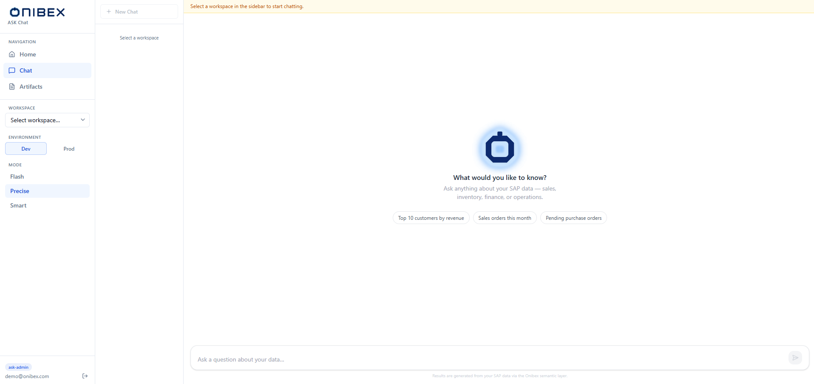
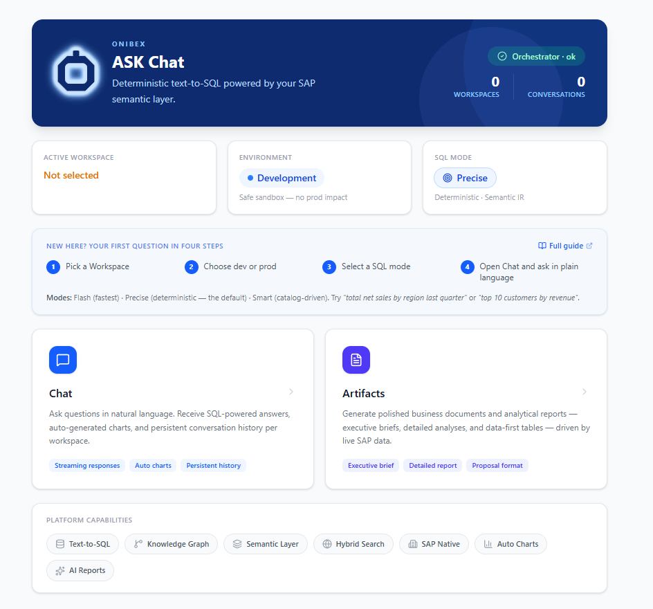

# Ask questions · ASK Chat

ASK Chat is the surface business users see. They pick what a question may reach, ask it in
plain language, and read an answer with the SQL behind it.

Nothing here works until an administrator has configured the platform and published Data
Products — see [Configure the platform first · ASK Setup](../ask-setup/README.md) and
[Author the semantic layer · ASK Studio](../ask-studio/README.md).

## What you need to know first

- **ASK Chat** is the natural-language query interface. You type a question; the agent answers
  from the governed semantic layer — a written answer, a results table, an auto-generated chart,
  and optionally the SQL behind it.
- Three controls in the sidebar scope every query: **Workspace** (what data the agent sees),
  **Environment** (`dev` or `prod` database), and **Mode** (`Flash` / `Precise` / `Smart` SQL
  strategy).
- A separate **Artifacts** section lets you generate shareable business documents — reports,
  executive briefs, and data tables — without writing a single line of SQL.

---

## In this order, the first time

1. [Scope a question](01-workspace-environment-mode.md) — workspace, environment and mode.
2. [Using the Chat](02-chat.md) — ask, read the answer, see the SQL.
3. [Generate a report or brief](03-artifacts.md) — shareable documents, no SQL required.

## Find your way around

### 1. Sign in

Every user of the realm gets the **`ask-user`** role automatically, so asking questions needs
no extra setup.

→ **[Sign in to ASK](../guides/sign-in.md)** — the three authentication modes, the role model,
and what a 401 or a 403 actually means.

---

### 2. The navigation sidebar

Once signed in, the left sidebar is your permanent map. It is always visible, regardless of
which page you are on.

| Section | What it does |
|---|---|
| **Home** nav link | The dashboard — orchestrator health, active configuration, and links to Chat and Artifacts. |
| **Chat** nav link | The conversational interface — ask questions, read answers, browse session history. |
| **Artifacts** nav link | Generate, view, and download AI-produced business documents. |
| **Workspace** dropdown | Scopes every query to a specific data product collection. Required before asking anything. |
| **Environment** toggle | Switches between the `dev` (development) and `prod` (production) database. |
| **Mode** selector | Picks the SQL resolution strategy — **Flash**, **Precise**, or **Smart**. |

All three settings (Workspace, Environment, Mode) are **persisted to local storage** — they
survive page refreshes and browser restarts.

---

### 3. The Home dashboard

Opening the app takes you to the **Home** page. It shows:

1. **System status** — a live health check of the orchestrator backend; a green badge means
   queries are ready to run.
2. **Active configuration** — three cards confirming the workspace, environment, and mode
   currently in effect.
3. **Feature cards** — two clickable panels for navigating directly to Chat or Artifacts.
4. **Capabilities strip** — a row of feature badges (Text-to-SQL, Knowledge Graph, Hybrid
   Search, SAP Native, Auto Charts, AI Reports).

From here, follow the flows in order:

1. [Scope a question](01-workspace-environment-mode.md) — configure the three sidebar controls before asking anything.
2. [Using the Chat](02-chat.md) — ask questions and read governed SQL answers.
3. [Generate a report or brief](03-artifacts.md) — generate and download business documents.

---

---

[← Back to the manual](../README.md)
