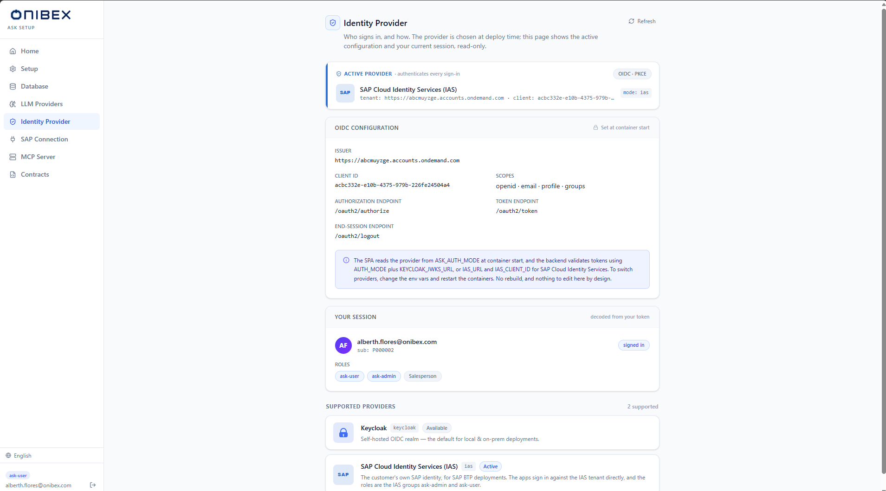

# ASK Setup · Review the identity provider

[Manual](../README.md) › [Configure the platform first](../README.md#configure-the-platform-first--ask-setup) › **Review the identity provider**

> **How to.** See who signs in to the platform, and how. This page is **read-only by
> design**: the identity provider is chosen at deploy time and read by each app when its container
> starts. The page exists to show you the active configuration and your own session, not to edit
> them.

| | |
|---|---|
| **Who** | Administrator |
| **Time** | ~1 minute (review only) |
| **Prerequisites** | You can sign in to **ASK Setup** (see [Install and run the platform](../01-installation.md)). |
| **You'll end with** | A clear view of the active identity provider, its OIDC configuration, and the roles carried in your token. |

---

## What you need to know first

- Authentication is configured **at deploy time**, not in the UI. Everything on this page is
  **read-only**. There are no editable fields by design.
- A user can sign in through one of two identity providers, or the platform can run with no login
  at all:
  - **Keycloak.** A self-hosted OIDC realm; the default for local and on-prem deployments.
  - **SAP Cloud Identity Services (IAS).** The customer's own SAP identity, for SAP BTP
    deployments. The apps sign in against the IAS tenant directly.
  - **Dev bypass (no authentication).** Local development only; requests are **not** authenticated.
    Never use it in production.
- Sign-in uses **OIDC with PKCE**. Each app reads its provider from **`ASK_AUTH_MODE`** when its
  container starts, and the backend validates tokens with matching environment variables.
- Your token carries **roles**. The two roles that mean something to the product are **`ask-admin`**
  and **`ask-user`**; other roles are identity-provider plumbing. With IAS they are the user's IAS
  **groups** of those two names.
- **To switch providers you change environment variables and restart the containers.** There is no
  in-app switch, and no image rebuild.

> **Why XSUAA is not among them.** SAP BTP's authorization service, XSUAA, is a separate thing from
> IAS even though both come with SAP BTP. The apps cannot sign in against XSUAA directly: it demands
> a client secret at the token exchange, and a browser can never hold one. Use SAP Cloud Identity
> Services to sign in with the customer's SAP identity.

---

## 1. Open the Identity Provider page

In the ASK Setup sidebar, open **Identity Provider**. The header reads *"Who signs in, and how. The
provider is chosen at deploy time; this page shows the active configuration and your current
session, read-only."* A **Refresh** button reloads the page.

## 2. Read the active provider

The **Active provider** card names the identity provider that *authenticates every sign-in*. A pill
on the right shows **OIDC · PKCE** when a real provider is bound (or **disabled** for dev bypass),
and a small **mode:** chip shows the raw mode value (`keycloak`, `ias` or `none`).

| Mode | Card shows |
|---|---|
| **Keycloak** | The **realm** and **client** id decoded from the issuer. |
| **SAP Cloud Identity Services (IAS)** | The **tenant** and the **client** id. |
| **Dev bypass (no authentication)** | *"no identity provider bound"*, authentication is off. |

## 3. Review the OIDC configuration (read-only)

When a real provider is active, the **OIDC configuration** card lists the connection details, marked
**Set at container start** (a lock icon):

| Field | Meaning |
|---|---|
| **Issuer** | The OIDC issuer URL. |
| **Client ID** | The public client the app authenticates as. |
| **Scopes** | The scopes requested at sign-in. With IAS these include `groups`. |
| **Authorization endpoint** | Where the browser is sent to sign in. |
| **Token endpoint** | Where the authorization code is exchanged for tokens. |
| **End-session endpoint** | Where sign-out (RP-initiated logout) is sent. |

An information note under the table explains the wiring: the app reads the provider from
**`ASK_AUTH_MODE`** at container start, and the backend validates tokens using **`AUTH_MODE`** plus
**`KEYCLOAK_JWKS_URL`**, or **`IAS_URL`** and **`IAS_CLIENT_ID`** for SAP Cloud Identity Services.
*"To switch providers, change the env vars and restart the containers. No rebuild, and nothing to
edit here by design."*

> **Note, no login looks different.** When the platform runs with authentication bypassed
> (`ASK_AUTH_MODE=none`), this card is replaced by an amber notice telling you to set the mode to
> `keycloak` or `ias` and restart to enable a real identity provider. There is no session panel in
> that mode.
>
> `none` has to be set on purpose. The app accepts only `keycloak`, `ias`, `xsuaa` or `none` and
> stops at startup on anything else, naming the variable, so a deployment cannot arrive at no login
> by leaving a value out or mistyping it.

## 4. Check your session and roles

The **Your session** panel (*"decoded from your token"*) shows the identity you signed in with: your
**email**, your **sub** (subject) id, a **signed in** badge, and your **Roles**. The product roles
**`ask-admin`** and **`ask-user`** are highlighted; any other roles appear muted. If your token
carries no roles, the panel says *"no roles in token."*

> **Tip, roles gate what you can do.** `ask-admin` and `ask-user` are the RBAC roles the platform
> recognises (see [Concepts and architecture](../02-concepts.md)). If an action returns a permission error, confirm
> the expected role appears here: your identity provider assigns it, not this page.

> **With IAS, "no roles in token" usually means a missing attribute, not a missing group.** IAS
> puts the groups in the token only when the IAS application is configured to send the groups
> attribute. Without it the token carries no groups at all, so a person who is in `ask-admin` still
> signs in and sees nothing they are allowed to do. Check the application's attributes in the IAS
> admin console before checking the person's groups.

## 5. Understand the supported providers

The **Supported providers** list shows the two identity providers a user can sign in with,
**Keycloak** and **SAP Cloud Identity Services (IAS)**. Each with its mode id, a short description,
and an **Active** or **Available** badge. Because switching is a deploy-time change, this list is
informational: it tells you what the platform can run against, not a menu you select from.

> **Warning, switching providers is an operations task.** Changing the identity provider means
> updating the app and backend environment variables (`ASK_AUTH_MODE` / `AUTH_MODE` and the
> matching `KEYCLOAK_*` or `IAS_*` values) and restarting the containers. It cannot be done from
> this page, and it needs no image rebuild: the apps read this configuration at container start.

---

## What's next

→ **[Connect to SAP](05-sap-connection.md)**. S/4HANA OData credentials.
→ **[Connect an LLM provider](03-llm-providers.md)**, the model registry and shared embedder.
→ **[Concepts and architecture](../02-concepts.md)**, how the `ask-admin` / `ask-user` roles map to what each person
can do.

---

[← Back to the manual](../README.md)
