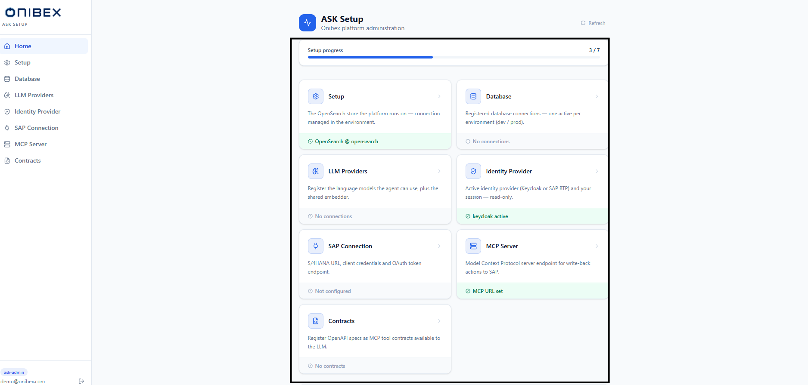

# Configure the platform first · ASK Setup

**Nothing in ASK Studio or ASK Chat works until this section is done.** ASK Setup is the
prerequisite, not a third product: the platform needs a database to query and a model provider
before there is anything to author against or answer from.

## What you need to know first

- **Two kinds of section.** Some sections are **read-only** mirrors of what the environment already
  provides (**Setup** / OpenSearch, **Identity Provider**). Others are **editable registries**
  (**Database**, **LLM Providers**) or small credential forms (**SAP Connection**, **MCP Server**,
  **Contracts**).
- **Secrets live in an encrypted store, not on disk.** Connection credentials are encrypted at rest
  inside OpenSearch and never written to `settings.json`. See [Where configuration is stored](#where-configuration-is-stored).
- **The Semantic Dictionary and Documents are not here.** Business-term mappings and document
  ingestion moved to **ASK Studio**. See [What lives in ASK Studio, not here](#what-lives-in-ask-studio-not-here).

---

## Required, in this order

1. [Connect a database](02-database-connections.md) — the database ASK queries. One active
   connection per environment.
2. [Connect an LLM provider](03-llm-providers.md) — the model that writes SQL, and the embedder
   that powers retrieval.

At that point the platform works. Everything below is optional or read-only.

## When you need them

- [Connect to SAP](05-sap-connection.md) — S/4HANA credentials, for write-back.
- [Enable the MCP server](06-mcp-server.md) — the endpoint that performs those writes.
- [Register an OpenAPI contract](07-contracts.md) — turns an OData spec into MCP tools.

## Read-only

- [Review the identity provider](04-identity-provider.md) — who signs in, and how.
- [Check the search index](01-setup.md) — the OpenSearch connection the whole platform runs on.
  stored.

## Find your way around

### 1. The Home dashboard

Signing in lands you on **Home**. The page opens with a hero — the app title and an **Onibex
platform administration** subtitle — and a **Refresh** button that re-reads live status from the
server.

Below the hero, a **Setup progress** bar reports how many sections are configured, as
**`X / 7`**. When every section is green it shows the **All sections configured** badge. Under that
sits a grid of **seven cards**, one per configuration section, each with a short description and a
**status strip** at its foot:

- A green strip with a check means the section is configured (for example **Active connection set**
  or **Model configured**).
- A grey strip with an alert means it still needs attention (for example **No active connection**
  or **OpenSearch not set**).

Click any card to open its section. At the very bottom, when a language model is active, an
**Active model** badge shows the model id in use.

> **Tip — the cards are a checklist.** The status strips make the dashboard a live checklist:
> work top to bottom until the progress bar reads **`7 / 7`**. Status is derived from the server,
> so **Refresh** after a change made elsewhere (for example an environment variable update).

### 2. The seven sections

The left sidebar and the Home grid list the same seven sections, in order. Each has its own page in
this manual:

| # | Section | What you set there |
|---|---|---|
| 1 | **Setup** | [Check the search index](01-setup.md) — the read-only, environment-sourced OpenSearch connection, plus a health check. |
| 2 | **Database** | [Connect a database](02-database-connections.md) — the registry of databases the agent queries; one active per environment. |
| 3 | **LLM Providers** | [Connect an LLM provider](03-llm-providers.md) — the language models the agent can use, plus the shared embedder. |
| 4 | **Identity Provider** | [Review the identity provider](04-identity-provider.md) — the read-only active sign-in provider and your session. |
| 5 | **SAP Connection** | [Connect to SAP](05-sap-connection.md) — S/4HANA URL, client credentials and OAuth token endpoint. |
| 6 | **MCP Server** | [Enable the MCP server](06-mcp-server.md) — the Model Context Protocol endpoint for write-back actions to SAP. |
| 7 | **Contracts** | [Register an OpenAPI contract](07-contracts.md) — OpenAPI specs registered as MCP tool contracts for the agent. |

### Where configuration is stored

ASK Setup uses a layered storage model. Understanding it explains why some pages are editable and
others are read-only:

- **Encrypted store in OpenSearch.** Database and LLM connections are kept as encrypted documents
  inside OpenSearch — database connections under `dbconn:*` with a `db_active` pointer per
  environment, and language models under `llmconn:*` with an `llm_active` pointer. Sensitive fields
  (passwords, tokens, keys) are encrypted at rest and never returned to the UI in clear text.
- **Environment variables take precedence.** Where a value can come from more than one place, an
  environment variable overrides the stored configuration. The **Setup** page tags each field with
  a source chip — **env**, **file**, **encrypted**, **config** or **default** — so you can see where
  a live value actually came from.
- **OpenSearch credentials come from the environment.** OpenSearch hosts the encrypted secret store
  itself, so its own connection details cannot live inside that store. They are supplied by
  `OPENSEARCH_*` environment variables and shown read-only under **Setup**.
- **`settings.json` is pruned.** The on-disk config file now holds only a handful of non-secret
  keys. It is no longer the home of database or LLM credentials.

### What lives in ASK Studio, not here

Two capabilities that older versions of the platform placed under configuration now belong to
**ASK Studio**:

- **The Semantic Dictionary** — business-term and phrase mappings. Managed on the ASK Studio
  dictionary page, not in ASK Setup.
- **Document ingestion** — uploading PDFs, Word, text and Markdown for documentation answers.
  Managed on the ASK Studio Docs page.

If you are looking for either, switch to ASK Studio.

---

---

[← Back to the manual](../README.md)
