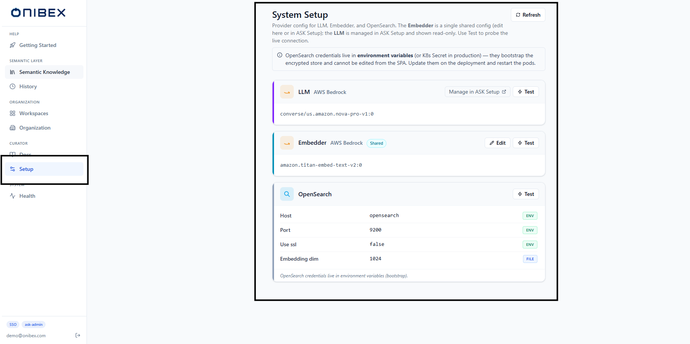
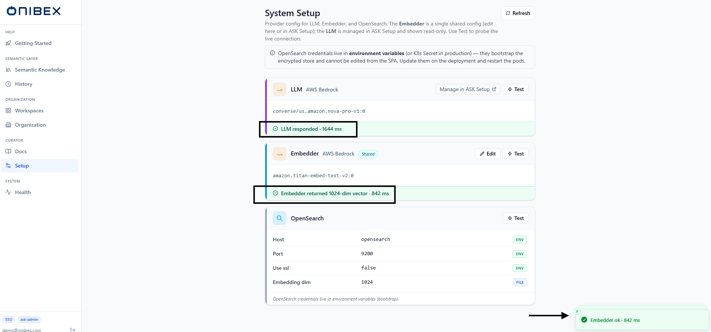

# ASK Studio · Check the embedder and search index

[Manual](../README.md) › [Author the semantic layer](../README.md#author-the-semantic-layer--ask-studio) › **Check the embedder and search index**

> **How to.** The **System Setup** page is what remains in ASK Studio
> now that provider, database and identity configuration moved to ASK Setup: three read-only
> cards showing what the platform is actually using, and one editable provider — the shared
> **Embedder**.

| | |
|---|---|
| **Who** | Administrator / platform curator |
| **Time** | ~4 minutes |
| **Prerequisites** | Signed in to ASK Studio ([Sign in to ASK](../guides/sign-in.md)); embedder credentials to hand if you intend to edit it. |
| **You'll end with** | A verified Embedder connection, and a green Test on every card. |

> Provider, model, database and identity configuration live in **ASK Setup** — see [Find your way around ASK Setup](../ask-setup/00-overview.md),
> not here. Use a **real** provider when editing the Embedder, and redact every credential field
> before capturing a screenshot.

---

## What you need to know first

- **System Setup** shows one **card per system concern** — **LLM**, **Embedder** and
  **OpenSearch**. Only the **Embedder** is editable here, and it is a **single shared config**
  used across ASK Studio and ASK Setup.
- The **LLM** card is read-only. It is managed in ASK Setup, and the card links out.
- The **OpenSearch** card is read-only because its credentials must live in environment
  variables — they bootstrap the encrypted store, so they cannot live inside it.

---

## 1. Open System Setup

In the left sidebar, open **Setup**. The page header reads **System Setup**, with a **Refresh**
button top-right and a slate info banner explaining why OpenSearch credentials are not editable
from the SPA.

## 2. Read the LLM card

The **LLM** card shows the provider label (e.g. *AWS Bedrock*) and a single **model-summary
line** — the configured model id — rather than credential rows. On the right it carries a
**Manage in ASK Setup** link and a **Test** button; there is **no Edit** button.

To change the LLM provider, model or credentials, follow that link to
[Connect an LLM provider](../ask-setup/03-llm-providers.md) in ASK Setup. This page only reflects what is
configured there.

## 3. Edit the Embedder

The **Embedder** card carries a **Shared** badge, a model-summary line, and both an **Edit**
and a **Test** button. It is the only provider you edit from ASK Studio, and the same config is
shared with ASK Setup.

Click **Edit** to open the **Edit embedder** drawer:

| Control | Behaviour |
|---|---|
| **Provider** | A dropdown of registered providers. Selecting one shows only the credential fields that provider declares. |
| **Model** | Required. Free-text model id (a suggestion list is offered per provider, e.g. `amazon.titan-embed-text-v2:0`). Enter just the model id — the provider is already selected. |
| **Credentials** | One input per field the provider declares. Sensitive fields are tagged **encrypted**, are password-typed, and read *"leave blank to keep"* — type only to overwrite. |

Click **Save embedder**. A toast confirms and the page reloads.

> **Warning — changing the embedder provider or model rebuilds every vector space.** Rotating
> credentials is safe. But changing the **provider or model** makes every existing embedding —
> knowledge graph, semantic dictionary and docs, across dev and prod — incompatible. They must
> be **re-ingested and re-embedded**. The drawer requires you to confirm, this is not automatic,
> and switching back will not restore rebuilt data.

## 4. Read the OpenSearch card

Each connection field carries a **source badge** telling you where that value came from:

| Badge | Source | Meaning |
|---|---|---|
| **ENV** | Environment variable | Loaded from a process env var (K8s Secret in prod, shell in dev). |
| **FILE** | `config/settings.json` | Loaded from the settings file on disk. |
| **ENCRYPTED** | OpenSearch (encrypted) | Fernet-encrypted in `ask-system-settings-v1` — the value never leaves the server. |
| **STORED** | OpenSearch (plain) | Stored in `ask-system-settings-v1` as a non-sensitive value. |
| **DEFAULT** | Internal default | No value set — the platform's built-in default is used. |

To change host, port or credentials, update the environment variables (or K8s Secret) on the
deployment and restart the pods.

> **Tip — secrets are masked, not truncated.** Sensitive values render as a fixed-length mask
> regardless of the real length, so a screenshot can never leak how long a key is. Non-secret
> values longer than 50 characters truncate with an ellipsis and are click-to-copy.

## 5. Test every card

Click **Test** on a card. A coloured result strip appears at the bottom:

| Outcome | What you see |
|---|---|
| Success | A green strip: the returned **detail** plus the round-trip **latency in ms**, and a toast *"`<card>` ok · N ms"*. |
| Failure | A red strip: **"Test failed · N ms"** with the error in monospace below. |

**LLM** and **Embedder** tests run against the stored encrypted config; **OpenSearch** probes
the live cluster directly.

> **Warning — a failing Test is a real signal.** If a Test fails, the agent's corresponding
> capability — SQL generation, embeddings, or retrieval — will fail too. Fix the Embedder here,
> the LLM in [Connect an LLM provider](../ask-setup/03-llm-providers.md), or OpenSearch on the deployment,
> before publishing a workspace.

---

## What's next

→ **[Ingest documents the agent can cite](10-ingest-documents.md)** — the other curator tool in
ASK Studio.
→ **[Create workspaces and business domains](01-workspaces-domains.md)** — start authoring once your
Embedder is green.

---

[← Back to the manual](../README.md)
