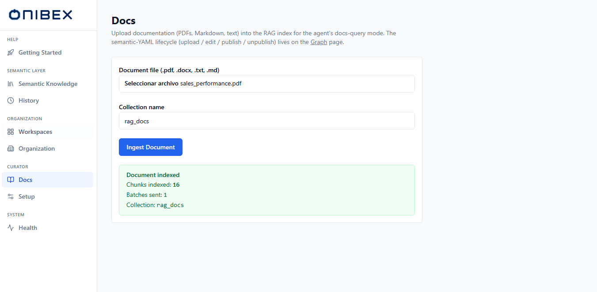

# ASK Studio · Ingest documents the agent can cite

> **Flow 10 of the ASK Studio manual.** Upload documentation into the RAG index so the agent
> can answer questions from your written material, not only from your tables.

| | |
|---|---|
| **Who** | Administrator / platform curator |
| **Time** | ~3 minutes |
| **Prerequisites** | Signed in to ASK Studio, and a **green Embedder** ([Check the embedder and search index](09-check-providers.md)) — ingestion embeds every chunk. |
| **You'll end with** | A document indexed and citable by the agent's documentation mode. |

**Where this fits:** **Configure — ingest documents (you are here)** → Author → Publish → Ask

---

## Concepts (30-second version)

This is a **separate corpus from the semantic layer**. The YAML layer describes your *data*;
this describes your *documentation*. They answer different question types:

| Question | Answered from |
|---|---|
| *"How many orders are still open?"* | The semantic layer — Data Products, compiled to SQL |
| *"How is yield rate defined in this model?"* | This corpus — your documents, cited |

Files are chunked, embedded and written to a RAG index. The Data Product lifecycle — upload,
edit, publish — is elsewhere; see [Add Data Products](02-add-data-products.md).

---

## 1. Open Docs

In the left sidebar, open **Docs**.

## 2. Upload and index a document

| Field | Notes |
|---|---|
| **Document file** | Accepts `.pdf`, `.docx`, `.txt`, `.md` and `.rst`. |
| **Collection name** | The target RAG collection. Defaults to **`rag_docs`**; change it to route documents into a separate collection. |

Pick a file, confirm the **Collection name**, then click **Ingest Document**. The button shows
**Indexing…** while the file is chunked, embedded and written.

On success a green panel reports:

| Line | Meaning |
|---|---|
| **Chunks indexed** | How many text chunks were written. |
| **Batches sent** | How many write batches the ingest used. |
| **Collection** | Where the chunks landed. |

If ingestion fails, a red panel and a toast surface the error instead. The most common cause is
an embedder that is not working — check it on
[Check the embedder and search index](09-check-providers.md) before re-trying.

## 3. Choose what is worth ingesting

The agent cites what it finds here, so the corpus is worth curating rather than filling.

Documents that earn their place define terms the tables cannot: KPI glossaries, model-definition
notes, calculation rules, process documentation. A question like *"how is the yield rate defined
in this model, and which SAP fields does it use?"* is answerable only if someone wrote that down
and it was ingested.

Documents that do not: anything already expressed as a Data Product description, and anything
whose numbers will go stale — the agent will cite them with the same confidence either way.

---

## What's next

→ **[Using the Chat](../ask-chat/02-chat.md)** — ask a documentation question and read the
citation.
→ **[Check the embedder and search index](09-check-providers.md)** — the other curator tool.
