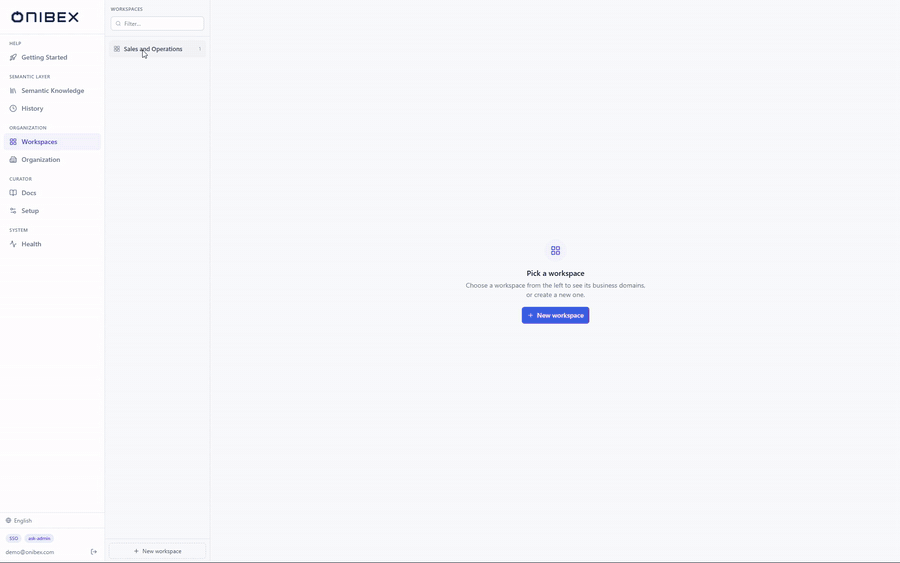
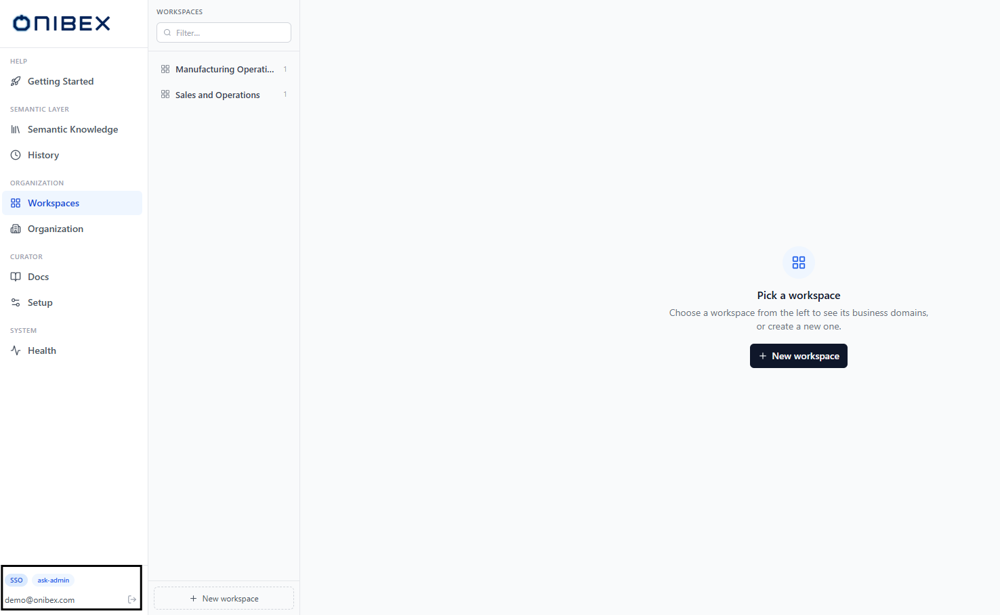
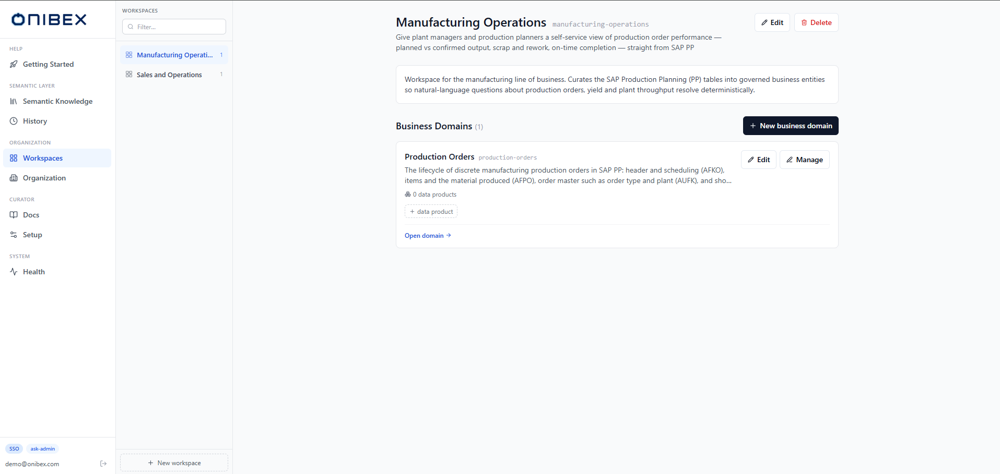

# Author the semantic layer · ASK Studio

ASK Studio is where the semantic layer is written: the workspaces and business domains that
scope a question, the Data Products that answer it, and the publish step that makes them
queryable.

## What you need to know first

- **ASK Studio** is the semantic-layer curator app. Its sign-in screen shows the title
  **Agentic Semantic Knowledge** (short: **ASK Studio**).
  This is where you author and publish the business meaning the chat agent maps questions to.
- **ASK Studio owns the semantic layer.** Workspaces, business domains, Data Products.
  Databases, model providers and MCP are configured once in
  [ASK Setup](../ask-setup/README.md) before any of this can be published or queried.
- The whole platform follows one journey: **Configure → Author → Publish → Ask**. ASK Studio
  covers the **Author** and **Publish** steps.

---

## If you are starting from nothing, in this order

1. [Create workspaces and business domains](01-workspaces-domains.md). The containers
   everything else lives in.
2. [Add Data Products](02-add-data-products.md). Manual, upload, DDL + AI, or OneConnect.
3. [Edit and enrich Data Products](03-edit-enrich.md). Fields, relationships, AI-drafted
   descriptions.
4. [Inspect a domain as a graph](04-domain-canvas.md). See the join paths the agent will use.
5. [Publish and deploy](05-publish-deploy.md). **Nothing you author is queryable until this
   step.** dev first, then prod.

## The rest are occasional tasks, in no order

- [Audit, compare and restore versions](06-history.md). Every change is a commit.
- [Resolve conflicts on a OneConnect merge](07-conflicts-merge.md). When SAP changes a field
  you enriched.
- [Set the organization profile](08-organization.md). Defaults that pre-fill authoring.
- [Check the embedder and search index](09-check-providers.md). The one provider you edit here.

> **The Docs page is parked.** ASK Studio still shows **Curator › Docs**, and it still
> uploads. Nothing reads what it writes: the retrieval path that let the chat answer from
> uploaded documents was lost across successive changes to the flow and is being rebuilt from
> scratch. Until it lands, treat that page as inert and keep your written material outside ASK.

## Find your way around

### 1. Sign in

Authoring needs the **`ask-admin`** role; signing in with **`ask-user`** reaches the Chat but
not this app.

→ **[Sign in to ASK](../guides/sign-in.md)**: the three authentication modes, the role model,
and what a 401 or a 403 actually means.

### 2. The navigation sidebar

Once signed in, the left sidebar is your permanent map. It's grouped into five labelled
sections; the current page is highlighted in Onibex blue.

| Section | Item | What the page does | Flow |
|---|---|---|---|
| **Help** | **Getting Started** | In-product launchpad: the Configure → Author → Publish → Ask journey with deep links into each page. | this overview |
| **Semantic Layer** | **Semantic Knowledge** | The global catalog of all Data Products, with status filters and the **New data product** button. | [Add Data Products](02-add-data-products.md) |
| **Semantic Layer** | **History** | Version history of the semantic layer, viewable per branch (working / dev / prod). | [Audit, compare and restore versions](06-history.md) |
| **Organization** | **Workspaces** | Create and manage workspaces and the business domains inside them; the app's landing page. | [Create workspaces and business domains](01-workspaces-domains.md) |
| **Organization** | **Organization** | Your organization profile (company name, source system) that pre-fills authoring defaults. | [Set the organization profile](08-organization.md) |
| **Curator** | **Docs** | Uploads documentation files. Not currently reachable from the chat. See below. |, |
| **Curator** | **Setup** | The shared embedder and the read-only provider cards. | [Check the embedder and search index](09-check-providers.md) |
| **System** | **Health** | Service health check for the platform's backing services. | [Check the embedder and search index](09-check-providers.md) |

> **Tip:** The sidebar footer always shows the **auth chip**, your **email**, your **role**,
> and a **sign-out** button. Use the sign-out button (the door icon) to end your session.

### 3. The page chrome (PageHeader)

Most tool pages share the same header bar at the top of the content area: a tinted, rounded
icon, a **title**, an optional one-line **subtitle**, and an optional actions area pinned to
the right (for buttons like **New data product**). Reading that header tells you at a glance
which page you're on and what actions it offers.

### 4. The landing page (Workspaces)

Signing in takes you to **Workspaces**, the app's home. It's a split screen: a **rail** of
all workspaces on the left and the selected workspace's business domains on the right. This is
where the authoring journey begins.

From here, follow the flows in order:

1. [Create workspaces and business domains](01-workspaces-domains.md). Create the containers.
2. [Add Data Products](02-add-data-products.md). Create the entities.
3. [Edit and enrich Data Products](03-edit-enrich.md). Refine fields and descriptions.
4. [Inspect a domain as a graph](04-domain-canvas.md). See the domain as a graph and check the join paths.
5. [Publish and deploy](05-publish-deploy.md). Make it queryable in the chat.

---

---

[← Back to the manual](../README.md)
