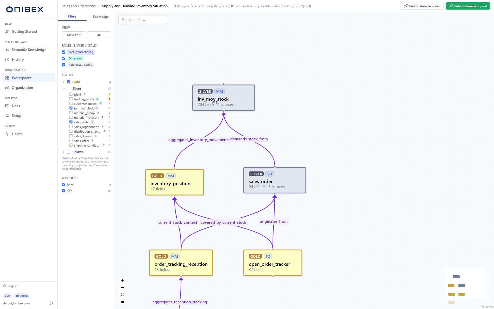

# The three chat engines

[Manual](../README.md) › [Understanding how it works](../README.md#understanding-how-it-works) › **The three chat engines**

> **Explanation.** Why ASK ships three ways to answer the same question, what each one
> makes deterministic, and how to choose. No procedure here — to switch engines in the
> chat, see [Scope a question](../ask-chat/01-workspace-environment-mode.md).

| | |
|---|---|
| **Who** | Anyone choosing an engine, and architects evaluating how governed the answers are |
| **Time** | ~6 minutes to read |
| **You'll end with** | A defensible reason for picking one engine over another |

---

## The question all three answer

A business user types *"based on open sales orders for material ID TG12, do we have enough
stock to cover that demand?"*. Something has to decide **which Data Products answer that**,
**how they join**, and **what SQL to emit**. Those are three separate decisions, and the three engines differ in
exactly one thing: **how many of them the LLM makes, and how many are computed.**

That framing is the whole story. Everything below is detail.

| Decision | Flash | Precise | Smart |
|---|---|---|---|
| Which Data Products are relevant | LLM (chunk similarity) | **Computed** — hybrid search, ranked | LLM, from a scoped catalog |
| How they join | LLM | **Computed** — Dijkstra | **Computed** — Dijkstra |
| The SQL text | LLM | LLM | LLM |

The SQL text is always written by the LLM. That is not the risky part: the model is choosing
among fields that have already been resolved for it, in a dialect it is told to emit. The risky
part is the first two rows — and that is where the engines diverge.

## Flash — one call, no plan

Flash searches the semantic layer as free-text chunks and writes SQL in a single LLM call. No
plan, no computed join path, no scope audit afterwards.

It is the fastest and cheapest engine, and it is honest about what it gives up: when several
join paths exist between two entities, Flash picks one the way a fluent reader would — by
plausibility, not by cost. On a well-modelled, shallow domain that is usually right. On a deep
one it is a coin flip that looks like an answer.

**Reach for it** when you are exploring, when latency matters more than guarantees, and when
you would notice a wrong number yourself.

## Precise — computed selection, audited output

Precise is the most reproducible engine, and the only one that checks its own work.

It extracts a structured plan from the question, then ranks Data Products **deterministically**
— hybrid keyword-plus-vector retrieval, fused and re-ranked so Gold outranks Silver. Selection
is a pure function of the question and the corpus: the same question against the same corpus
selects the same entities, every time. Join paths are computed with Dijkstra over the declared
relationship graph, so the cheapest correct path wins rather than the most plausible-sounding
one. Finally it audits the emitted SQL against the entities it authorised, and retries once if
the SQL reached for something outside that set.

That is the graph a path is computed over, filtered here to the five Data Products one question
needed. Every edge is declared, and every one carries the cost that decides which way Dijkstra
goes.

That last step is what makes Precise the engine to reach for in an audit. It is also why it
costs the most and takes the longest.

**Reach for it** when someone will ask *"which table did this number come from, and why that
join?"* — and when the answer has to be the same tomorrow.

## Smart — the default outside the Chat

Smart is what answers when nobody picked an engine, and it earns that place by putting the
determinism where it buys the most.

It shows the LLM a **condensed catalog** of the Data Products in scope and lets it pick — a
judgement call that models are genuinely good at, and one that scales to a catalog far larger
than would fit in a prompt as full definitions. It then resolves the joins **deterministically**,
through the same relationship graph Precise uses.

So Smart concedes the selection and keeps the join planning. That is the right trade for
everyday use: a wrong entity selection usually produces an obviously wrong answer, while a
wrong join path produces a plausible one — and plausible-but-wrong is the failure that reaches
a board deck.

**Reach for it** by default, and for anything high-volume.

---

## Choosing

| | **Flash** | **Precise** | **Smart** |
|---|---|---|---|
| **In one line** | Fastest — one-shot SQL from schema text | Most rigorous and reproducible | Balanced and production-grade |
| **LLM calls per query** | 1 | 3 | 2 |
| **Schema source** | Free-text chunks | Structured Data Products | Structured Data Products |
| **Data Products chosen by** | Chunk similarity | Ranking function (deterministic) | LLM, from a scoped catalog |
| **Joins planned by** | The LLM | Dijkstra | Dijkstra |
| **Scope validation** | None | Post-SQL audit + one retry | None (catalog-scoped) |
| **Speed (approx.)** | ~15–20 s | ~60 s | ~40 s |
| **Reproducibility** | Low | High | Medium |

*Speed figures are observational and vary with your model provider and question complexity.*

### Which engine runs when nobody chooses

There is no single platform-wide default. Every caller sends a mode, and what happens when
one is omitted depends on the entry point:

| Entry point | Default when the mode is omitted |
|---|---|
| **ASK Chat** — the **Mode** selector in the sidebar | **Precise** |
| **`/external/ask`** — agent runtimes such as watsonx Orchestrate, n8n and Zapier | **Smart** |
| **Artifact generation** | **Smart** |

Worth knowing before you compare two answers to the same question: asked through the Chat and
asked through the agent API, they did not come from the same engine.

> **Unsure?** Start with **Smart**. Switch to **Precise** when an answer looks off and you want
> a validated, reproducible result. Use **Flash** for quick exploration.

## What all three guarantee

The engines are interchangeable from the chat's point of view because they share the same
contract downstream:

- **The same database and environment.** Any supported SQL engine — PostgreSQL, SAP HANA,
  ClickHouse, IBM Db2, Snowflake, Databricks, Google BigQuery, SQL Server, Microsoft Fabric —
  and the published `dev` or `prod` environment. The active connection is chosen in ASK Setup,
  never in the chat.
- **The same answer shape.** Generated SQL, a results table, a written answer, and an automatic
  chart when the result has more than one row.
- **The same workspace scope.** A workspace allowlist decides which Data Products a question can
  reach at all, before any engine runs.
- **No raw tables.** No engine will answer a business question from a Bronze node. Flash cannot:
  Bronze is never chunked into the collections it searches. Smart restricts its catalog query to
  Silver and Gold. Precise filters both entity resolution and path selection to the same two
  layers, opening Bronze only for schema questions — *"what columns does VBAK have"* — which are
  not questions about your data. See
  [Bronze isolation](../../../definition/docs/BRONZE_LAYER.md#66-what-isolates-bronze-and-how).

None of them invents a column, because none of them is ever shown one it could invent from. What
differs between the engines is how much is *computed* rather than judged — not whether the
semantic layer is enforced.

---

## What's next

→ **[Scope a question](../ask-chat/01-workspace-environment-mode.md)** — switch
engines in the chat.
→ **[Concepts and architecture](../02-concepts.md)** — how the whole platform fits together.

---

[← Back to the manual](../README.md)
