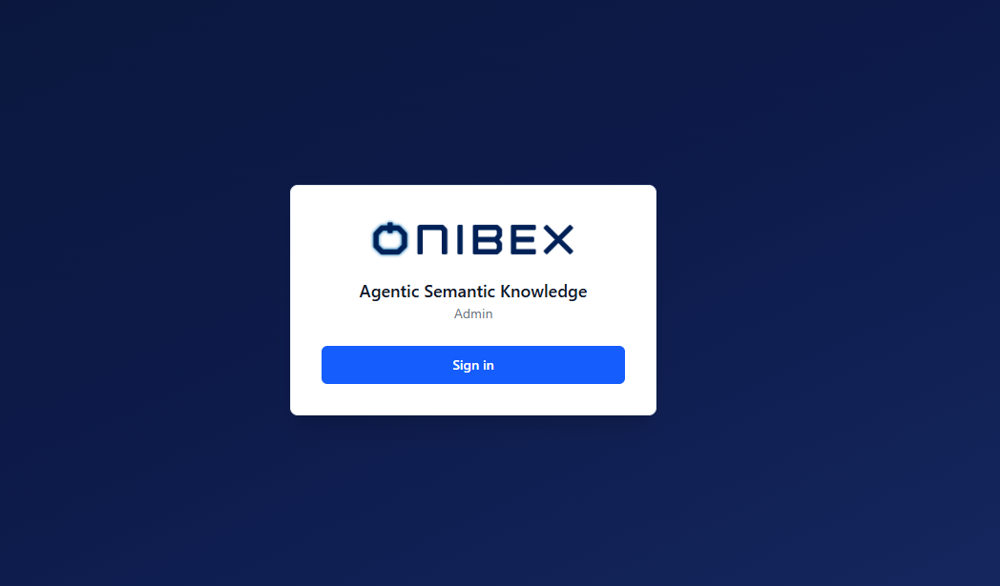

# Sign in to ASK

[Manual](../README.md) › [Everyday tasks](../README.md#everyday-tasks) › **Sign in to ASK**

> **How to.** Get into ASK Studio, ASK Chat or ASK Setup, understand which of the three
> authentication modes your deployment uses, and know what your role lets you do.

| | |
|---|---|
| **Who** | Everyone: business users, authors and platform engineers |
| **Time** | ~3 minutes to read |
| **Prerequisites** | The platform is running and reachable ([Install and run the platform](../01-installation.md)). |
| **You'll end with** | A session in the surface you need, and the vocabulary to describe an access problem accurately. |

All three surfaces share one identity provider and one session model, which is why this page
covers them together. Signing in is not a per-app procedure.

---

## 1. Open the surface you need

| Surface | For | Default local URL |
|---|---|---|
| **ASK Chat** | Asking questions in plain language | `http://localhost:5174` |
| **ASK Studio** | Authoring and publishing the semantic layer | `http://localhost:5173` |
| **ASK Setup** | Databases, LLM providers, identity | `http://localhost:5175` |

If you are not already authenticated you land on the Onibex-branded sign-in screen.

## 2. Pick the mode your deployment uses

What you see on that screen depends on how the deployment was configured. There are three
modes, and you do not choose between them at sign-in time, an administrator set one.

| Mode | Button | What happens |
|---|---|---|
| **Keycloak (SSO)** | **Sign in** | Redirects to your identity provider and back. The usual on-premise or self-hosted production mode. |
| **SAP BTP (XSUAA)** | **Sign in** | Redirects to SAP BTP identity (IAS / XSUAA) and back. Used on SAP BTP deployments. |
| **Dev bypass** | **Continue without authentication** | Enters directly, with no login at all. Local development only. |

> **Never run production with the dev bypass enabled.** *Continue without authentication*
> appears only when the deployment is explicitly set to that mode. If you see it on anything
> that is not a developer's own machine, treat it as a misconfiguration, not a convenience.

Each app runs its own sign-in against the shared provider, so signing in to Studio does not
by itself give you a Chat session.

## 3. Know which role you have

Two platform roles govern everything:

| Role | Grants | Who has it |
|---|---|---|
| **`ask-user`** | ASK Chat: ask questions, read answers | **Everyone**, automatically. Business users need no extra setup. |
| **`ask-admin`** | ASK Studio and ASK Setup: authoring and configuration | Assigned deliberately, to the people who author and configure the platform. |

After signing in, the sidebar footer shows an **auth chip** naming the active mode, `SSO`
for Keycloak, `XSUAA` for SAP BTP, `Dev` for the bypass, alongside your email and your role.
That chip is the fastest way to confirm what a session actually is before diagnosing anything
else.

The door icon next to it signs you out.

## 4. When it does not work

| What you see | What it means | What to do |
|---|---|---|
| **401 / Unauthorized** | The session expired, is missing, or the provider credentials are wrong. | Sign in again. If it recurs, an administrator should check the provider credentials in ASK Setup. |
| **403 / Forbidden** | You are signed in as **`ask-user`** and attempted an admin-only action. | Authoring and configuration need **`ask-admin`**. Ask an administrator to grant it. |
| **Repeated 401 right after signing in** | Usually a clock skew or a provider misconfiguration rather than your account. | Report it with the auth chip's value. It tells the administrator which flow to look at. |

A 403 is not a broken login. It means the login worked and the role does not cover the action,
which is a different conversation with your administrator.

## 5. Where the settings live

You do not configure authentication from the sign-in screen. The active provider, its OIDC
configuration and your session details are visible. Read-only, in ASK Setup:

→ **[Review the identity provider](../ask-setup/04-identity-provider.md)**

The mode itself is fixed at deployment time through environment variables, covered in
[Install and run the platform](../01-installation.md).

---

## What's next

→ **[Using the Chat](../ask-chat/02-chat.md)**, ask your first question.
→ **[ASK Studio](../ask-studio/README.md)**. Start authoring.

---

[← Back to the manual](../README.md)
